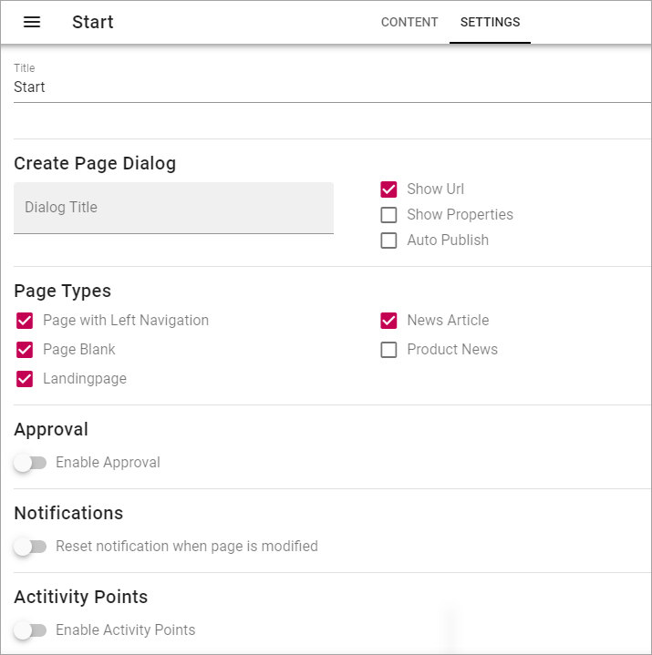
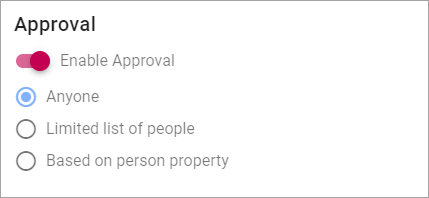
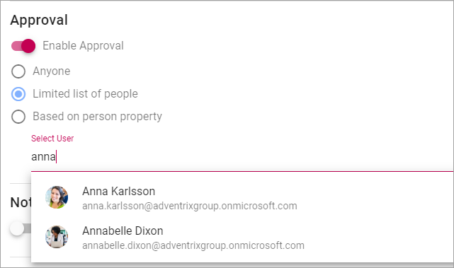
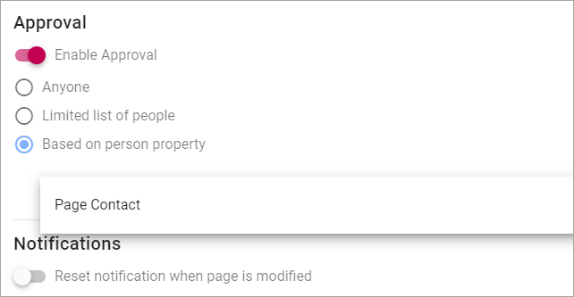

Page Collections
==================

Within a Publishing App a number of Page Collections can exist, where some settings can differ, for example if approval of new pages are needed or not. 

A Page Collection contains, as the name imply, a number of pages.

If the Feature “Default Page Collections and Page Types” has been activated, two Page Collections has been created; Start and News. If needed, additional Page Collections can be created within the Publishing App.

Page Collection Settings
*************************
A number of settings can be made for the Page Collection, this way:

1. Edit a page in the Publishing App and open the Page menu.
2. Click the main navigation node for the Page Collection.

In this example, the two Page Collections Start and News has been created in the Publishing App, and "Start" is selected:

.. image:: page-collection-general.png

3. Click "Settings".

.. image:: page-collection-click-settings.png

4. Use the following settings:

For the Page Collection "Start" edit mode is always active. For other Page Collections you have to activate edit mode by clicking here:

.. image:: page-collection-edit-mode.png

Use th settings this way:

+ **Title**: The Title for the Page Collection is shown here. It can be edited if needed.
+ **Create Page Dialogue**: You can set the title for the dialogue displayed when an editor has selected to create a new page. If you leave this field blank, the dialogue title will be "Create New Page".
+ **Show Url**: If the Url for the new page should be shown for the editor when creating a page, select this option. The Url can then be edited.
+ **Show Properties**: If available Page Properties should be shown for the editor when creating a page, select this option. The Properties can then be edited in that stage. Page Properties can always be edited after the page has been created.
+ **Auto Publish**: (A description will be added soon).
+ **Page Types**: Select which of the Page Types should ba available for an editor to select when creating a page.
+ **Enable Approval**: If Approval should be needed for creation of new pages, enable this. If not enabled, editors can publish new pages directly. See more info about Approval settings below.
+ **Reset notification when page is modified**: (A description will be added soon.)
+ **Enable Activity Points**: (A description will be added soon.)

Settings for Approval
----------------------
When Approval is activated, the following settings are available:

You select who can approve the creation of a page:

+ Anyone - (A description will be added soon.)
+ Limited list of people - you define the approvers using the field shown (see below). You can define one or more approvers but only one approval is needed each time.
+ Based on person property - you select property from the list shown (see below).

When selecting "Limited list of people", you add approvers by typing their names in the field displayed:

When you select "Based on person property", you open the list and select property. Normally just one or two properties are available.

Creating a new Page Collection
******************************
(A descirption will be added soon).

