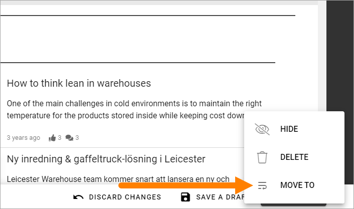
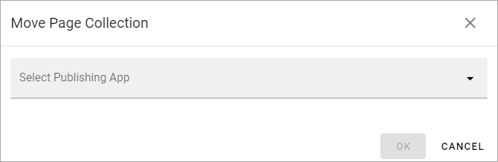

Move Page Collection
=============================================

If youre setup contains more than one publishing app you can move a page collection to another one. You do it this way:

1. Select the main node in the page collection.
2. Open the menu bottom right and select MOVE TO.

3. Select publishing app to move to.

**Important Note!**
When moving a page collection ony tenant page types are supported. Local page types will be lost when a page collection is moved.

