Page collection settings
===============================

A number of settings can be edited for the Page Collection, this way:

1. Edit a page in the Publishing App and open the Page menu.
2. Click the main navigation node for the Page Collection.

In this example, three Page Collections has been added in the Publishing App, besides Start and News, and "Start" is selected:

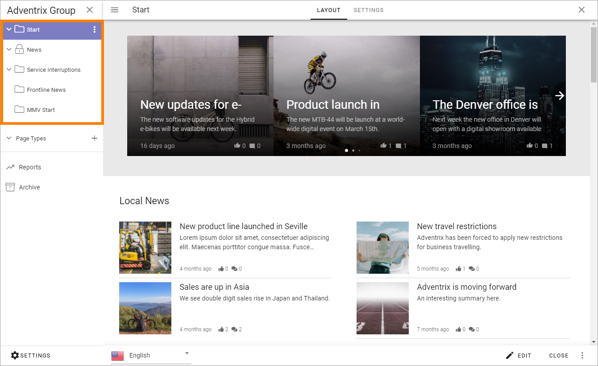

3. Click "Settings".

.. image:: page-collection-click-settings-new2.png

4. Click "Edit" at the bottom to edit the settings.

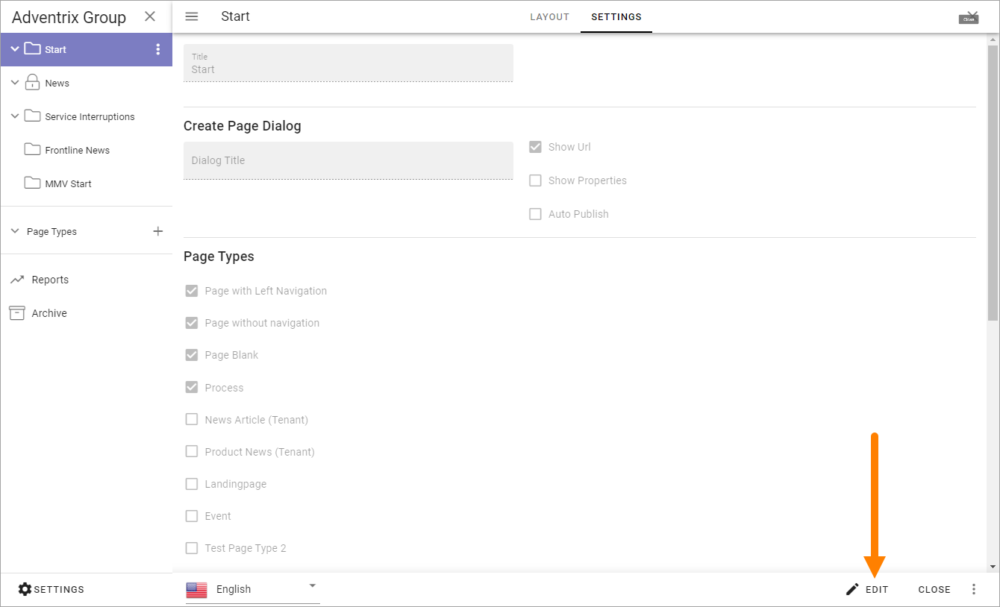

4. Use the following settings:

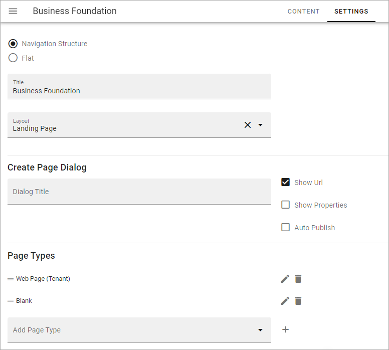

All settings are not shown in the image above, but listed below.

Use the settings this way:

+ **Navigation Structure/Flat**: Select page collection type here; using a navigation structure or flat. If you want to change from navigation structure to flat, you need to first manually flatten the page structure (move sub pages so they all become main pages) and then use the option here.
+ **Title**: The Title for the Page Collection is shown here. It can be edited if needed. It's updated everywhere it's shown when the changes here are published.
+ **Layout**: Applicable for Communities. Here a Layout can be selected. Layouts for Communtites works somewhat like Page Types, but can contain a full set up, ie for several pages. Layouts are created in Omnia Admin.
+ **Create Page Dialog**: You can set the title for the dialog displayed when an editor has selected to create a new page. If you leave this field blank, the dialog title will be "Create New Page".
+ **Show Url**: If the Url for the new page should be shown for the editor when creating a page, select this option. The Url can then be edited.
+ **Show Properties**: If available Page Properties should be shown for the editor when creating a page, select this option. The Properties can then be edited in that stage. Page Properties can always be edited after the page has been created.
+ **Auto Publish**: This is a setting probably most relevant for Communities. If this option is selected a new page is always published automatically. It's only applicable when a new page is created, not when it's updated.
+ **Page Types**: Select which of the Page Types that should be available for an editor to select when creating a page in this Page Collection. It can be Local Page Types or Tenant Page Types. Tenant Page Types are indicated by the text "(Tenant)". For more information about Tenant Page Types, see this page: :doc:`Tenant Page Types </admin-settings/tenant-settings/webcontent-managament/page-types/index>`. 
+ **Automatic Page Creation**: A copy of a page can be published automatically to another Page Collection when certain rules are met. In Omnia 7.0 and later, it can be possible to automatically publish to another tenant as well. These rules can be set up here. For more information, see this page: :doc:`Automatic Page Creation </pages/automatic-page-creation/index>`
+ **Yammer Integration**: When Yammer Integration is setup, a post will be created in the selected Yammer community whenever a new page, matching the selected criteria, is created. See below for more information.
+ **Taxonomy Connection**: When this option is activated, it's possible to connect the page collection to a taxonomy. Whenever a page is created in the page collection, a term will be created in the connected taxonomy and the page will automatically be tagged with the newly created term. This can, for example, be useful in different rollups. For more information, see below.
+ **Approval**: If Approval should be needed for publication of pages (new pages and updates), enable this. If not enabled, editors can publish themselves. See more info about Approval settings below.
+ **Activities**: For a Community, Activity Tracking can be activated. See the heading *Settings for Activity Points* on this page, for more information: :doc:`Setting up a Community </using-communities/settings/index>` 
+ **Notifications**: This setting defines when a notification that a page is new should be shown for users, for example in the Notification Panel. Normally it's only when the page is created, not when it's updated. If this option is activated the page is considered to be new every time it's updated and a new version is published. Therefore it's probably more relevant for pages in Communities than for Publishing Pages.
+ **Send as Email**: Select "Enable Send Page as Email" if pages in the Page Collection should be available to send through e-mail. One example of when this is needed is in a Newsletter inplementation.
+ **Scheduling**: If scheduling should be available in this Page Collection, select this option and select the property to be used. The author can then set a scheduled start date and time, using the PROPERTIES tab for the page. Note that Scheduled Publishing never is mandatory, an author van always choose to oublish directly. 
+ **Break permission inheritance by default**: Select this option if inheritance should be broken when a new page is created within the Page Collection. This could, for example, be useful for Communities. When this option is active, the colleague creating the page will be the page owner, meaning that he or she has full control over who can edit. The new option "Invite co-authors" can then be used to easily add authors for the page, see below.
+ **Allow invitation of co-authors**: If this option is selected, authors can invite co-authors. 
+ **Channel**: If you enable this, it will be possible for an author to select channels the page should be published to. Publication to a channel may require approval from the channel administrator. See more information below.
+ **Open AI**: Available in Omnia 7.1 and later. When you activate this option you can set properties for what the Open AI should be able to work with, see below. Also note that two tenant features must be activated for this option to be available and settings for Open AI has to be made in Omnia Admin.

Set default values for a Page Type
--------------------------------------
You can set default values for the Page Types that has been added to the Page Collection. Any changes you do applies to the active Page Collection only.

1. Click the pen for the Page Type.

.. image:: page-type-default-pen.png

The default setting is that the settings are inherited from the tenant setting.

2. Deselect a settings to change it.

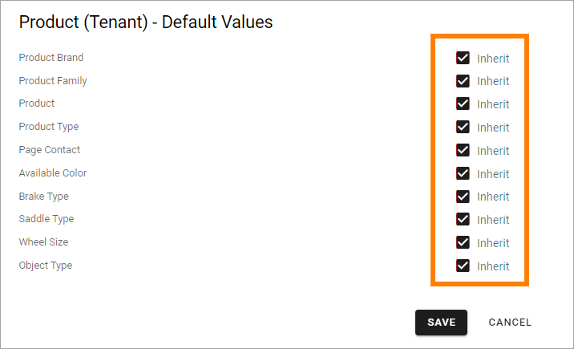

3. Set a new default value for the Page Type, using the field that becomes available.

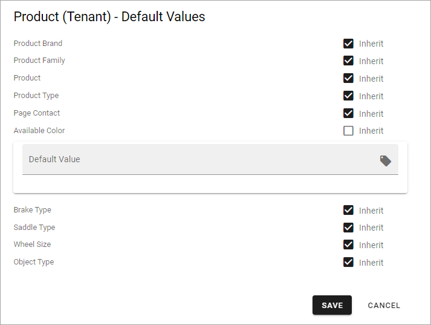

Don't forget to save your changes.

Setup Yammer integration for the Page Collection
--------------------------------------------------
The Yammer integration you can set up here is a one way integration; from Omnia to Yammer. A prerequisite is that the Feature "Yammer Integration" is activated in Omnia Admin (Tenant level).

To set up Yammer integration, do the following:

1. Select "Edit" to edit the settings.
2. Click the cogwheel for "Yammer Integration".

.. image:: yammer-integration-cogwheel.png

3. Use these settings:

.. image:: yammer-integration-settings.png

+ **Yammer Group**: Select a Yammer Group to intergate this Page Collection with.
+ **Initial Properties**: Select the properties used on pages for Title, Summary and Content.
+ **Page Creation Rule**: Select if a Yammer post should always be created when a page is added, or only according to certain rules.

4. Save when you're done.

To set up rules, do the following:

1. Select "Only Create If*.
2. Click ADD to add a rule.
3. Select a property.

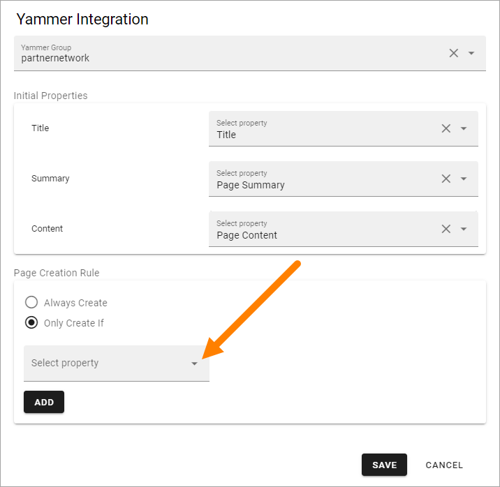

4. Add settings for that property as needed.

By using settings in the Page Likes and Comments block, you can set up a two way Yammer integration. Note that you must set up the integration here first.

For more information, see: :doc:`The Page Likes and Comments block </blocks/page-likes-and-comments/index>`

Allow invitation of co-authors
------------------------------------
If "Allow invitation of co-authors" is selected, an author can use this menu option to invite one or more co-authors:

.. image:: co-author-meny.png

Note that this is not temporary, the co-authors will be added to the page permissions as authors.

For more information about inviting co-authors, see: :doc:`Invite co-authors </pages/invite-co-authors/index>`

Enable taxonomy connection
---------------------------
When you enable taxonomy connection, select a taxonomy from the list.

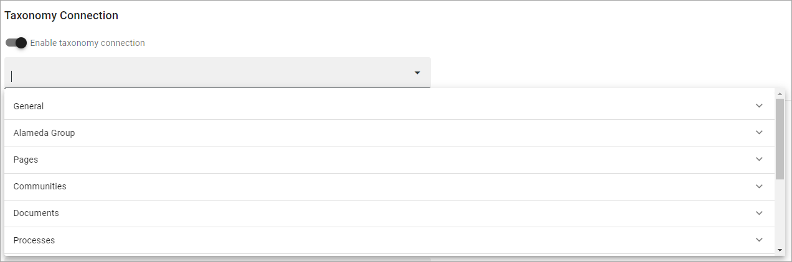

When you have done that every new page in the page collection creates a term in the selected taxonomy, based on the title of the page. The newly created page is automatically tagged with the new term.

**Note!** If you change a title of a page, the term for the page is NOT changed automatically. If you would like to change the term as well, you have to do that in the term set manually.

**Also Note!** You must see to that the editors/authors that will create pages in this page collection has permissions to create terms in the selected term set.

Settings for Approval
----------------------
When Approval is activated, the following settings are available (image from Omnia 7.5):

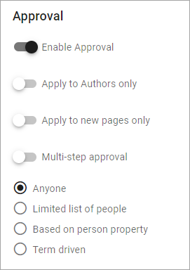

+ **Apply to authors only**: If you select this, editors never need approval, they can always publish directly. When an author publishes, approval is needed.
+ **Apply to new pages only**: When this option is selected, only creating new pages needs approval, not when updating an existing page.
+ **Multi step approval**: Available in Omnia 7.1 and later. Normally, when this option is not used, only one colleague can approve a page. When this option is used, a number of steps for approval can be set up, meaning several coleagues can need to approve a page. For more information, see below.

When approval is activated, you can select who can approve the creation of a page this way (also used in the Multi step approval settings, see below):

+ Anyone - The Author can select any colleague as approver when a page is published. See below for more information.
+ Limited list of people - you define the approvers using the field shown (see below). You can define one or more approvers but only one approval is needed each time, from any of the approvers.
+ Based on person property - you select property from the list shown (see below).
+ **Term driven**: Authors can select approvers from a defined list only. Which approvers will be available depends on the Properties selected for the documents. You select the term(s) here. When you have selected one or more terms you can use the cogwheel to set approvers for individual terms in the set.

When "Anyone" is selected the following is shown when an editor sends the page for approval:

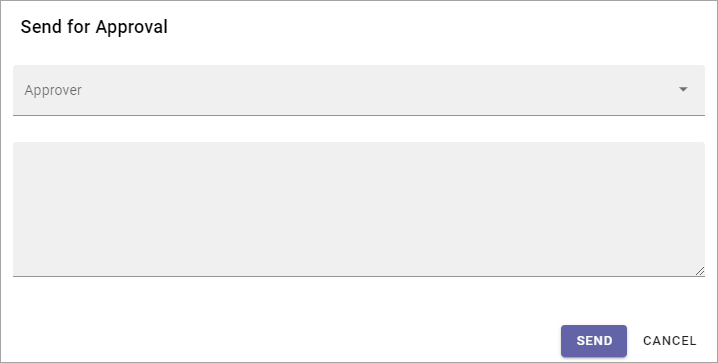

The author adds the approver to the field "Approver", types a message and sends the approval request.

When selecting "Limited list of people", you add approvers by typing their names in the field displayed:

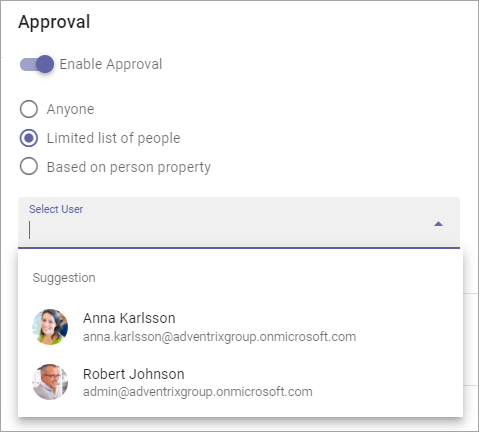

Authors can then only choose between the colleagues in the list when selecting approver.

When you select "Based on person property", you open the list and select property. Normally just one or two properties are available. Page Contact is an example of a field that can be relevant, if such a property is set up.

.. image:: based-on-person-new.png

Based on person property can result in more colleagues being available for approval. Authors can only choose between these colleagues when selecting approver.

For more information, see this page: :doc:`Properties </admin-settings/tenant-settings/properties/index>` 

For Term driven, you first select a term, then click the cogwheel.

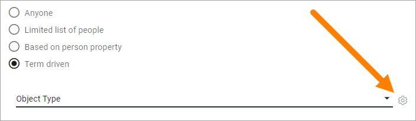

Then select the colleague or group that should be available for approval for the term.

In this exeample Robert Johnson is set as approver for all object types (the parent). If you would like to select someone else to be avaialable as approval for, let's say for News Article, deselect "Inherit parent settings" and select colleague or group there.

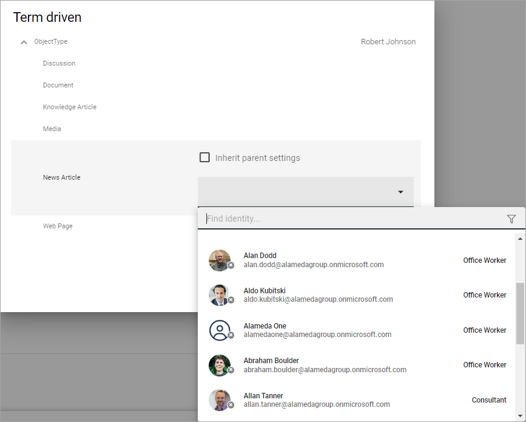

Setting up multi step approval
---------------------------------
When Multi step approval is selected, you set it up this way:

1. Click ADD STEP and set the following:

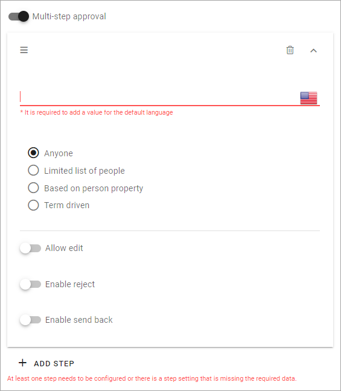

2. Add a description of the step in one or more languages (click the flag to change language). Default tenant language is mandatory.
3. Select who should be able for approval in this step. See above for information about the options.
4. Set the following:

+ **Allow edit**: If this option is selected the "approver" can edit the page with the changes he or she sees as necessary and then approve for publishing, or send back with a comment (if send back is activated for that step). 
+ **Enable reject**: Select this option if publication could be rejected in this step.
+ **Enable send back**: If it should be possible to send back to previous approval step from here, select this option.

5. Continue adding the needed approval steps the same way.

When you're finished it can look something like this:

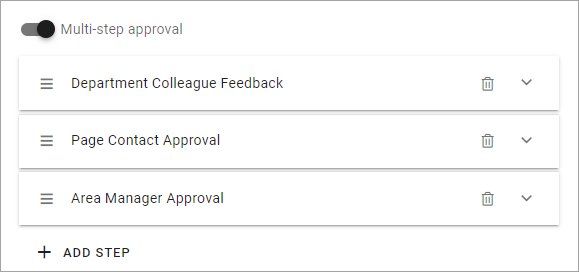

To edit a step, just expand it and use the settings as described above. To adjust the order of the steps, use drag and drop. To delete a step, click the dust bin.

Don't forget to to publish to save your settings.

Channel settings
-------------------
In Omnia 7.1, there's two options available for channels. When you enable publishing to channels you can also choose that at least one publishing channel is required:

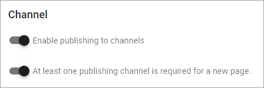

I you select this there must be at least one channel selected when a new page is created in the page collection, or the the new page can not be saved.

Options for OpenAI
-----------------------
When activating the OpenAI option, the following settings are available for this page collection:

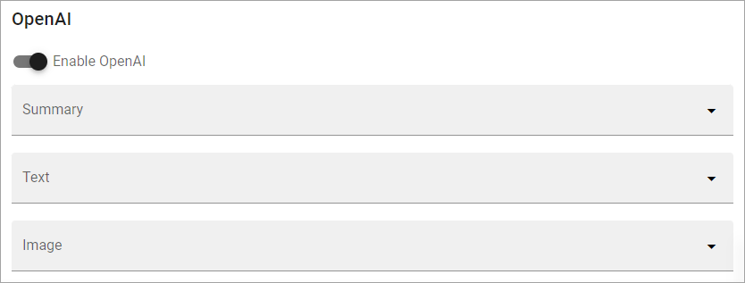

+ **Summary**: To activate OpenAI functionality for page summary, select the appropriate summary property here.
+ **Text**: Likewise for text fields, select property to activate OpenAI functionality.
+ **Image**: Dall-E is an OpenAI option that can be activated (a feature needs to be activated) and are then available as an image provider in the Image Picker. Select the image property used to activate the functionality.

See the bottom of this page for information about how OpenAI can be used in the RTF editor: :doc:`Editing text with the RTF Editor </general-assets/rtf-editor/index>`

Saving Page Collection settings
********************************
To save the changes to the Page Collection settings, you need to publish. You can't save a draft, even if that option is present. 

