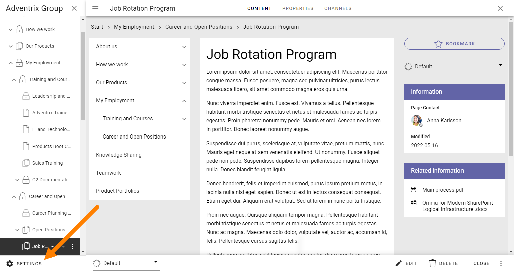
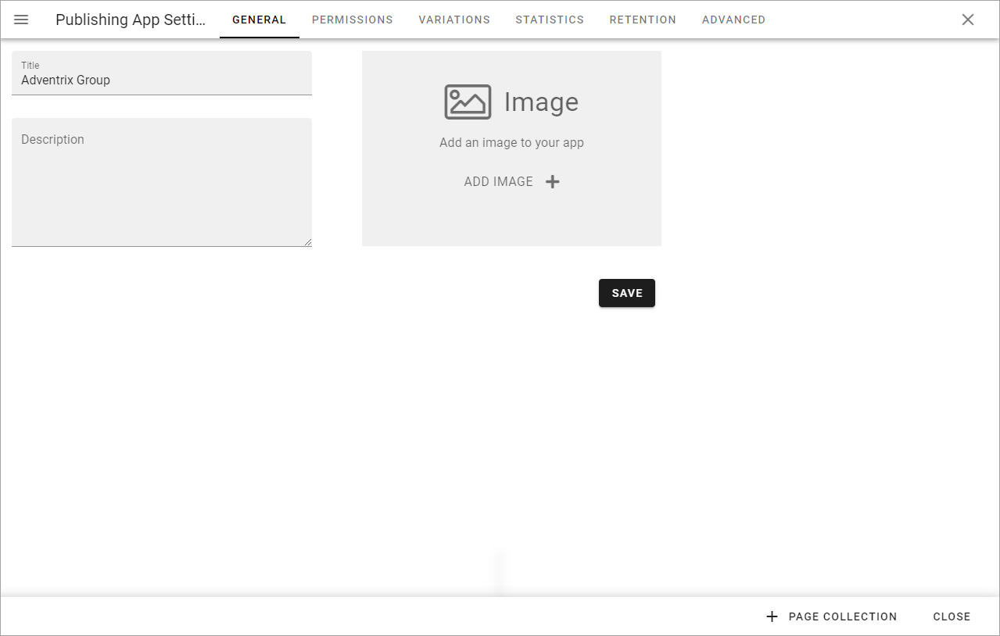
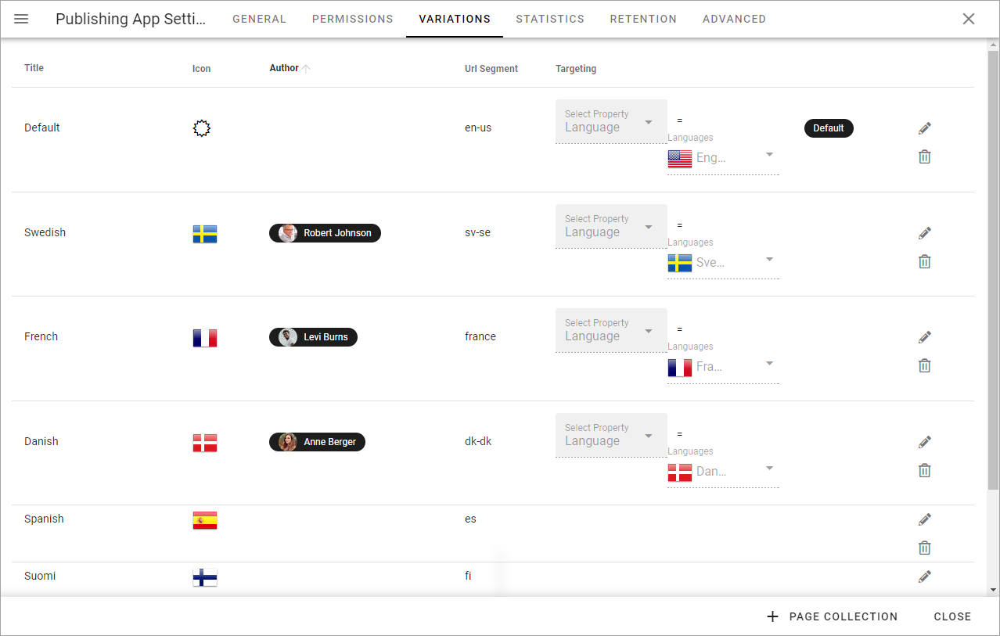
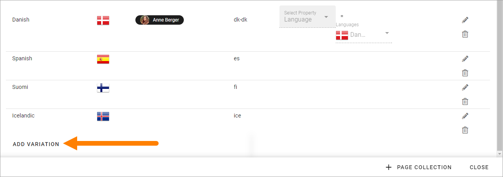
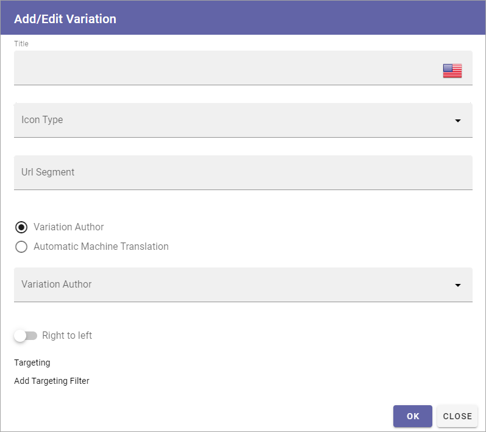
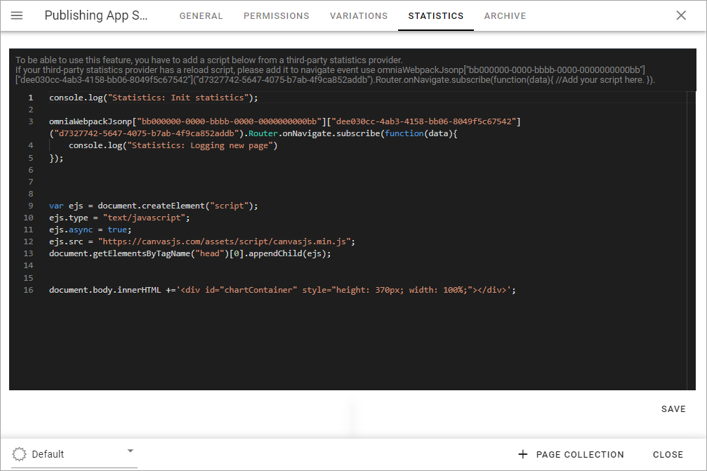

Publishing App settings
===========================================

**This page is being edited. Will be finished soon**:

A number of Publishing App settings are available. You have to be Publishing App administrator to use them.

Open the Publishing App settings by clicking here:

General 
*********
Here you can set what is shown for your pubishing app in listings:

You use the Media Picker to add or change the image. For more information on how to use this asset, see: :doc:`Media Picker </general-assets/media-picker/index>`

Permissions
************
Use these settings to Edit permissions in the Publishing App. 

.. image:: page-settings-permissions-new5.png

+ **Allow Mobile Login**: This setting is intended to offer login to certain parts of Omnia for first line workers, partners and similar. The user needs the Kaizala app and a viable account. If you see the label "Kaizala login" somewhere, it's the same thing. **Note!** Mobile Login/Kaizala login is not available in Omnia on-prem.
+ **Administrators**: Add and remove Publishing App administrators here as needed.
+ **Contributors**: This permissions settings is needed if colleagues should be able to add comments to pages.
+ **Resource Readers**: Here you set the general Read permission for the Publishing App, needed for users to be able to read pages.

Single users, Security groups and Microsoft 365 groups can be added here (In Omnia on-prem, Microsoft 365 groups can't be used).

Note that this permissions setting is valid for these settings only. To be able to edit Publishing App settings in Omnia Admin you need to be either a tenant administrator or administrator for the Business Profile.

Regarding these settings a tenant administrator and business profile administrator can go here and add him or herself to the permissions list and that way gain access to the settings.

Variations
************
Here you set up the Page Variations that should be possible to use in the Publishing App. It's then up to Page Editors to use a variation, or not, for a page. A page variation is created for a page when it's needed.

A variation can also be set up for Automatic Machine Translation, see below. (Not available in Omnia on-prem).

It's also possible to add one variation author for each variation.

You see the variations that has been set up so far, with information about for example targeting. A "Variaton" in the tenant's default language is also listed here - note the label "Default" in the image above. For all pages, a variation with the default language must always exist. That is what is added when a page is created the first time.

To edit the settings for a variation, click the pen. To delete a variation, click the dust bin.

.. image:: page-settings-variations-edit-delete-new3.png

When you edit a variation, the same settings as when you create a new variation are available, see below.

Create a new variation
-----------------------
Note that you can use Variations for a lot of implementations, not just languages, even if language versions of a page probably is the most common.

Do the following to create a new variation (you have to scroll down to the end of the list):

1. Click ADD VARIATION.

2. Use the following settings:

+ **Title**: Add a title for the variation to be shown in the lists, for example the list where users can select variation. If needed, the title can be added in any or all of the languages set up in the tenant. Click the flag to change language.
+ **Icon Type**: If you want show an icon for the variation, select Icon Type here, for excample "Flags".
+ **Icon**: Shown when you have selected Icon Type. Select the icon here.
+ **Url Segment**: Add a suitable Url Segment in this field.
+ **Variation author**: You can add a variation author for this variation. See this page for more information: :doc:`Edit Page Variations </pages/edit-page-variations/index>`
+ **Automatic Machine Translation**:You can select machine translation for this variation, to any language that is set up in the tenant. If you do, you can't select a Variation author, and the machine translated variation can not be edited manually. When you have selected this option, choose language in the list shown. Automatic Machine Translation is executed when the page is published. It will be noted on the variation page that it has been machine translated, see below. **Note!** Machine translation is not available in Omnia on-prem.
+ **Right to left**: If you're creating a variation for a language that is read right to left, select this option.
+ **Add Targeting Filter**: To set up targeting for this variation, click here. It is not mandatory. See below for more information.

Languages used for Titles, or for targering, must be set up in the Tenant Settings, see this page: :doc:`Regional Settings </admin-settings/tenant-settings/settings/regional-settings/index>`

Here's an example of a machine translated variation page:

.. image:: variation-machine-translated.png

Targeting a Page Variation
----------------------------
Use targeting for a variation to set which variation of a page that will be displayed to the logged in user. Note that if a Variation Selector block is added to a page, users can always select any of the available variations. This is true even if no targeting is set up. See this page for information about the Variation Selector block: :doc:`Variation Selector </blocks/variation-selector/index>`

**Note!** The Targeting Properties to use must be set up in Omnia Admin. See this page for more information: :doc:`Targeting Properties </admin-settings/tenant-settings/properties/targeting-properties>`

To target a Page Variation, do the following: 

1. Click "Add Targeting Filter" when editing a Page Variation's settings.

.. image:: page-variation-add-targeting-new4.png

2. Select Targeting Property from the list. 
3. As the next step you can select to include all Children, or you can target one or more of the Children specifically. 

Here's an example which will see to that all users that has French set as preferred language will see the French variation of the page.

.. image:: page-targeting-french-new2.png

4. Click "OK" to save your changes.

You can add as many Targeting Properties for a Variation as is needed, this way (and remember that variations can be a lot more than just languages). To remove a target, just click the X.

Note that the targeting settings also are shown in the Variations list, for example:

.. image:: page-variation-example-new6.png

Edit contents of a Page Variation
--------------------------------------
When more than one variation of the page exists, an editor can select variation to work with in the list, in the lower left corner:

.. image:: select-variation-new3.png

If no variation exists yet for the page, the editor can select to create one.

.. image:: variation-create-page-new.png

Editing a Page Variation works exactly the same way as editing the default page.

Statistics
*************
For more advanced statistics in Omnia, this is the place to add the scripts you get from your statistics provider, for example: 

Don't forget to save. The "Save" button is located in the lower right corner.

Archive
*********
On this tab, you can set rules for termination of archived (deleted) pages in the Publishing App. Termination means those pages can no longer be retrived from the archive. Regardless of if you have this option on or not, pages can always be terminated manually in the archive, as long as they are present in the archive.

Here's an example of such a setting:

.. image:: publishing-app-settings-archive-new.png

If you don't want automatic termination, just keep this option deselected.

Important note! The archiving and termination settings are valid for Omnia. If a page truly must be removed from your system, settings for dust bins in Sharepoint may also need to be edited.
