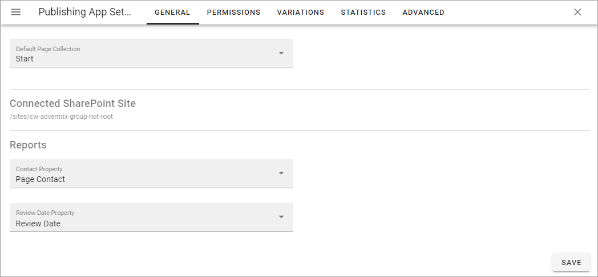
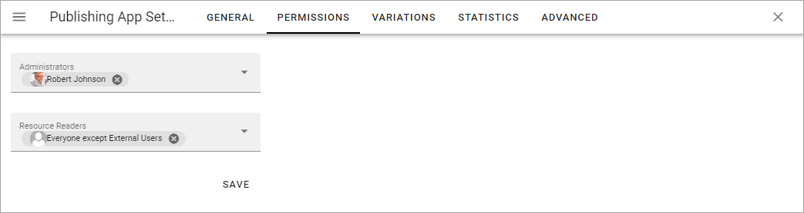
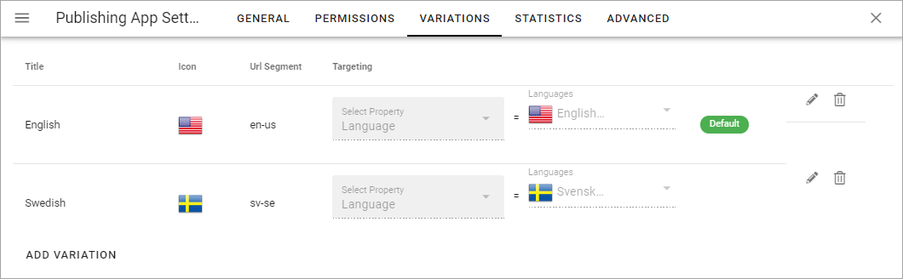
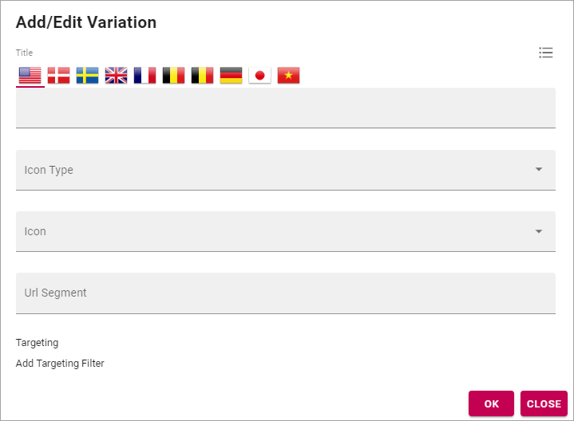
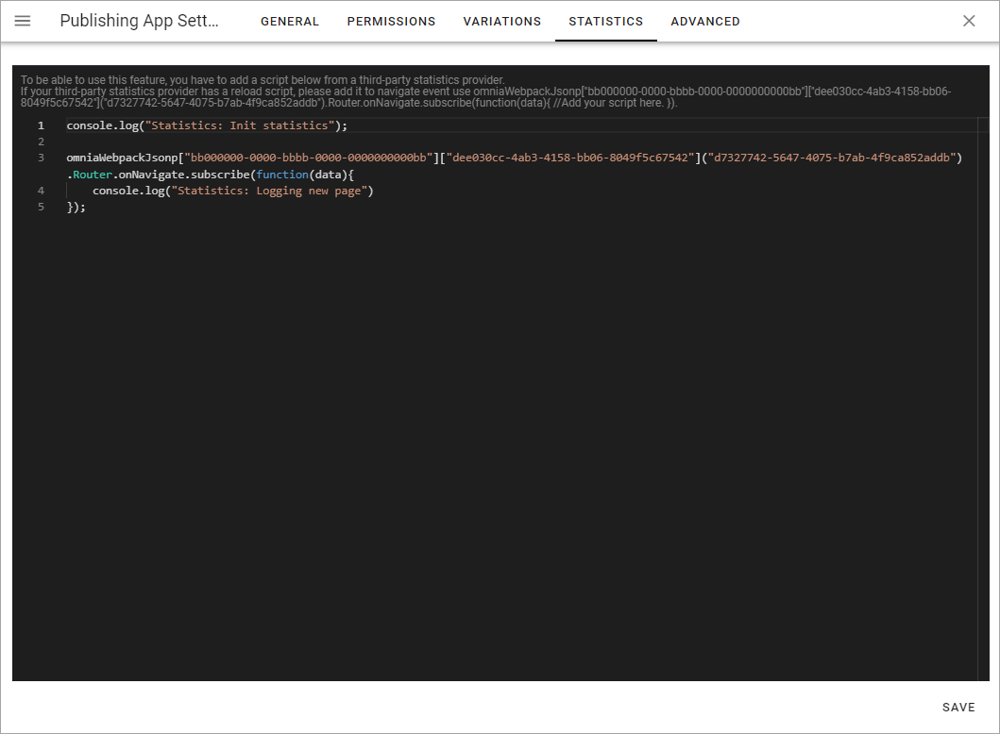

Publishing App settings
===========================================

A number of Publishing App settings are available. You have to be Publishing App administrator to use them.

Open the Publishing App settings by clicking here:

.. image:: page-settings.png

General 
*********
Set the following here:

+ **Default Page Collection**: The default Page Collection for the page can be set here.
+ **Connected Sharepoint Site**: The address to the Sharepoint Site is shown here.

Set the following, needed for page reports to work:

+ **Contact Property**: Select the property used to store information about the user being page contact.
+ **Review Date Property**: Select the property used to store information about review date for pages.

Permissions
************
Use these settings to Edit permissions in the Publishing App. 

+ **Administrators**: Add and remove Publishing App administrators here as needed.
+ **Resource Readers**: Here you set the general Read permission for the Publishing App, needed for users to be able to read pages.

Note that this permissions setting is valid for these settings only. To be able to edit Publishing App settings in Omnia Admin you need to be either a tenant administrator or administrator for the Business Profile.

Regarding these settings a tenant administrator and business profile administrator can go here and add him or herself to the permissions list and that way gain access to the settings.

Variations
************
Here you set up the Page Variations to use in the Publishing App.

You see the variations that has been set up so far, with information about for example targeting.

To edit the settings for a variation, click the pen. To delete a variation, click the dust bin.

.. image:: page-settings-variations-edit-delete.png

When you edit a variation, the same settings as when you create a new variation are available, see below.

Create a new variation
-----------------------
Note that you can use Variations for a lot of implementations, not just languages, even if that is probably the most common.

1. Click "ADD VARIATION".
2. Use the following settings.

+ **Title**: Add a title for the variation to be shown in the lists, for example the list where users can select variation. If needed, the title can be added in any or all of the languages set up in the tenant. 
+ **Icon Type**: Select the Icon Type here, for excample "Flags".
+ **Icon**: Selevt the icon (for exemple the flag) here.
+ **Url Segment**: Add a suitable Url Segment in this field.
+ **Add Targeting Filter**: To set up targeting for this variation, click here. It is not mandatory. See below for more information.

Languages used for Titles, or for targering must be set in the Tenant Settings, see the heading "Languages" on this page: :doc:`Tenant Settings </admin-settings/tenant-settings/settings/index>`

Targeting a Page Variation
----------------------------
Use targeting for a variation to set which variation of a page that will be displayed to the logged in user. Note that if a Variation Selector block is added to a page, users can always select any of the available variations. This is true even if no targeting is set up. See this page for information about the Variation Selector block: :doc:`Variation Selector </blocks/variation-selector/index>`

**Note!** The Targeting Properties to use must be set up in Omnia Admin, see the section about Targeting Properties on this page: :doc:`Properties </admin-settings/tenant-settings/properties/index>`

To target a Page Variation, do the following: 

1. Click "Add Targeting Filter" when editing a Page Variation's settings.

.. image:: page-variation-add-targeting-new.png

2. Select Targeting Property from the list. 
3. As the next step you can select to include all Children, or you can target one or more of the Children specifically. 

Here's an example with the Sweden and Denmark offices selected for the Office property.

.. image:: page-targeting-sweden-new.png

4. Click "OK" to save your changes.

You can add as many Targeting Properties for a Variation as is needed, this way. To remove a target, just click the X.

Note that the targeting settings also are shown in the Variations list, for example:

.. image:: page-variation-example-new2.png

Edit contents of a Page Variation
--------------------------------------
When more than one variation of the page exists, an editor can select variation to work with in the list, in the lower left corner:

.. image:: select-variation-new2.png

If no variation exists yet for the page, the editor can select to create one.

Editing a Page Variation works exactly the same way as editing a "normal" page.

Statistics
*************
For more advanced statistics in Omnia, this is the place to add the scripts you get from your statistics provider, for example: 

Don't forget to save. The "Save" button is located in the lower right corner.

Advanced
**********
This tab is a preparation for functionality to come. Can't be used at the moment.

