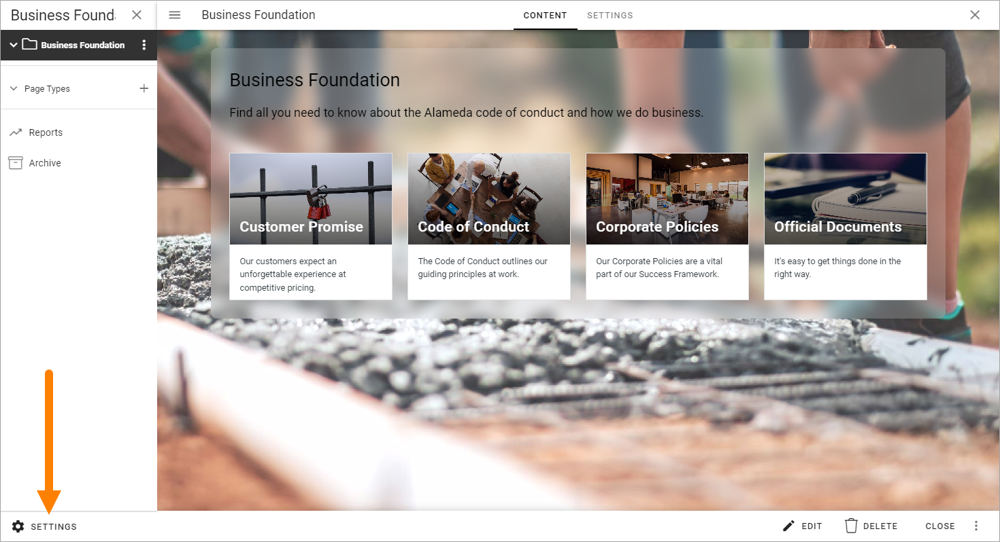
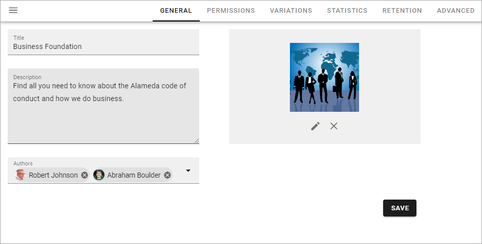
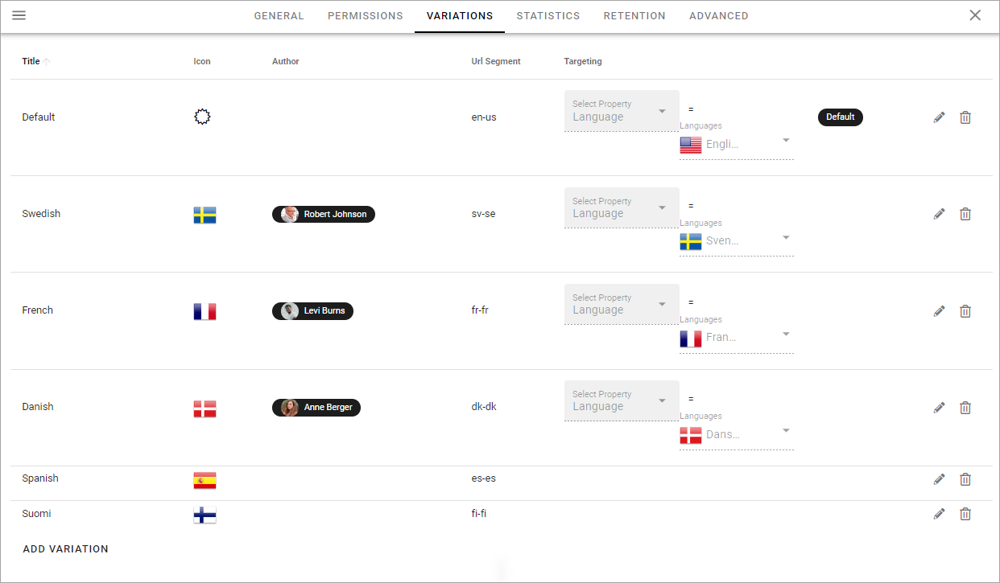
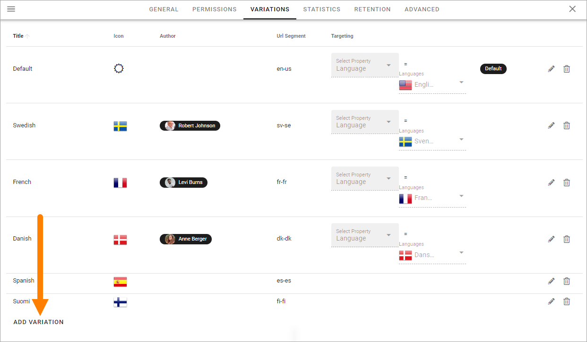
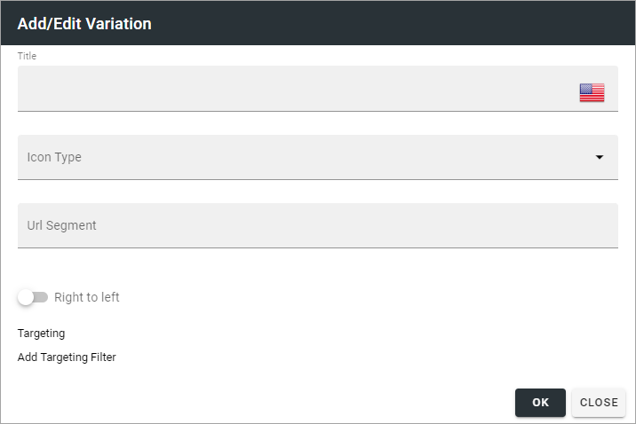
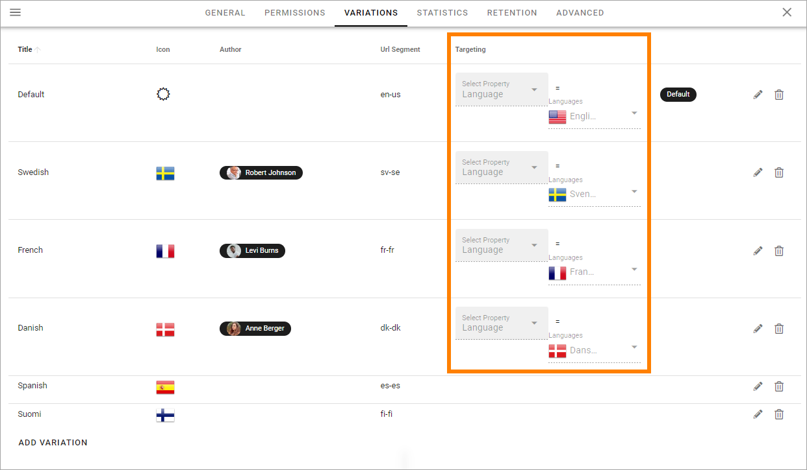
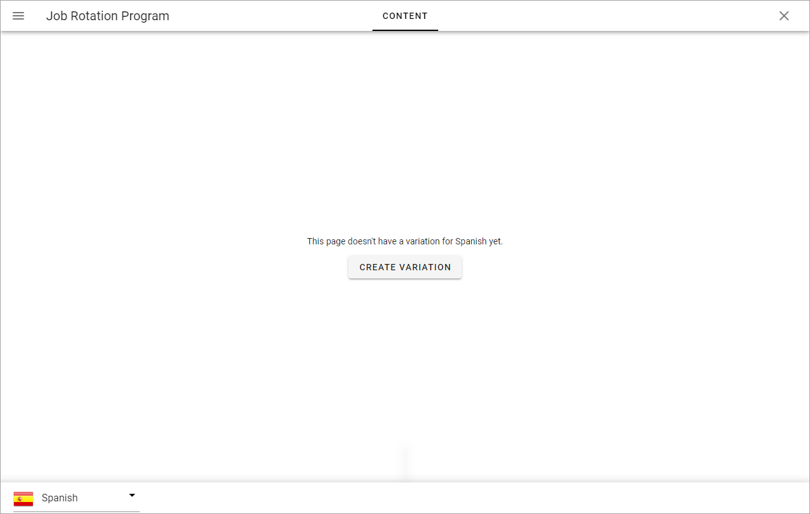
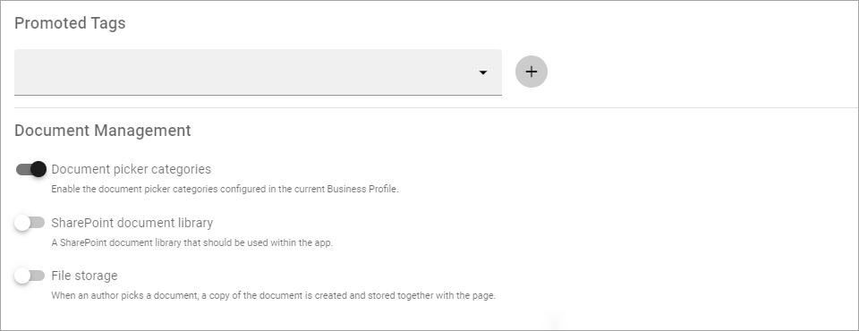
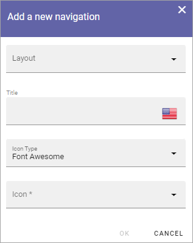
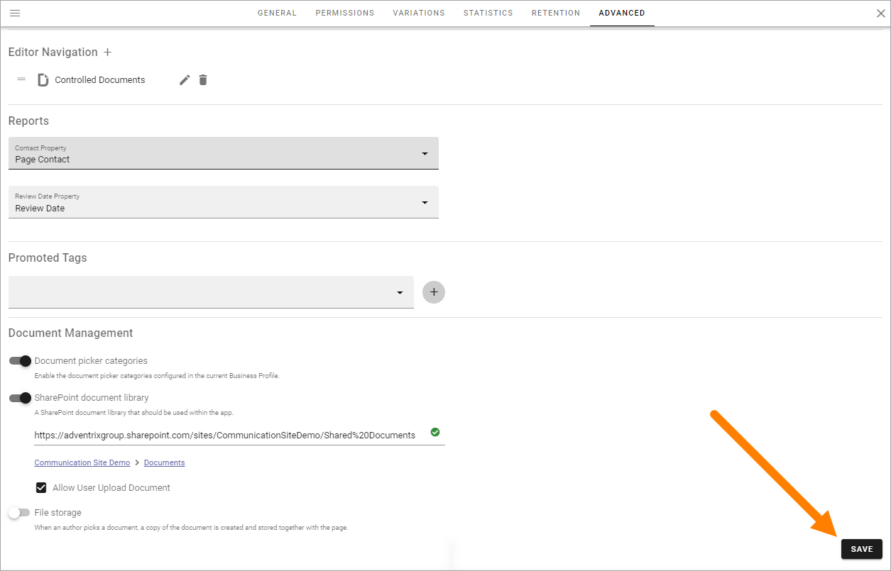

Publishing app settings
=======================================

A number of publishing app settings are available. You have to be publishing app administrator to use them.

Open the publishing app settings by clicking here:

General 
*********
The following settings are available here:

+ **Title**: Add the title to be displayed for the publishing app here. 
+ **Description**: Add a description if you wish (recommended).
+ **Authors**: Add general authors for pages in the publishing app. Can be edited for specific pages if needed.
+ (Image): You use the media picker to add or change the image. For more information on how to use this asset, see: :doc:`Media picker </general-assets/media-picker/index>`

Permissions
************
Use these settings to Edit permissions in the publishing app. 

.. image:: page-settings-permissions-76.png

+ **Administrators**: Add and remove publishing app administrators here as needed.
+ **Contributors**: This permissions settings is needed if colleagues should be able to add comments to pages.

For more information on the people picker, see: :doc:`Using the people picker </general-assets/using-people-picker/index>`

Note that this permissions setting is valid for the settings here, only. To be able to edit publishing app settings in Omnia admin, you need to be either a tenant administrator or administrator for the business profile. Regarding these settings a tenant administrator and business profile administrator can go here and add him or herself to the permissions list and that way gain access to the settings.

Variations
************
Here you set up the page variations that should be possible to use in the publishing app. It's then up to page editors to use a variation, or not, for a page. A page variation is created for a page when it's needed.

A variation can also be set up for automatic machine translation, see below. (Not available in Omnia on-prem).

It's also possible to add one variation author for each variation. Here's an example with a number of variations set up:

You see the variations that has been set up so far, with information about for example targeting. A "Variaton" in the tenant's default language is also listed here - note the label "Default" in the image above. For all pages, a variation with the default language must always exist. That is what is added when a page is created the first time.

To edit the settings for a variation, click the pen. To delete a variation, click the dust bin.

.. image:: page-settings-variations-edit-delete-612.png

When you edit a variation, the same settings as when you create a new variation are available, see below.

Create a new variation
-----------------------
Note that you can use variations for a lot of implementations, not just languages, even if language versions of a page probably is the most common.

Do the following to create a new variation (you have to scroll down to the end of the list):

1. Click ADD VARIATION.

2. Use the following settings:

+ **Title**: Add a title for the variation to be shown in the lists, for example the list where users can select variation. If needed, the title can be added in any of the languages set up in the tenant.
+ **Icon type**: If you want show an icon for the variation, select icon type here, for example "Flags".
+ **Icon**: Shown when you have selected icon type. Select the icon here.
+ **URL Segment**: Add a suitable URL Segment in this field.
+ **Variation author**: You can add a variation author for this variation. See this page for more information: :doc:`Edit page variations </pages/edit-page-variations/index>`
+ **Automatic machine translation**: You can select machine translation for this variation, to any language that is set up in the tenant. If you do, you can't select a variation author, and the machine translated variation can not be edited manually. When you have selected this option, choose language in the list shown. Automatic machine translation is executed when the page is published. It will be noted on the variation page that it has been machine translated, see below. **Note!** Machine translation is not available in Omnia on-prem.
+ **Right to left**: If you're creating a variation for a language that is read right to left, select this option.
+ **Add targeting filter**: To set up targeting for this variation, click here. It is not mandatory. See below for more information.

Languages used for titles, or for targering, must be set up in the tenant Settings, see this page: :doc:`Regional settings </admin-settings/tenant-settings/settings/regional-settings/index>`

Targeting a page variation
----------------------------
Use targeting for a variation to set which variation of a page that will be displayed to the logged in user. Note that if a Variation selector block is added to a page, users can always select any of the available variations. This is true even if no targeting is set up. See this page for information about the Variation selector block: :doc:`Variation selector </blocks/variation-selector/index>`

**Note!** The targeting properties to use must be set up in Omnia admin. See this page for more information: :doc:`Targeting properties </admin-settings/tenant-settings/properties/targeting-properties>`

To target a page variation, do the following: 

1. Click "Add Ttargeting filter" when editing a page variation's settings.

.. image:: page-variation-add-targeting-612.png

2. Select targeting property from the list. 
3. If there are children in the property, as the next step you can select to include all children, or you can target one or more of the children specifically. 

Here's an example which will see to that all users that has Danish set as preferred language will see the Danish variation of the page.

.. image:: page-targeting-danish.png

4. Click "OK" to save your changes.

You can add as many targeting properties for a variation as is needed this way (and remember that variations can be a lot more than just languages). To remove a target, just click the X.

Note that the targeting settings also are shown in the variations list, for example:

Edit contents of a page variation
--------------------------------------
When more than one variation of the page exists, an editor can select variation to work with in the list, in the lower left corner:

.. image:: select-variation-new4.png

If no variation exists yet for the page, the editor can select to create one.

Editing a page variation works exactly the same way as editing the default page.

Statistics
*************
For more advanced statistics in Omnia, this is the place to add the scripts you get from your statistics provider, for example: 

.. image:: page-settings-statistics-612.png

Don't forget to save. The "Save" button is located in the lower right corner.

Retention
***********
Here you can edit the settings for automatic termination, for the pages in this app that has been archived. 

.. image:: page-settings-retention-612.png

Advanced
**********
The settings available here depends on features activated. Here's an example:

.. image:: page-settings-advanced-612-1.png

and these settings can also be available:

+ **Default page collection**: The default page collection for the page can be set here.
+ **Allow reuse content**: If it should be allowed to resuse content within the publishing app, activate "Enable reuse content". For more information about how to reuse content, see: :doc:`Reusable content </pages/reusable-content/index>`
+ **Connected SharePoint site**: The address to the SharePoint site is shown here.
+ **Editor navigation**: Here you can add options that should be available in the page menu, in additional to the default options. For more information, see below.
+ **Reports**: Select the property used to store information about the user being page contact, and select the property used to store information about review date for pages.
+ **Promoted tags**: A publishing app can be configured to have promoted tags/terms for certain properties. Promoted tags/terms will be displayed at the top of the tag/term picker both for the author, when working with pages, and for the end user when filtering in a page rollup.
+ **Variations**: Select to share comments, reactions and ratings across variations. This option is only available if one or more varations exists in the app. **Important note!** This option should be activated before any variation pages are created. If this option is activated later on, the comments from the main page are shown on all variation pages. If comments had been added to a variation page, they will no longer be displayed.  
+ **Document management**: You use this part for documents settings, both forstandard documents and for controlled documents. For more information, see below.

For more information about layouts for publishing, see this page: :doc:`Publishing layouts </admin-settings/business-group-settings/publishing-apps/publishing-65/layout/index>`

Editor navigation
--------------------
Use this setting to add options to the page menu, if needed. On example is to add an option to make it possible to work with controlled documents in a publishing app.

Prerequisit: A publishing layout for the option to be used must have been created in Omnia admin. For more information about how to work with publishing layouts, see: :doc:`Publishing layouts </admin-settings/business-group-settings/publishing-apps/publishing-65/layoutindex>`

Here's how to add a menu option:

1. Click the plus to the right of "Editor navigation".
2. Use the following settings:

+ **Layout**: Select layout here.
+ **Title**: Add a title in any tenant language. 
+ **Icon type/Icon**: Add an icon if you wish by first selecting icon type.

3. Click OK when you're done.

.. image:: editor-navigation-settings-ok.png

4. Save the changes to the publishing app settings.

The new option is now added to the menu, for example:

.. image:: editor-navigation-settings-added.png

To edit a menu option, click the pen, to delete it, click the dust bin.

.. image:: editor-navigation-settings-editdelete.png

Document management settings
-----------------------------------
The following settings are available here (example from an existing site):

.. image:: document-management-settings.png

+ **Document picker categories**: If the document picker categories that are set up in Omnia admin should be available here, select this option.
+ **SharePoint document library**: If the documents created here should be saved in a specific SharePoint document library, enter the address to the library here.
+ **Allow user upload document**: Available when a document library has been defined here. Editors and authors can normally upload documents. If this should be possible for all users, select this option.
+ **File storage**: Select the option if a copy of a document an editor or author uploads, should be saved locally. The document is then saved in Omnia, not in SharePoint. This is useful if a specific version of a document should be saved with the page, for example a news page. 

