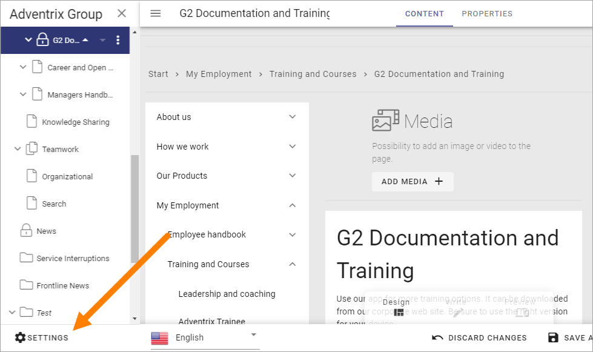
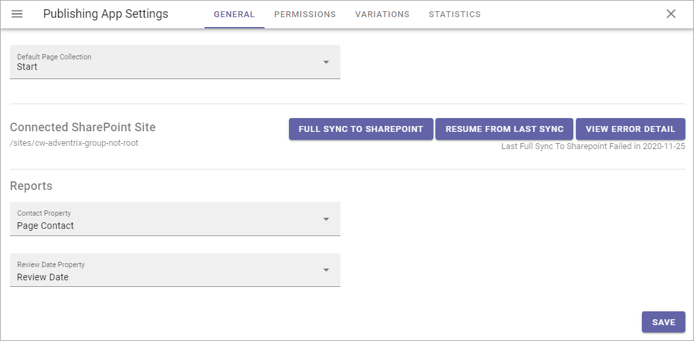
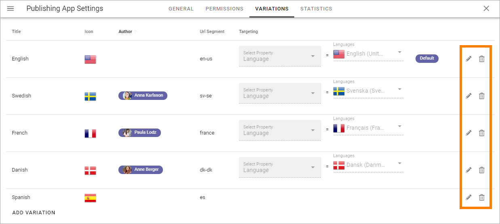
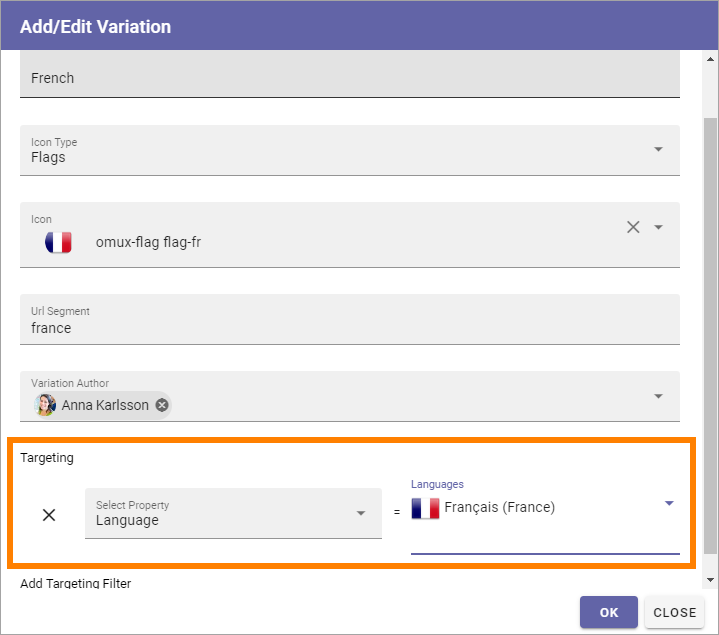

Publishing App settings
===========================================

A number of Publishing App settings are available. You have to be Publishing App administrator to use them.

Open the Publishing App settings by clicking here:

General 
*********
Set the following here:

+ **Default Page Collection**: The default Page Collection for the page can be set here.
+ **Connected Sharepoint Site**: The address to the Sharepoint Site is shown here.
+ **Full Sync etc**: (For a description of these buttons, see below).

Set the following, needed for page reports to work:

+ **Contact Property**: Select the property used to store information about the user being page contact.
+ **Review Date Property**: Select the property used to store information about review date for pages.

Sync to Sharepoint
--------------------
This sync is a map of some properties to Sharepoint fields, either as set up in Omnia Admin, or set up specifically for a Page Type, as an override.

When some (rare) actions has been executed, for example an override created for a Page Type, a new sync to Sharepoint may be needed, using the buttons here.

For more information about the Admin settings, see: :doc:`Web Content Management </admin-settings/tenant-settings/webcontent-managament/index>`

For more information about the override, see this page: :doc:`Page Type Settings </pages/page-types/page-type-settings/index>`

Permissions
************
Use these settings to Edit permissions in the Publishing App. 

.. image:: page-settings-permissions-new3.png

+ **Allow Mobile Login**: This setting is intended to offer login to certain parts of Omnia for first line workers, partners and similar. The user needs the Kaizala app and a viable account. 
+ **Administrators**: Add and remove Publishing App administrators here as needed.
+ **Resource Readers**: Here you set the general Read permission for the Publishing App, needed for users to be able to read pages.

Note that this permissions setting is valid for these settings only. To be able to edit Publishing App settings in Omnia Admin you need to be either a tenant administrator or administrator for the Business Profile.

Regarding these settings a tenant administrator and business profile administrator can go here and add him or herself to the permissions list and that way gain access to the settings.

Variations
************
Here you set up the Page Variations that should be possible to use in the Publishing App. It's then up to Page Editors to use a variation, or not, for a page. A page variation is created for a page when it's needed.

In Omnia 6.5 there's a new option for variations - Automatic Machine Translation, see below.

It's also possible to add one variation author for each variation.

.. image:: page-settings-variations-new4.png

You see the variations that has been set up so far, with information about for example targeting. A "Variaton" in the tenant's default language is also listed here - note the label "Default" in the image above. For all pages, a variation with the default language must always exist. That is what is added when a page is created the first time.

To edit the settings for a variation, click the pen. To delete a variation, click the dust bin.

When you edit a variation, the same settings as when you create a new variation are available, see below.

Create a new variation
-----------------------
Note that you can use Variations for a lot of implementations, not just languages, even if language versions of a page probably is the most common.

Do the following to create a new variation:

1. Click ADD VARIATION.

.. image:: click-add-variation.png

2. Use the following settings.

.. image:: variations-new3.png

+ **Title**: Add a title for the variation to be shown in the lists, for example the list where users can select variation. If needed, the title can be added in any or all of the languages set up in the tenant. 
+ **Icon Type**: Select the Icon Type here, for excample "Flags".
+ **Icon**: Selevt the icon (for exemple the flag) here.
+ **Url Segment**: Add a suitable Url Segment in this field.
+ **Variation author**: You can add a variation author for this variation. See this page for more information: :doc:`Edit Page Variations </pages/edit-page-variations/index>`
+ **Automatic Machine Translation**: In Omnia 6.5, you can select machine translation for this variation, to any language that is set up in the tenant. If you do, you can't select a Variation author, and the machine translated page can not be edited manually. When you have selected this option, choose language in the list shown. Automatic Machine Translation is executed when the page is published. It will be noted on the variation page that it has been machine translated.
+ **Add Targeting Filter**: To set up targeting for this variation, click here. It is not mandatory. See below for more information.

Languages used for Titles, or for targering, must be set up in the Tenant Settings, see this page: :doc:`Regional Settings </admin-settings/tenant-settings/settings/regional-settings/index>`

Targeting a Page Variation
----------------------------
Use targeting for a variation to set which variation of a page that will be displayed to the logged in user. Note that if a Variation Selector block is added to a page, users can always select any of the available variations. This is true even if no targeting is set up. See this page for information about the Variation Selector block: :doc:`Variation Selector </blocks/variation-selector/index>`

**Note!** The Targeting Properties to use must be set up in Omnia Admin, see the section about Targeting Properties on this page: :doc:`Properties </admin-settings/tenant-settings/properties/index>`

To target a Page Variation, do the following: 

1. Click "Add Targeting Filter" when editing a Page Variation's settings.

.. image:: page-variation-add-targeting-new3.png

2. Select Targeting Property from the list. 
3. As the next step you can select to include all Children, or you can target one or more of the Children specifically. 

Here's an example which will see to that all users that has French set as preferred language will see the French variation of the page.

4. Click "OK" to save your changes.

You can add as many Targeting Properties for a Variation as is needed, this way (and remember that variations can be a lot more than just languages). To remove a target, just click the X.

Note that the targeting settings also are shown in the Variations list, for example:

.. image:: page-variation-example-new4.png

Edit contents of a Page Variation
--------------------------------------
When more than one variation of the page exists, an editor can select variation to work with in the list, in the lower left corner:

.. image:: select-variation-new3.png

If no variation exists yet for the page, the editor can select to create one.

.. image:: variation-create-page-new.png

Editing a Page Variation works exactly the same way as editing the default page.

Statistics
*************
For more advanced statistics in Omnia, this is the place to add the scripts you get from your statistics provider, for example: 

.. image:: page-settings-statistics-new2.png

Don't forget to save. The "Save" button is located in the lower right corner.

