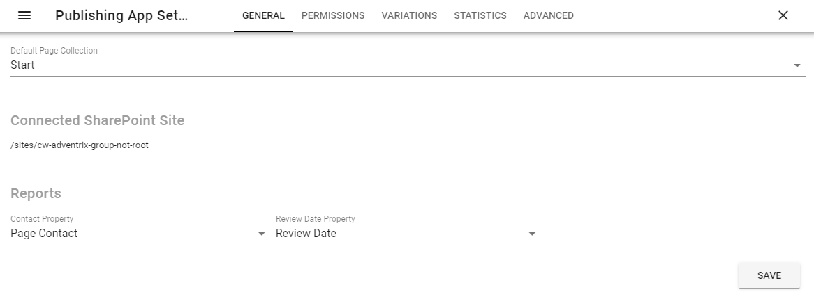
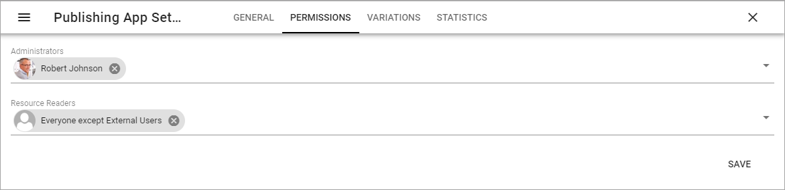
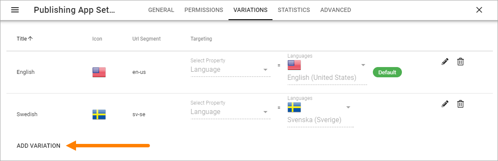
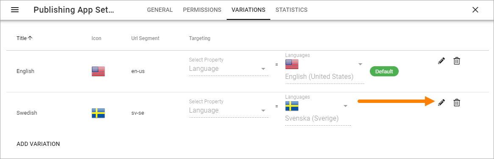
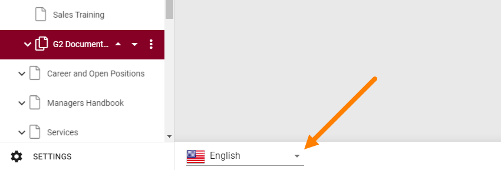
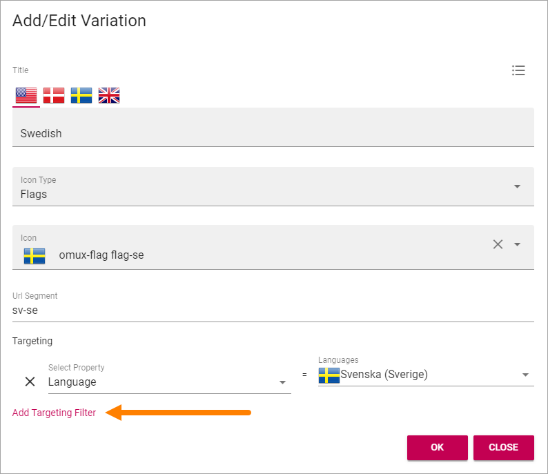
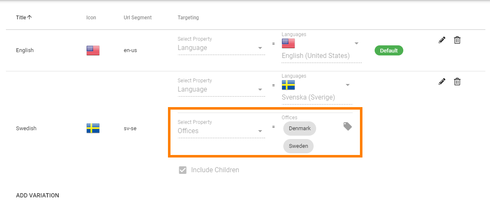

Publishing App settings
===========================================

When editing page, a number of Publishing App settings are available by clicking here:

.. image:: page-settings.png

General 
*********
Set the following here:

+ **Default Page Collection**: The default Page Collection for the page can be set here.
+ **Connected Sharepoint Site**: The addreess to the Sharepoint Site is shown here.

Set the following, needed for page reports to work:

+ **Contact Property**: Select the property used to store information about the user being page contact.
+ **Review Date Property**: Select the property used to store information about review date for pages.

Permissions
************
Use these settings for edit permissions in the Publishing App. 

Note that a tenant administrator always can edit all pages in the tenant. A business profile administrator can always edit all pages within the business profile.

Variations
************
Here you set up the Page Variations to use in the Publishing App.

.. image:: page-settings-variations-new.png

Create a new Page Variation
-------------------------------
To create a new variation for this page, do the following:

1. Go to the page.
2. Open the Pusblishing App Settings and select "VARIATIONS".
3. Click "ADD VARIATION".

4. Add settings for the new Page Variation (see below).
5. Target the Page Variation, if needed (se below for instruction).
6. Click "OK" to create the Page Variation.

Edit the settings for a Page Variation
-----------------------------------------
To edit the settings for a Page Variation, do the following:

1. Go to the page.
2. Open the Page Settings and select "VARIATIONS".
3. Click the pen for the Page Variation.

4. Edit settings for the new Page Variation and click "OK" to save the changes.

Edit contents of a Page Variation
--------------------------------------
When more than one variation of the page exists, the editor can select variation to work with in the list, in the lower left corner:

Editing a Page Variation works exactly the same as editing a "normal" page.

Targeting a Page Variation
----------------------------
**Note!** The Targeting Properties to use must be set up in Omnia Admin, see: :doc:`Targeting Properties </admin-settings/tenant-settings/targeting-properties/index>`

To target a Page Variation, do the following:

1. Click "Add Targeting Filter" when editing a Page Variation's settings.

2. Select Targeting Property from the list. 
3. As the next step you can select to include all Children, or you can target one or more of the Children specifically. 

Here's an example with the Sweden and Denmark offices selected for the Office property.

.. image:: page-targeting-sweden-new.png

4. Click "OK" to save your changes.

You can add as many Targeting Properties for a Variation as is needed, this way. To remove a target, just click the X.

Note that the targeting settings also are shown in the Variations list, for example:

Statistics
-----------
For more advanced statistics in Omnia, this is the place to add the scripts you get from your statistics provider. 

.. image:: page-settings-statistics.png

Don't forget to save. The "Save" button is located in the lower right corner.

