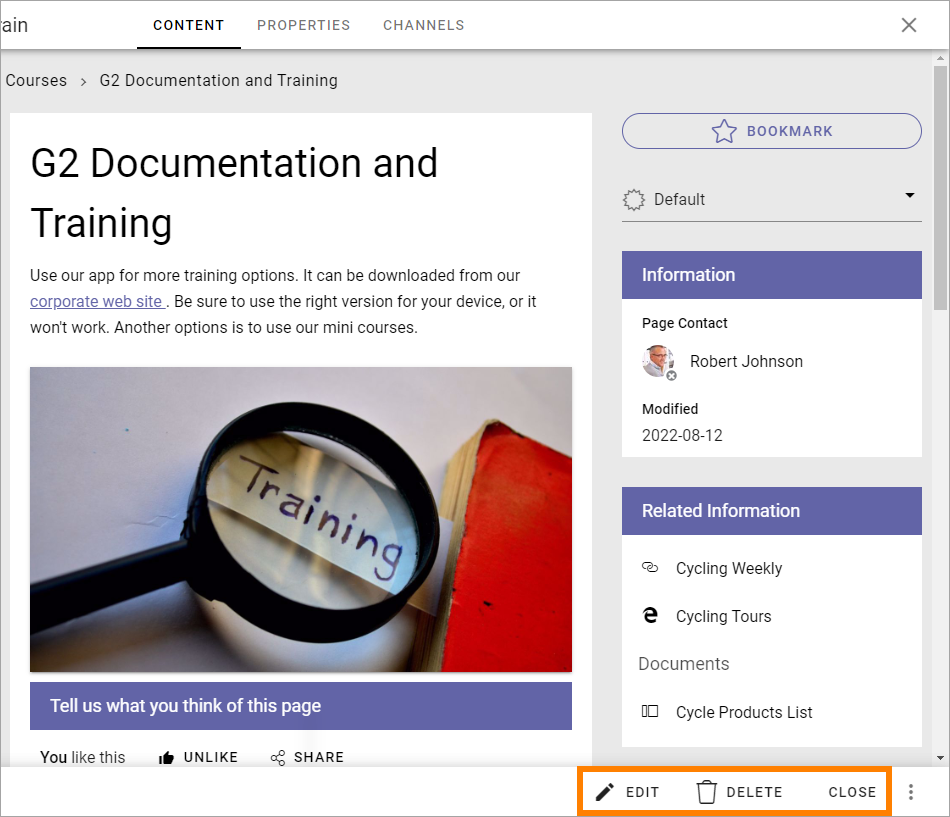
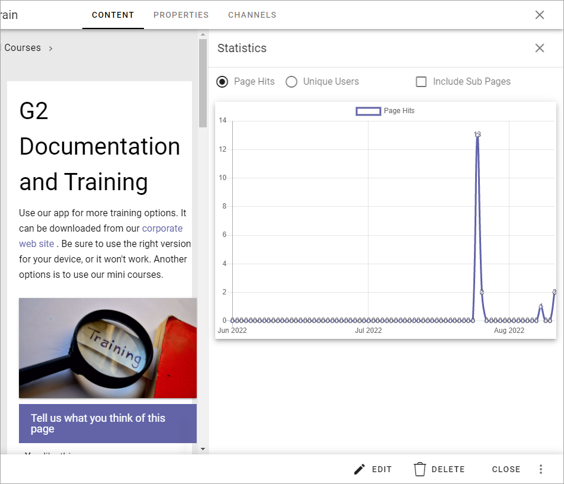

Page Statistics
=================

When the page editor is open you can have a look at some basic statistics for the page.

**Note!** The page must be published, and not be actively edited, for the Statistics to be available.

When it looks like this, Statistics is available:

1. Open the menu to the right and select STATISTICS.

.. image:: page-statistics-menu-statistics-new3.png

Here's an example:

The graph displays statistics for the last three months.

You can display "Page Hits" or "Unique Users". The difference is that if a user has entered the page a number of times, all the times are registered for Page Hits, but only once per day if "Unique Users" is selected. You can also choose to include all sub pages of the selected page.

More detailed statistics
*******************************
More detailed usage statistics can be found on the Usage tab under Reports, see: :doc:`Reports </pages/reports/index>`

For more advanced statistics, use the Statistics tab in the Publishing App Settings and add the scripts from a statistics provider there. See the bottom of this page for more information: :doc:`Publishing App Settings </pages/page-settings/index>`

