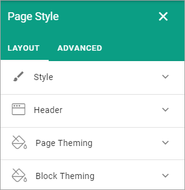
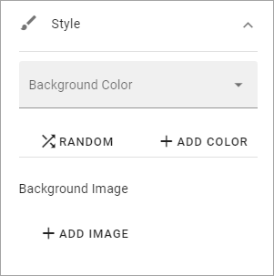
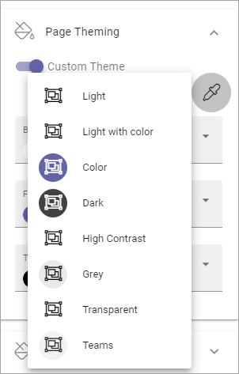
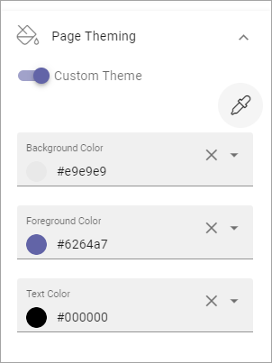
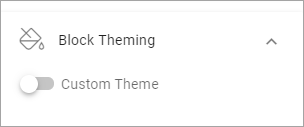
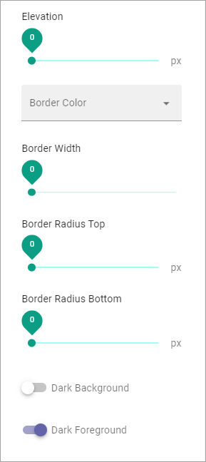

Page Style
==============

This option makes it possible to set a certain style for a specific page. You must be able to edit the page in Design mode to be to do this.

Do the following:

1. Go to the page.
2. Edit page and select Design mode.
3. Open the action menu.

.. image:: page-style-open.png

4. Select PAGE STYLE.

.. image:: page-style-menu.png

Use these settings:

Style
*******
Here you can use the following settings:

+ **Background Color**: Here you can choose a background color for the whole page.
+ **RANDOM**: If you want to try a random background color, click here. (You can click the x in the field above to remove it, if it didn't work.)
+ **ADD COLOR**: If you want to add an additional background color for various effects, click here. An additional color field is placed above where you can select color.
+ **Background Image**: To add a background image to the page, click ADD IMAGE and use the Media Picker to choose an image. See this page for more information:  :doc:`The Meda Picker </general-assets/media-picker/index>`

Settings for background image
-------------------------------
When you have added a background image, you can use these settings:

.. image:: background-image-settings.png

+ **EDIT**: Click this link to edit the image in the Media Picker (see link above for more information.)
+ **DELETE**: Click here to remove the image from the page.
+ **Size**: Set the size here; Auto, Cover or Custom. When you select Custom you can set a custom size in pixels.
+ **Position**: Set the position of the image here. The result can be that different parts of the image is shown depending on what you selected for Size.
+ **Repeat**: If you did set a custom size for the image you can select if the image should be repeated. (You can set it for Auto and Cover as well, but ususally with no effect.)
+ **Scroll behaviour**: For Scroll behaviour, for the background image, you can choose; Scroll, Fixed or Local. 
+ **Opacity**: You can set the opacity of the background image, using this slider.
+ **Blur Effect**: To blur the background image, use this slider.

Header
*******
Under Header the following settings are found:

.. image:: page-style-settings-header.png

+ **Tenant Header Background Color**: Using this setting you can choose colors for the tenant header background (the header with the logo), specifically for this page
+ **App Header Background Color**: Use this setting to choose colors for the App Header background (the header with the menu and icons), specifically for this page.

Page Theming
**************
Here you can choose to set a custom theme for this page. 

.. image:: page-style-settings-page-theming.png

If you select Custom Theme, you can click the icon to select a theme from the list:

The themes are set up for the Business Profile in Omnia Admin, see: :doc:`Theming - Preview </admin-setings/business-group-settings/theming-preview/index>`

When you have chosen a theme you can edit colors using the three Color fields:

Block Theming
***************
Here you can choose a custom theme for blocks on this page:

if you chose to set a Custom Theme, you can click the icon to select a theme and edit the colors the same way as described above.

Show Advanced Settings
------------------------
For the custom block theming, a number of additional settings are also available:

