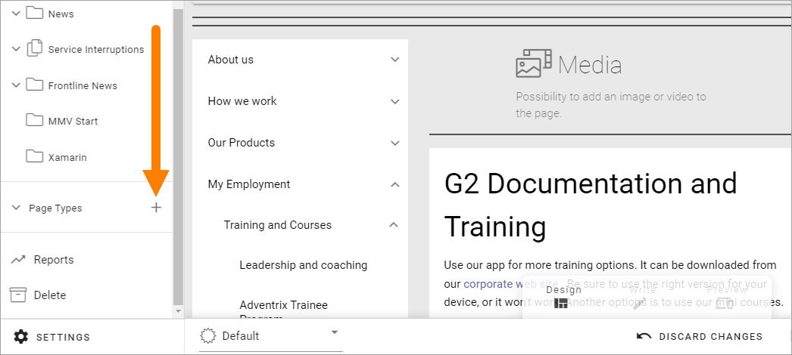

Create a new Page Type
========================

To create a new page type when you're editing a page, do the following.

Note that if your organization works with Tenant Page Types you first have to consider if you should add it as a Tenant Page Type or a Local Page Type. For more information, see this page: :doc:`Tenant Page Types </admin-settings/tenant-settings/webcontent-managament/page-types/index>`

1. Click the plus for Page Types.

2. Add a name for the new page type and click "CREATE".

.. image:: page-types-click-create-new.png

3. Now start to build the the base layout by adding sections. Note that there are a number of Layout Templates you can use as a starting point (see to the right).

.. image:: page-types-add-sectionnew.png

There are a number of sections you can use. 

.. image:: page-types-base-layout2-new.png

See the images on the icons for the layouts, for a simple preview of the layout.

For a description of the section settings, see: :doc:`Section settings </pages/page-types/section-settings/index>`

5. You then add blocks for the page's content.

.. image:: page-types-blocks.png

For more information on how to use sections and blocks on pages, see: :doc:`Sections and blocks in a Page Type </pages/page-types/working-with-sections-and-blocks/index>`

For information on how to work with blocks, see: :doc:`Working with blocks on pages </blocks/working-with-blocks/index>`

All blocks you can use are listed here: :doc:`Blocks </blocks/index>`

