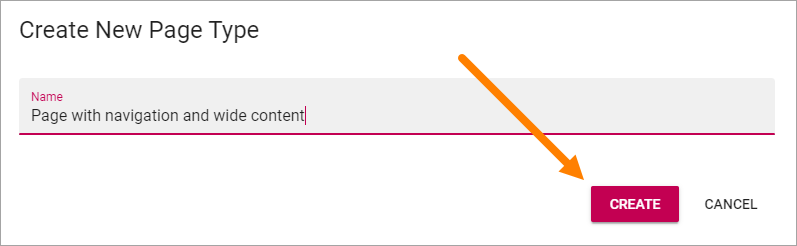
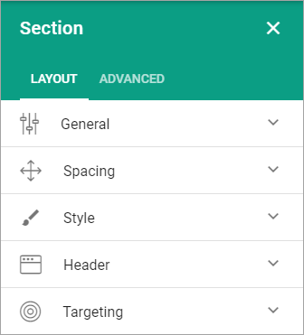
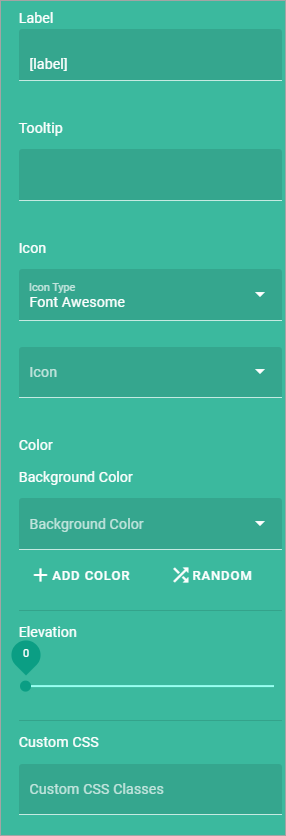
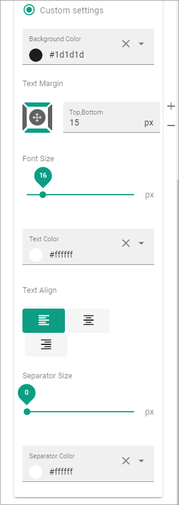
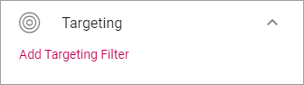
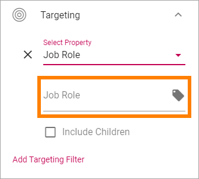

Create a new Page Type
========================

To create a new page type when you're editing a page, do the following:

1. Click the plus for Page Types.

.. image:: page-types-click-plus.png

2. Add a name for the new page type and click "CREATE".

3. Click the plus to add a section.

.. image:: page-types-add-section.png

4. Select a base layout.

.. image:: page-types-base-layout2.png

See the images on the icons for the layouts, for a simple preview of the layout.

5. Use the section settings:

General
**********
What you can set under General depends on if you select a section with columns or a section with tabs. 

General settings for a section with columns
------------------------------------------------
For a section with columns, the following can be set:

.. image:: page-types-general-new.png

+ **Width Type**: Set dynamic width ("Full Page") or a fixed width in pixels. When you have selected Fixed, a slider is shown where you can set the width.
+ **Column**: Using the sliders, set a width for each of the column. Default = same width for every column.
+ **Add Column**: You can add a column if needed. The same settings as above can then be used for the new column. 

To remove a column, click the dust bin. By clicking the pen, the following can be set for a column:

.. image:: page-types-columns-pen.png

+ **Chrome**: Set boxed or not for the column.
+ **Color**: The background color for the column can be set here.
+ **Elevation**: If the column should stand out from the page, use the slider to set how much.
+ **Custom CSS**: You can use custom CSS for formatting the column.^

General settings for a section with tabs
-----------------------------------------
For a section with tabs, the following can be set:

.. image:: page-types-general-tabs.png

+ **Width Type**: Set dynamic width ("Full Page") or a fixed width in pixels. When you have selected Fixed, a slider is shown where you can set the width available for the tabs.
+ **Tabs**: Here you can edit the settings for each tab, by clicking the pen. See information about these settings below.
+ **Add tab**: Ta add a new tab, click here. You edit the settings as described below. To remove a tab, click the dust bin. 
+ **Tab Type**: You can choose to just have a "normal" tab an accordion tab. The difference is that a "normal" tab displays it's content all the time, an accordion tab displays it's content when it's clicked.
+ **Show Active Slider**: Available for "normal" tabs. Indicates which tab is active.
+ **Tab Alignment"**: Available for "normal" tabs. The tabs are aligned within where the tabs are placed.

By clicking the pen, the following can be set for a tab:

+ **Label**: If a label should be shown for the tab, add the label here.
+ **Tooltip**: If a tooltip should be shwon for the tab, add it here.
+ **Icon**: First select the "Icon Type" and then select the icon in the list below, if an icon should be shown. (If no icon should be shown, just don't select an icon, it doesn't matter that an Icon Type is selected.)
+ **Color**: The background color for the tab can be set here.
+ **Elevation**: If the tab should stand out from the page, use the slider to set how much.
+ **Custom CSS**: You can use custom CSS for formatting the tab.

Spacing
***********
Here you can set the following:

.. image:: page-types-spacing.png

+ **Section Padding**: Here you can set some padding within the active section.
+ **Column Spacing**: Here you can set the spacing between the columns in this section.
+ **Block Spacing**: You can set spacing between blocks in this section. 

Style
************
Available settings for Style depends on if it's a section with columns or a section with tabs.

Style settings for columns
------------------------------
If it's a section with columns, this can be set for Style, for the active section:

.. image:: page-types-style2.png

+ **Minimum Height**: You can make sure that this section always has a minimun height, regardless of what is shown in the section. Set the height in pixels here.
+ **Background color**: A default background color for sections are set in Omnia Admin. You can set another background color for this section here, if needed.
+ **Background image**: Another option is to use an image as background in this section. When you click "Add Image", the Media Picker starts, see this page for more information: :doc:`Media Picker </general-assets/media-picker/index>`
+ **Elevation**: With this setting you can make the content of the section “stand out” from the page. ^

Style settings for tabs
--------------------------
If it's a section with tabs, this can be set for Style, for the active section:

.. image:: page-types-style-tabs.png

+ **Minimum Height**: You can make sure that this section always has a minimun height, regardless of what is shown in the section. Set the height in pixels here.
+ **Background Color Tabs**: A default background color for sections are set in Omnia Admin. You can set another background color for the tabs in this section here, if needed.
+ **Text Color Tabs**: You can set text color for the tabs here.
+ **Background color**: A default background color for sections are set in Omnia Admin. You can set another background color for this section here (that is the whole section, not just the tab), if needed.
+ **Background image**: Another option is to use an image as background in this section. When you click "Add Image", the Media Picker starts, see this page for more information: :doc:`Media Picker </general-assets/media-picker/index>`
+ **Elevation**: With this setting you can make the content of the section “stand out” from the page. 

Header
****************
Here you can set the following:

.. image:: page-types-settings-header.png

+ **Title**: If you want a Title to be displayed for the section, add it here. Not mandatory.

You can then decide to use the global settings for the business profile, or custom settings. 

The global settings are set in Omnia Admin, see the bottom at this page: :doc:`Header Settings </admin-settings/business-group-settings/settings/index>`

When selecting custom settings, the following is available:

This is the same settings as for the global settings, see the link above.

Targeting
***************
A section can be targeted by using this setting:

Targeting must have been setup in Omnia Admin for this to work, see that section on this page: :doc:`Properties </admin-settings/tenant-settings/properties/index>`

To set up targeting for the section, do the following:

1. Click "Add Targeting Filter".
2. Select Property for Targeting.

.. image:: page-types-settings-targeting-property-new.png

3. Select one or more children for the property.

Or:

3. Select "Include Children", to include all children pf the property.

.. image:: page-types-settings-targeting-properties-children-new.png

4. Click "Add Targeting Filter" to add additional filters.

.. image:: page-types-settings-targeting-additional-new.png

To remove a targeting filter, just click the X.

Advanced Settings
*******************
In the advanced settings you can use custom CSS styling for the section.

.. image:: page-types-settings-advanced-new3.png