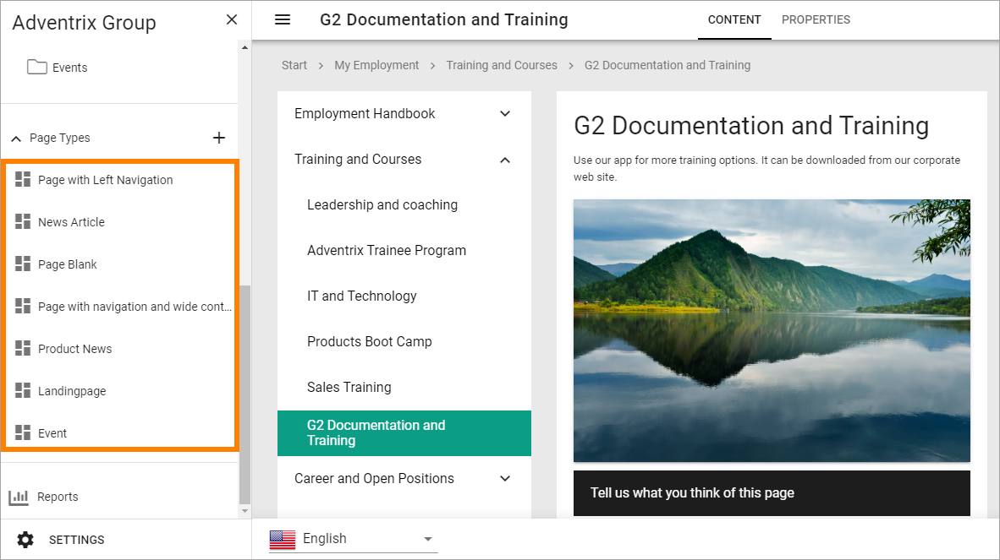

Edit a local page type
=========================

Page types can either be local, meaning they are only available in the publishing app where they are created, or tenant page types. Tenant page types can be made available in all publishing apps in the tenant.

To edit a local page type, do the following:

1. Go to any page.
2. Edit the page.

.. image:: page-types-edit-page-new.png

3. Open this menu (if it doesn't open automatically):

.. image:: page-types-open-menu-new.png

4. Open the list of page types at the bottom:

.. image:: page-types-open-list-new.png

5. Select the page type you want to edit.

6. Click "Edit".

.. image:: page-types-click-edit-new.png

7. Edit and remove/add sections and blocks the normal way.

For more information about tenant page types, see: :doc:`Tenant page types </admin-settings/tenant-settings/webcontent-managament/page-types/index>`

For information about section settings, see :doc:`Section settings </pages/page-types/section-settings/index>`

For more information about sections and blocks, see :doc:`Working with sections and blocks </pages/page-types/working-with-sections-and-blocks/index>`
