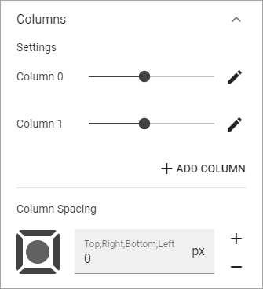
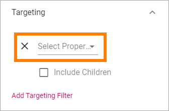
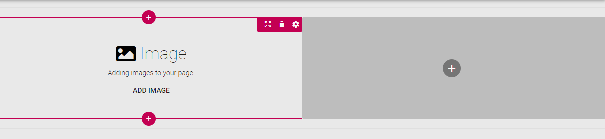

Page Types
==================

An administrator or an editor with the correct permissions can work with Page Types. A Page Type contains sections where blocks can be placed for content. Sections can be targeted.

Some blocks can be added to a Page Type so they are a part of the layout presented to editors of a page based on the Page Type. See the bottom of this page for more information on Blocks that belong to the Page Type.

When a new page is created, the editor can choose Page Type from any available in the Pag Type list.

Edit a Page Type
*****************
To edit a Page Type, do the following:

1. Go to any page.
2. Edit the page.

.. image:: page-types-edit-page.png

3. Open this menu:

.. image:: page-types-open-menu.png

4. Open the list of Page Types at the bottom:

.. image:: page-types-open-list.png

5. Select the Page Type you want to edit.

.. image:: page-types-edit-select.png

6. Click "Edit".

.. image:: page-types-click-edit.png

7. To edit a Section, click the section, then the plus for the section, and then the cog wheel.

.. image:: page-types-edit-section.png

For information about various settings and how to place Blocks, see below.

Create a new Page Type
**************************
To create a new Page Type when you're editing a page, do the following:

1. Click the plus for Page Types.

.. image:: page-types-click-plus.png

2. Add a name for the new Page Type and click "CREATE".

.. image:: page-types-click-create.png

3. Click the plus to add a section.

.. image:: page-types-add-section.png

4. Select a base layout.

.. image:: page-types-base-layout.png

See the images for the layouts for a simple preview of the layout.

5. Use the Section settings:

.. image:: page-types-section-settings.png

General
----------
Under General, the following can be set:

.. image:: page-types-general.png

+ **Alignment**: You can set Left, Centred or Right Alignment for the blocks in the Section. Default=Left.
+ **Width Type**: Set dynamic width ("Full Page") or a Fixed width in pixels. When you have selected Fixed, a slider is shown where you can det the width.
+ **Section Margin**: Set a Margin in pixels, inside the Section if needed. Default=0.

Columns
--------
Under Columns you can set the following:

+ **Settings**: Here you can set the width for each Column by using the sliders. 

By clicking the pen, the following can be set for a column:

.. image:: page-types-columns-pen-border.png

+ **Chrome**: Set Boxed or not for the Column.
+ **Color**: The Background Color for the Column can be set here.
+ **Custom CSS**: You can use Custom CSS for formatting the Column.
+ **Remove Column**: If the Column should be removed, click here.

+ **Add Column**: You can add a Column if needed. The same settings as above can then be used for the new Column.
+ **Column Spacing**: Set some Spacing between the columns, if needed.

Blocks
---------
With this setting you can add some spacing between Blocks in the Section.

.. image:: page-types-settings-blocks.png

Targeting
----------
A Section can be targeted by using this setting:

.. image:: page-types-settings-targeting-border.png

Targeting must have been setup in Omnia Admin for this to work, see: :doc:`Targeting Properties </admin-settings/tenant-settings/targeting-properties/index>`

To set Targeting for the Section, do the following:

1. Click "Add Targeting Filter".
2. Select Property for Targeting.

3. Select one or more children for the Property.

.. image:: page-types-settings-targeting-properties-metadata.png

Or:

3. Select "Include Children", to include all children for the Property.

.. image:: page-types-settings-targeting-properties-children.png

4. Click "Add Targeting Filter" to add additional filters.

.. image:: page-types-settings-targeting-additional.png

To remove a Targeting Filter, just click the X.

Header
--------
Here you can set the following:

.. image:: page-types-settings-heading.png

+ **Title**: If you want a Title to be displayed for the Section, add it here. 

You can then decide to use the Global settings for the Business Profile, or Custom Settings. 

The Global settings are set in Omnia Admin, see the bottom at this page: :doc:`Global Content Header Settings </admin-settings/business-group-settings/settings/index>`

When selecting Custom Settings, the following is available:

.. image:: page-types-settings-header-custom.png

This is the same settings as for the Global Settings, see the link above.

Advanced Settings
----------------------
In the Advanced Settings you can use Custom CSS Styling for the block.

.. image:: page-types-settings-advanced. png

Create a Section in a Column
******************************
If nedded, you can create a Section in a Column and then select a layout for the Column and set all other Sections Settings. Here's how:

1. Click the plus for the Column.

.. image:: column-layout-click-plus.png

2. Open the Layout list.

.. image:: column-layout-list.png

3. Select Layout for the Column.

.. image:: column-layout-list-open.png

4. Set the Sections Settings (see above).

If needed, you can even go a step further and create a new Section in one of the new Columns.

Delete a section
*****************
If you need to delete a section, here's how to do it:

1. Click in the Section (not on any plus).

.. image:: delete-section-1.png

2. Click the dust bin for the Section.

.. image:: delete-section-2.png

Adding blocks to a Section
***************************
Here's how to add a block to a section:

1. Click the plus for the Section.
2. Select Block to add.

.. image:: section-add-block.png

Here's an example with a Block added:

You add additional Blocks, work with the settings, move or delete Blocks the same way as editors do when editing a page, see: :doc:`Working with Blocks </blocks/working-with-blocks/index>`

**Note!** When editing a page, Blocks that belong to the Page Type is locked, meaning they can not be moved or deleted, and settings for those Blocks can't be edited. But content can be edited, if applicable, using Write mode. 

.. image:: using-write-mode.png

More information on editing Blocks when editing a Page, is found here: :doc:`Edit a Page </pages/edit-page/index>`

 