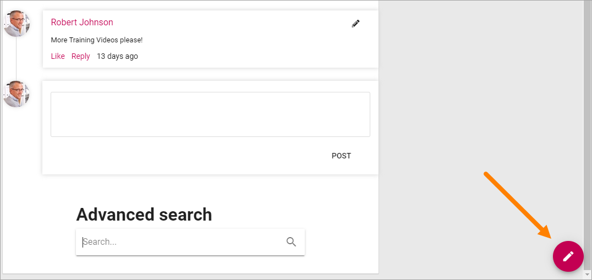
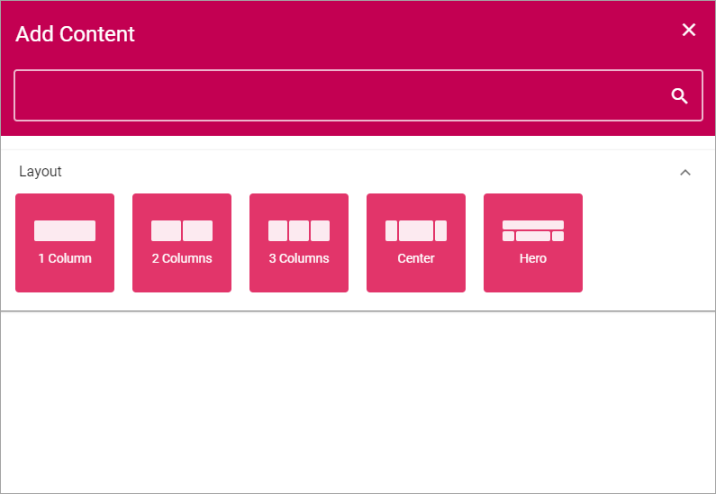

Page Types
==================

**(This descrption is just started, more will be added soon.)**

An administrator or an editor with the correct permissions can work with Page Types. A Page Type contains sections where blocks can be placed for content. Sections can be targeted.

Some blocks can be added to a Page Type so they are a part of the layout presented to editors of a page based on the Page Type.

Edit a Page Type
*****************
To edit a Page Type, do the following:

1. Go to any page.
2. Edit the page.

3. Open this menu:

.. image:: page-types-open-menu.png

4. Open the list of Page Types at the bottom:

.. image:: page-types-open-list.png

5. Select the Page Type you want to edit.

.. image:: page-types-edit-select.png

6. Click "Edit".

.. image:: page-types-click-edit.png

7. To edit a Section, click the section, then the plus for the section, and then the cog wheel.

.. image:: page-types-edit-section.png

For information about various settings and how to place Blocks, see below.

Create a new Page Type
**************************
To create a new Page Type when you're editing a page, do the following:

1. Click the plus for Page Types.

.. image:: page-types-click-plus.png

2. Add a name for the new Page Type and click "CREATE".

.. image:: page-types-click-create.png

3. Click the plus to add a section.

.. image:: page-types-add-section.png

4. Select a base layout.

5. Use the Section settings:

.. image:: page-types-section-settings.png

(More information will be added tomorrow.)

 