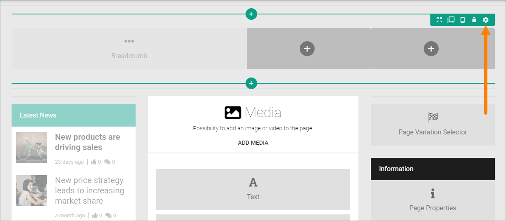
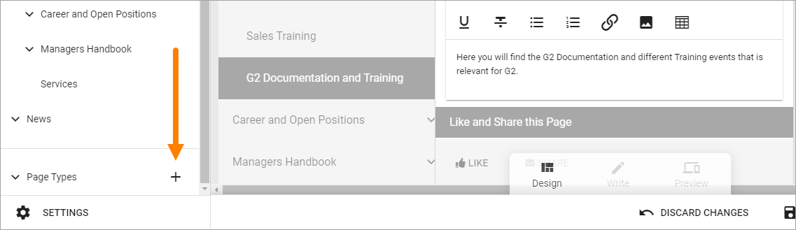
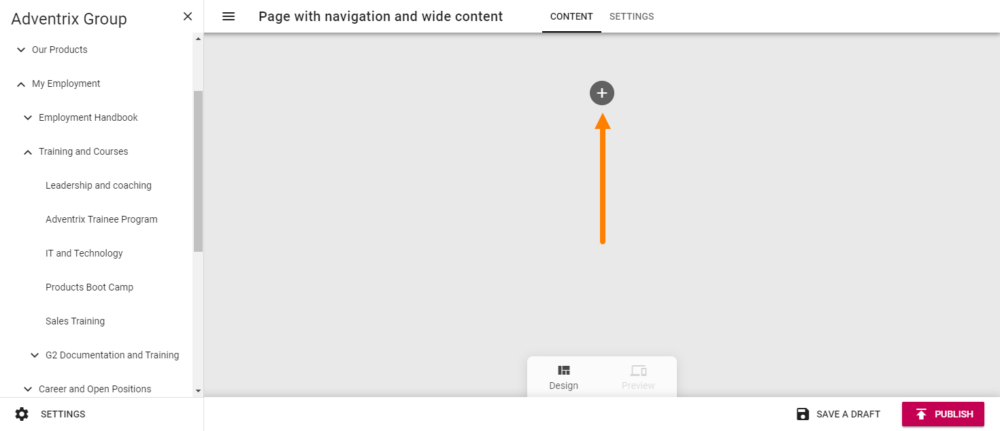
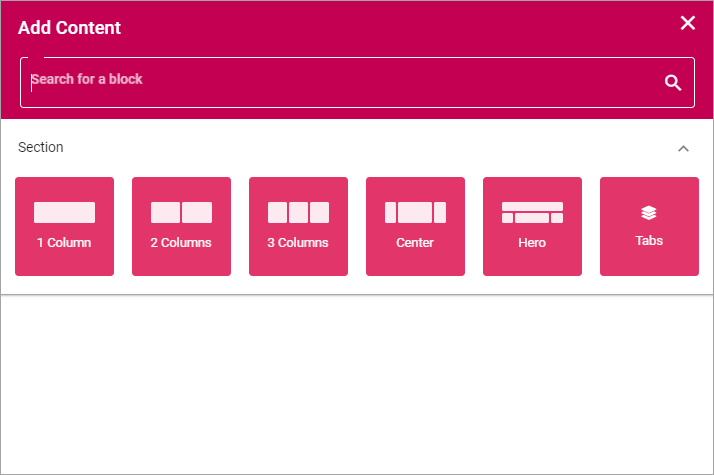
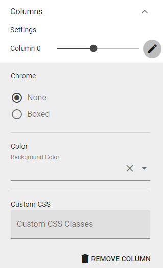
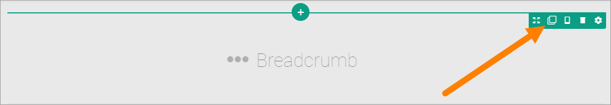
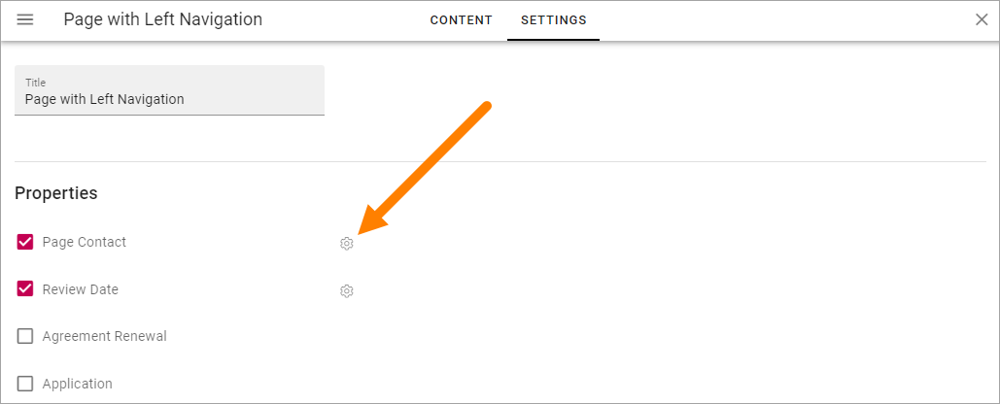
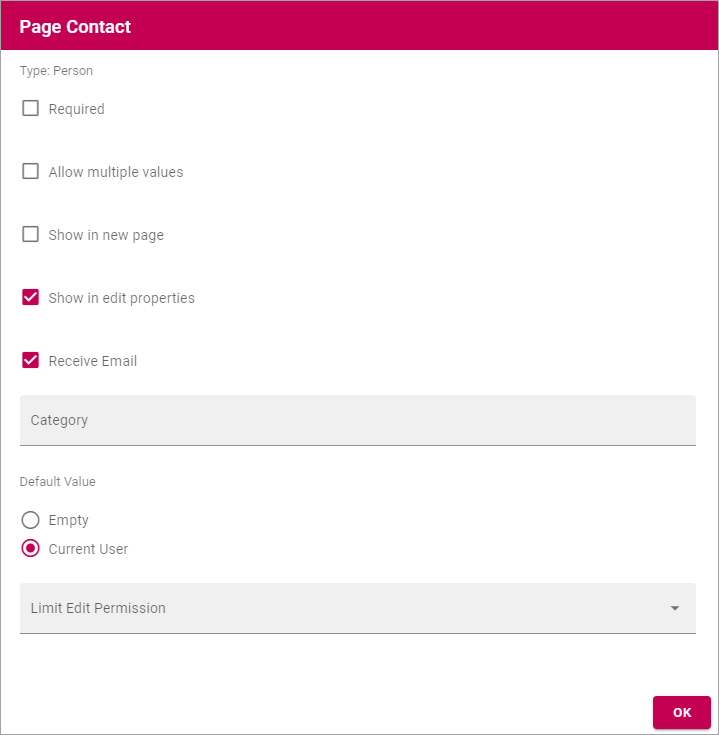
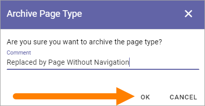

Page Types
==================

If you are Publishing App administrator you can work with Page Types. A page type contains sections where blocks can be placed for content. Sections can be targeted.

Some blocks can be added to a page type so they are a part of the layout presented to editors of a page based on the Page Type. See the bottom of this page for more information on blocks that belong to the Page Type.

When a new page is created, the Editor or Author can choose page type from any available in the page type list.

An unsued Page Type can be archived (and then kept or deleted), see the bottom of this page.

Edit a Page Type
*****************
To edit a page type, do the following:

1. Go to any page.
2. Edit the page.

.. image:: page-types-edit-page-new.png

3. Open this menu (if it doesn't open automatically):

.. image:: page-types-open-menu-new.png

4. Open the list of page types at the bottom:

.. image:: page-types-open-list-new.png

5. Select the page type you want to edit.

.. image:: page-types-edit-select-new.png

6. Click "Edit".

.. image:: page-types-click-edit-new.png

7. To edit settings for a section, click the section, and then the cog wheel.

For information about various settings and how to place Blocks, see below.

Create a new Page Type
**************************
To create a new page type when you're editing a page, do the following:

1. Click the plus for Page Types.

2. Add a name for the new page type and click "CREATE".

.. image:: page-types-click-create.png

3. Click the plus to add a section.

4. Select a base layout.

See the images on the icons for the layouts, for a simple preview of the layout.

5. Use the section settings:

.. image:: page-types-section-settings-new.png

General
----------
What you can set under General depends on if you select a section with columns or a section with tabs. 

General settings for a section with columns
^^^^^^^^^^^^^^^^^^^^^^^^^^^^^^^^^^^^^^^^^^^^
For a section with columns, the following can be set:

.. image:: page-types-general-new.png

+ **Width Type**: Set dynamic width ("Full Page") or a fixed width in pixels. When you have selected Fixed, a slider is shown where you can set the width.
+ **Column**: Using the sliders, set a width for each of the column. Default = same width for every column.
+ **Add Column**: You can add a column if needed. The same settings as above can then be used for the new column. 

To remove a column, click the dust bin. By clicking the pen, the following can be set for a column:

+ **Chrome**: Set boxed or not for the column.
+ **Color**: The background color for the column can be set here.
+ **Elevation**: If the column should stand out from the page, use the slider to set how much.
+ **Custom CSS**: You can use custom CSS for formatting the column.^

General settings for a section with tabs
^^^^^^^^^^^^^^^^^^^^^^^^^^^^^^^^^^^^^^^^^^^^
For a section with tabs, the following can be set:

.. image:: page-types-general-tabs.png

+ **Width Type**: Set dynamic width ("Full Page") or a fixed width in pixels. When you have selected Fixed, a slider is shown where you can set the width available for the tabs.
+ **Tabs**: Here you can edit the settings for each tab, by clicking the pen. See information about these settings below.
+ **Add tab**: Ta add a new tab, click here. You edit the settings as described below. To remove a tab, click the dust bin. 
+ **Tab Type**: You can choose to just have a "normal" tab an accordion tab. The difference is that a "normal" tab displays it's content all the time, an accordion tab displays it's content when it's clicked.
+ **Show Active Slider**: Available for "normal" tabs. Indicates which tab is active.
+ **Tab Alignment"**: Available for "normal" tabs. The tabs are aligned within where the tabs are placed.

By clicking the pen, the following can be set for a tab:

.. image:: page-types-tabs-pen.png

+ **Label**: If a label should be shown for the tab, add the label here.
+ **Tooltip**: If a tooltip should be shwon for the tab, add it here.
+ **Icon**: First select the "Icon Type" and then select the icon in the list below, if an icon should be shown. (If no icon should be shown, just don't select an icon, it doesn't matter that an Icon Type is selected.)
+ **Color**: The background color for the tab can be set here.
+ **Elevation**: If the tab should stand out from the page, use the slider to set how much.
+ **Custom CSS**: You can use custom CSS for formatting the tab.

Spacing
--------
Here you can set the following:

.. image:: page-types-spacing.png

+ **Section Padding**: Here you can set some padding within the active section.
+ **Column Spacing**: Here you can set the spacing between the columns in this section.
+ **Block Spacing**: You can set spacing between blocks in this section. 

Style
------
Available settings for Style depends on if it's a section with columns or a section with tabs.

Style settings for columns
^^^^^^^^^^^^^^^^^^^^^^^^^^
If it's a section with columns, this can be set for Style, for the active section:

.. image:: page-types-style2.png

+ **Minimum Height**: You can make sure that this section always has a minimun height, regardless of what is shown in the section. Set the height in pixels here.
+ **Background color**: A default background color for sections are set in Omnia Admin. You can set another background color for this section here, if needed.
+ **Background image**: Another option is to use an image as background in this section. When you click "Add Image", the Media Picker starts, see this page for more information: :doc:`Media Picker </general-assets/media-picker/index>`
+ **Elevation**: With this setting you can make the content of the section “stand out” from the page. ^

Style settings for tabs
^^^^^^^^^^^^^^^^^^^^^^^^^^
If it's a section with tabs, this can be set for Style, for the active section:

.. image:: page-types-style-tabs.png

+ **Minimum Height**: You can make sure that this section always has a minimun height, regardless of what is shown in the section. Set the height in pixels here.
+ **Background Color Tabs**: A default background color for sections are set in Omnia Admin. You can set another background color for the tabs in this section here, if needed.
+ **Text Color Tabs**: You can set text color for the tabs here.
+ **Background color**: A default background color for sections are set in Omnia Admin. You can set another background color for this section here (that is the whole section, not just the tab), if needed.
+ **Background image**: Another option is to use an image as background in this section. When you click "Add Image", the Media Picker starts, see this page for more information: :doc:`Media Picker </general-assets/media-picker/index>`
+ **Elevation**: With this setting you can make the content of the section “stand out” from the page. 

Header
--------
Here you can set the following:

.. image:: page-types-settings-header.png

+ **Title**: If you want a Title to be displayed for the section, add it here. Not mandatory.

You can then decide to use the global settings for the business profile, or custom settings. 

The global settings are set in Omnia Admin, see the bottom at this page: :doc:`Header Settings </admin-settings/business-group-settings/settings/index>`

When selecting custom settings, the following is available:

.. image:: page-types-settings-header-custom-new2.png

This is the same settings as for the global settings, see the link above.

Targeting
----------
A section can be targeted by using this setting:

.. image:: page-types-settings-targeting-new.png

Targeting must have been setup in Omnia Admin for this to work, see that section on this page: :doc:`Properties </admin-settings/tenant-settings/properties/index>`

To set up targeting for the section, do the following:

1. Click "Add Targeting Filter".
2. Select Property for Targeting.

.. image:: page-types-settings-targeting-property-new.png

3. Select one or more children for the property.

.. image:: page-types-settings-targeting-properties-metadata-new.png

Or:

3. Select "Include Children", to include all children pf the property.

.. image:: page-types-settings-targeting-properties-children-new.png

4. Click "Add Targeting Filter" to add additional filters.

.. image:: page-types-settings-targeting-additional-new.png

To remove a targeting filter, just click the X.

Advanced Settings
----------------------
In the advanced settings you can use custom CSS styling for the section.

.. image:: page-types-settings-advanced-new3.png

Create a Section in a Column
******************************
If needed, you can create a section in a column and then select a layout for the column and set all other section's settings. Here's how:

1. Click the plus for the column.

.. image:: column-layout-click-plus.png

2. Open the Layout list.

.. image:: column-layout-list.png

3. Select layout for the column.

.. image:: column-layout-list-open.png

4. Set the section's settings (see above).

If needed, you can even go a step further and create a new section in one of the new columns.

Delete a section
*****************
If you need to delete a section, here's how to do it:

1. Click in the section (not on any plus).

.. image:: delete-section-1.png

2. Click the dust bin for the section.

.. image:: delete-section-2-new.png

Move a section
***************
Do the following to move a section to another placement on the page.

1. Click the section.
2. Click the Move icon.

.. image:: move-icon-section.png

Icons now show where you can move the section, for example:

.. image:: can-be-moved-section.png

3. Click the icon where you want the section and it's moved there.

Copy a section
***************
If you need a section with roughly the same settings somewhere else on the page, you can copy a section and place the copy where you want it, and then edit the settings. Do the following:

1. Click the section.
2. Click the Copy icon.

Icons now show where you can add the new section, the same way as when you move a section, for example:

.. image:: section-can-be-copied.png

3. Click the icon where you want the copied section and it's placed there.
4. Edit the settings that you want to change.

Adding blocks to a Section
***************************
Here's how to add a block to a section:

1. Click the plus for the section.
2. Select block to add.

.. image:: section-add-block.png

Here's an example with a block added:

.. image:: section-block-added-new.png

You add additional blocks, work with the settings, move or delete blocks the same way as editors do when editing a page, see: :doc:`Working with Blocks </blocks/working-with-blocks/index>`

**Note!** When editing a page, blocks that belong to the Page Type is locked, meaning they can not be moved or deleted, and settings for those blocks can't be edited. But content can be edited, if applicable, using Write mode. 

.. image:: using-write-mode.png

More information on editing blocks when editing a page, is found here: :doc:`Edit a Page </pages/edit-page/index>`

Decide to show a section on a device or not
**********************************************
When you're working on a section you can select to show it on different devices or not.

Click this icon:

.. image:: device-support-section-new.png

You can now use the following settings:

.. image:: select-device-section-new.png

To hide a section for a device, do the following:

1. Select the device.
2. Click the pen for Visibility.
3. Select Hide Section.

To add som padding for the section, for a specific device, do the following:

1. Select the device.
2. Click the pen for Section Padding.
3. Set the padding.

Settings
*********
On the "Settings" tab you can set the Properties for all pages created from this Page Type. In many cases it results in fields the page editor has to or can fill in for a page. You can select any of the properties defined in the tenant. See this page for more information about setting up properties: :doc:`Tenant Settings - Properties </admin-settings/tenant-settings/properties/index>`

Here's an example with a Page Type with left navigation:

.. image:: page-type-settings-left-new2.png

(For a description of "Override Sharepoint Sync Settings", see below.)

If properties was selected as in the image above it would result in these fields being available on the Properties tab for a page:

.. image:: page-type-settings-left-fields-new2.png

And here's an example with a Page Type for News:

.. image:: page-type-settings-news-new.png

Which results in these fields being available on the Properties tab for a News Article page:

.. image:: page-type-settings-news-fields-new.png

Set properties for the Page Type this way:

1. Select the properties to be used for this Page Type.
2. Click the cog wheel for more settings for a property.

Something like the following is shown:

The following settings can be available for a property:

+ **Required**: The editor creating the page has to enter information in the field.
+ **Allow multiple values**: For some properties multiple values are possible. If you will allow the editor to enter more than one value, check this option. If multiple values is not possible for the property, this option is not shown.
+ **Show in new page**: If the property (field) should be available in the New Page Wizard when creating a page, select this option.
+ **Show in edit properties**: If the property should be available on the Properties tab for a page created from this Page Type, select this option.
+ **Date only**: If it's a date/time field, both date and time can be set, or only the date. If you would like juat the date to be set, not the time, select this option.
+ **Receive e-mail**: This is available for most people properties. If the colleague set for this property should receive e-mails, select this option.
+ **Category**: This a preparation for future functionality. No need to enter anything here now.
+ **Default value**: A default value can be entered here. A defalt value can be edited by the author. What is possible to select here differs with type of property. 
+ **Limit Edit Permission**: You can limit Edit Permission for this property if needed. In that case, add one or more users here.

Override Sharepoint Sync Settings
------------------------------------
Sharepoint Sync Settings are set in Omnia Admin (available under Web Content Management), for the whole tenant. If you need some other synchronization for pages created from this Page Type, you can override the tenant settings and create a specific synchronization here.

When you activate this option, the following is shown:

.. image:: page-type-settings-override-message.png

And then something like the following is available:

.. image:: page-type-settings-override.png

The settings are used exactly the same way here as the settings for the tenant. See this page for more information:

:doc:`Web Content Management </admin-settings/tenant-settings/webcontent-management/index>`

When you have set up the sync here, you must execute a full sync to Sharepoint, as the message stated. Go to the Publishing App settings and click this button:

.. image:: page-type-settings-sync-button.png

Archive a Page type
**********************
An unused Page Type can be archived. If the Page Type is used for any active page, it can't be archived. If the pages are archived, the Page Type can also be archived.

Do the following to archive a Page Type:

1. Select the Page Type.

.. image:: archive-page-type-select.png

2. Open the action menu and select ARCHIVE.

.. image:: archive-page-type-select-menu.png

3. Type a comment and click OK.

Restore or delete a Page Type
******************************
An archived Page Type can be restored if you should need it again. An archived Page Type can also be deleted if needed.

1. Edit any page.
2. Select ARCHIVE.

.. image:: archive-page-type-restore-menu.png

3. Select PAGE TYPES.

.. image:: archive-page-type-restore-menu-select.png

4. Use the icons to the right to restore or delete an archived Page Type.

.. image:: archive-page-type-restore-icons.png
