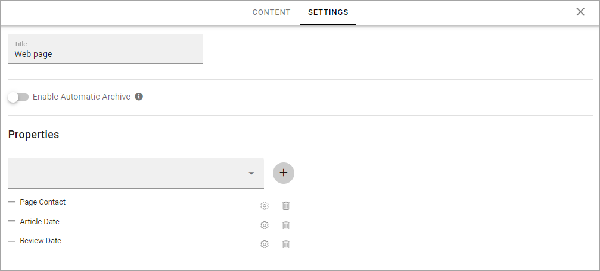
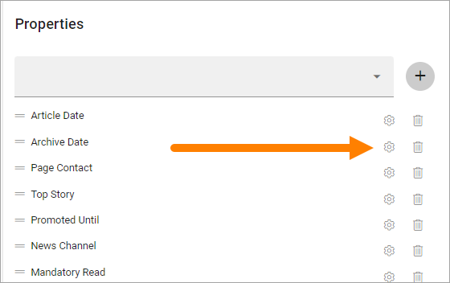
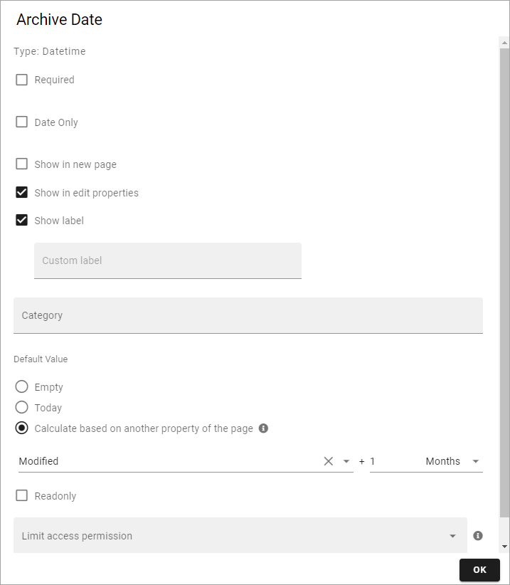
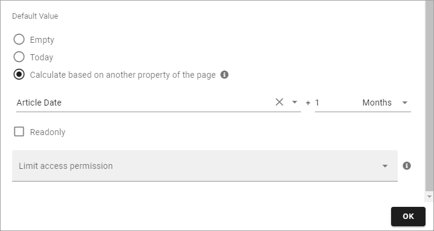
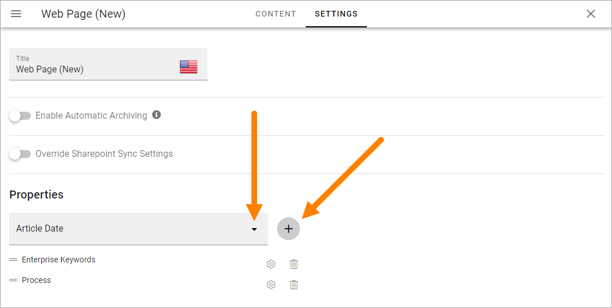
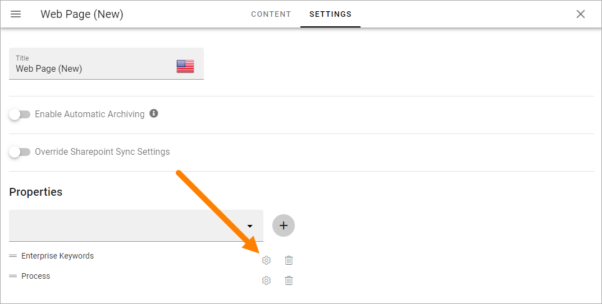
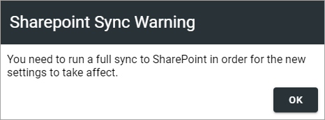
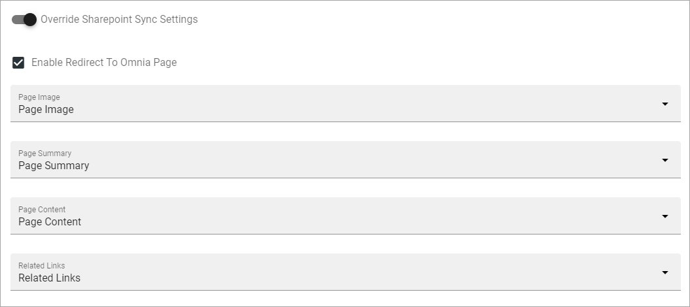
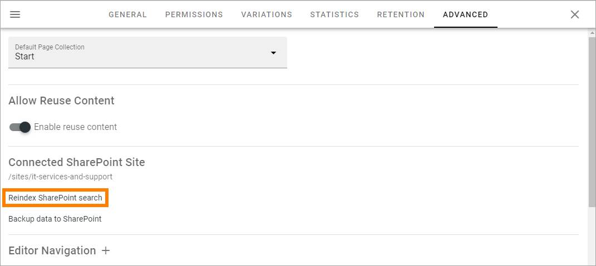

Page Type Settings
======================

The following can be available on the Settings tab:

.. image:: page-type-settings-left-v7.png

+ **Title**: The name of the Page Type can be edited here.
+ **Enable Automatic Archiving**: Set Automatic Archiving on or off for the Page Type. See below for more information.
+ **Override Sharepoint Sync Settings**: Available for local Page Types (not for Tenant ones). See below for a description.
+ **Properties**: Select the Properties that should be available for pages created from this Page Type. In many cases it results in fields the page editor has to or can fill in for a page. You can select any of the properties defined in the tenant. See this page for more information about setting up properties: :doc:`Tenant Settings - Properties </admin-settings/tenant-settings/properties/index>` 

Enable Automatic Archive
***************************
Using this option you can activate automatic archiving for pages created from this Page Type. When a page is automatically archived, it is deleted and placed in the archive, the same way as when an editor deletes a page manually.

Here's a Tenant Page Type as an example:

When you click "Enable Automatic Archive" the following is shown:

.. image:: automatic-archive-settings-new.png

Select a property to base the automatic archiving on. **Note!** Best practice is to create a specific property to use for this purpose. Any Custom property of type date or time can be used.

You can then edit the settings for the property you have chosen by clicking the cogwheel for the property.

Available options can differ depending on how the property is set up. Here's an example:

Note that the settings you do for a property here is valid for this Page Type only. It does not affect the property in any other way.

For a description of the fields, see above. Note that a poperty used for automatic archiving should always be read only. 

For more information on deleting, archiving, retrieving and terminating pages, see: :doc:`Delete a page </pages/delete-page/index>`

Calculate based on another property on the page
------------------------------------------------
Automatic archiving can be a calculated value. Note that the property that is used as base for the calculation, must be one of the other properties for the page.

In this example, the page should be automatically archived one month after the article date:

Note that if the value for the base property can be edited, which often is the case for Article Date, the automatic archiving date is automatically recalculated if the value of the base property is edited.

Automatic termination
-----------------------
Furthermore you can set automatic termination from the archive, based on archiving date. You can find that setting in the Publishing App Settings. See the heading "Archive" at the bottom of this page: :doc:`Publishing App Settings </pages/page-settings/index>`

Settings for Properties
******************************
Add a Property to the Page Type this way:

1. Select the property in the list and click the plus.

Remove a property by clicking the dust bin.

To edit settings for a property, do the following:

1. Click the cog wheel for the property.

Something like the following is shown:

.. image:: page-type-settings-dot-menu-settings-v7.png

Note that the settings you do for a property here is valid for this Page Type only. It does not affect the property in any other way.

The following settings can be available for a property (not all are shown in the image above):

+ **Required**: Select this option to make it mandatory to add settings to this property for all pages that use this Page Type.
+ **Allow multiple values**: For some properties multiple values are possible. If you will allow the editor to enter more than one value, check this option. If multiple values is not possible for the property, this option is not shown.
+ **Date Only**: If date should be the only type of data possible for this property, select this option.
+ **Show in new page**: if this property should be available in the wizard when a new page is created, select this option.
+ **Show in edit properties**: if this property should be available in settings for a page when it's edited, select this option.
+ **Show label**: Select this to show the label for the property.
+ **Custom label**: If Show label is selected, the property name is displayed per default. If you want another label to be displayed, add it here.
+ **Category**: You can add a category for this property, used when listing properties for the Page Type.
+ **Default value**: Use this setting to decide what should be shown for the property as a suggested value, when the page is created. Empty is just that, no value. Today displays todays date. You can also base the automatic archiving on another property. See below for more information.
+ **Read only**: You should normally not edit this option. (But see below concerning automatic archiving).
+ **Limit access permission**: If not all authors are permitted to edit this setting for the Page Type, add the colleagues or groups that should be able to edit these settings here.

2. Edit the settings as needed and click OK.

Override Sharepoint Sync Settings
************************************
Sharepoint Sync Settings are set in Omnia Admin (available under Web Content Management), for the whole tenant. If you need some other synchronization for pages created from this Page Type, you can override the tenant settings and create a specific synchronization here.

This option is available for local Page Types, not for Tenant Page Types.

When you activate this option, the following is shown:

And then something like the following is available:

The settings are used exactly the same way here as the settings for the tenant. See this page for more information: :doc:`Sharepoint Sync </admin-settings/tenant-settings/webcontent-managament/sharepoint-sync/index>`

When you have set up the sync here, you must execute a reindex/full sync to Sharepoint, as the message stated. You do that in the Publishing App settings:

