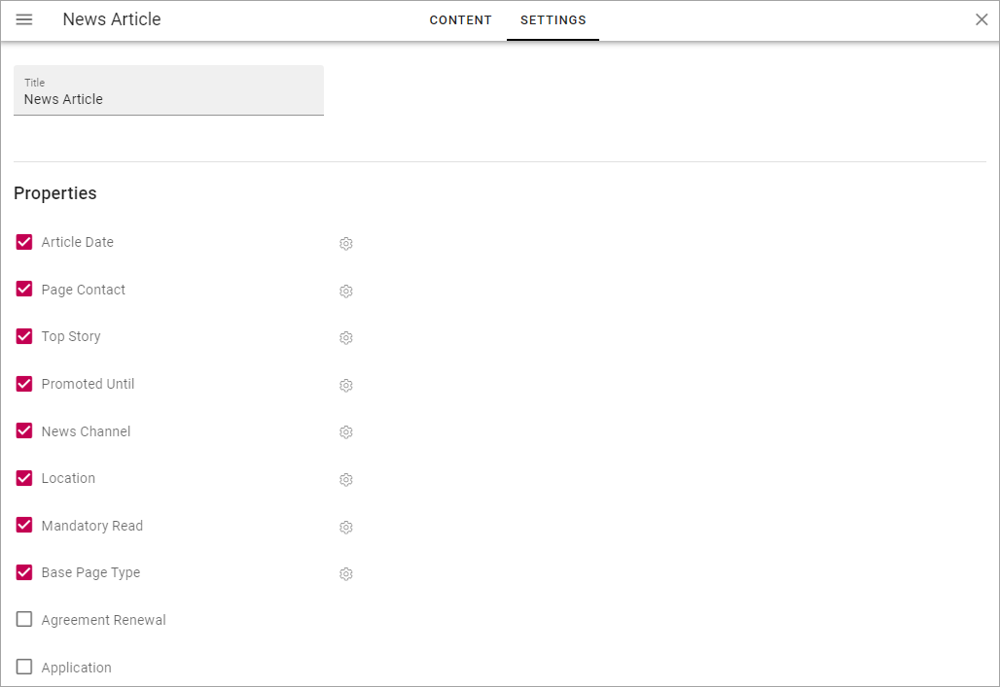
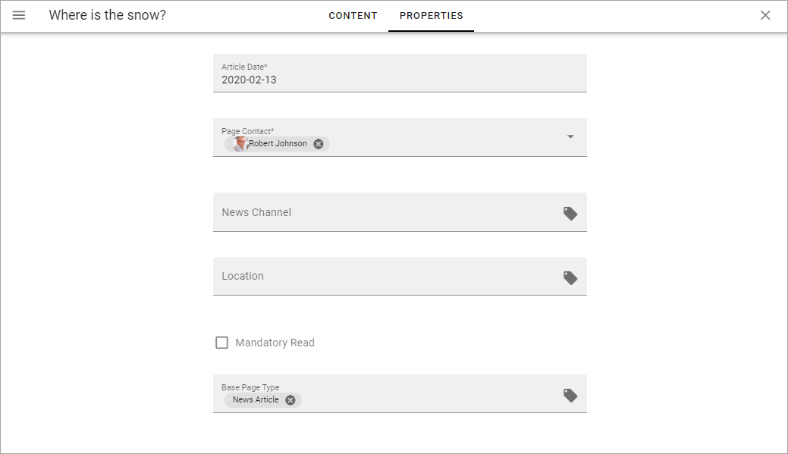
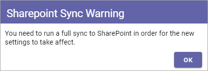
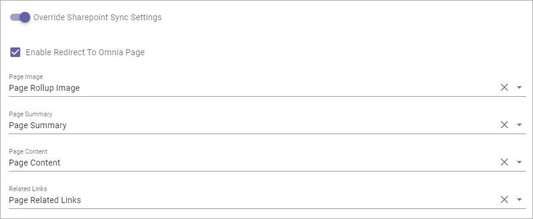
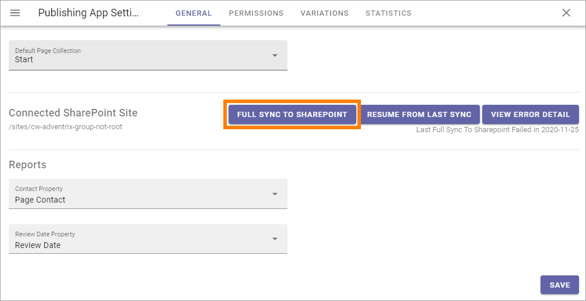
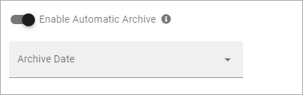

Page Type Settings
======================

On the "Settings" tab you can set the Properties for all pages created from this Page Type. In many cases it results in fields the page editor has to or can fill in for a page. You can select any of the properties defined in the tenant. See this page for more information about setting up properties: :doc:`Tenant Settings - Properties </admin-settings/tenant-settings/properties/index>`

Here's an example with a Page Type with left navigation:

.. image:: page-type-settings-left-new2.png

(For a description of "Override Sharepoint Sync Settings", see below.)

On Omnia 6.7 and later, it will be possible to automatically archive a page of a certain Page type. For more information, see below.

If properties was selected as in the image above it would result in these fields being available on the Properties tab for a page:

.. image:: page-type-settings-left-fields-new2.png

And here's an example with a Page Type for News:

Which results in these fields being available on the Properties tab for a News Article page:

Set properties for the Page Type this way:

1. Select the properties to be used for this Page Type.
2. Click the cog wheel for more settings for a property.

.. image:: page-type-settings-cogwheel.png

Something like the following is shown:

.. image:: page-type-settings-dot-menu-settings-new.png

The following settings can be available for a property:

+ **Required**: The editor creating the page has to enter information in the field.
+ **Allow multiple values**: For some properties multiple values are possible. If you will allow the editor to enter more than one value, check this option. If multiple values is not possible for the property, this option is not shown.
+ **Show in new page**: If the property (field) should be available in the New Page Wizard when creating a page, select this option.
+ **Show in edit properties**: If the property should be available on the Properties tab for a page created from this Page Type, select this option.
+ **Date only**: If it's a date/time field, both date and time can be set, or only the date. If you would like juat the date to be set, not the time, select this option.
+ **Receive e-mail**: This is available for most people properties. If the colleague set for this property should receive e-mails, select this option.
+ **Category**: This a preparation for future functionality. No need to enter anything here now.
+ **Default value**: A default value can be entered here. A defalt value can be edited by the author. What is possible to select here differs with type of property. 
+ **Limit Edit Permission**: You can limit Edit Permission for this property if needed. In that case, add one or more users here.

Override Sharepoint Sync Settings
************************************
Sharepoint Sync Settings are set in Omnia Admin (available under Web Content Management), for the whole tenant. If you need some other synchronization for pages created from this Page Type, you can override the tenant settings and create a specific synchronization here.

When you activate this option, the following is shown:

And then something like the following is available:

The settings are used exactly the same way here as the settings for the tenant. See this page for more information: :doc:`Sharepoint Sync </admin-settings/tenant-settings/webcontent-managament/sharepoint-sync/index>`

When you have set up the sync here, you must execute a full sync to Sharepoint, as the message stated. Go to the Publishing App settings and click this button:

Enable Automatic Archive
***************************
This is a new option that will be availble in Omnia 6.7 and later.

Here's a Tenant Page Type as an example:

.. image:: automatic-archive.png

When you click "Enable Automatic Archive" the following is shown:

Select a property to base the automatic archiving on.

(More info about how this works will be added soon).

Another way to do this is to use the settings for archiving in the Publishing App Settings. See the heading "Archive" on this page: (link to be added)
