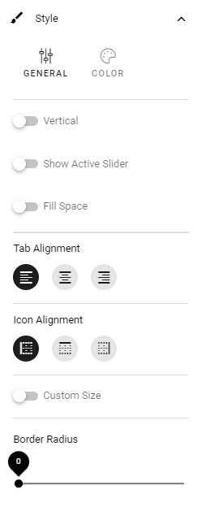

Settings for Sections
=======================

The following settings are available when working with Sections:

.. image:: section-settings.png

General
**********
What you can set under General depends on the section type selected; Column, Tab, Accordion and Stepper.

General settings for a section with columns
------------------------------------------------
For a section with columns, the following can be set:

.. image:: page-types-general-new3.png

+ **Width Type**: Set dynamic width ("Full Page") or a fixed width in pixels. When you have selected Fixed, a slider is shown where you can set the width.
+ **Columns**: Using the sliders, set a width for each of the column. Default = same width for every column.
+ **Add Column**: You can add a column if needed. The same settings as above can then be used for the new column. 

To remove a column, click the dust bin. 

For columns with fixed width, the following can be set:

.. image:: fixed-width-column.png

Use the slider to set the fixed column width. You can also set Alignment for the content in the section.

General settings for a section with tabs
-----------------------------------------
For a section with tabs, the following can be set:

.. image:: page-types-general-tabs-new.png

+ **Tabs**: Here you can edit the settings for each tab, by clicking the pen. See information about these settings below.
+ **Add tab**: Ta add a new tab, click here. You edit the settings as described below. To remove a tab, click the dust bin. 

By clicking the pen, the following can be set for a tab:

.. image:: page-types-tabs-pen-new2.png

+ **Label**: If a label should be shown for the tab, add the label here. You can add a label in any, or all, the tenant languages. Click the flag to change language.
+ **Custom Anchor Name**: ¨Here you can set a custom anchor name, if needed. For more information, see below.
+ **Tooltip**: If a tooltip should be shown for the tab, add it here.
+ **Icon**: First select the "Icon Type" and then select the icon in the list below, if an icon should be shown. (If no icon should be shown, just don't select an icon, it doesn't matter that an Icon Type is selected.)

Set a custom anchor name
---------------------------
Anchor names are created automatically for sections with type Tab, Accordion and Stepper, based on the Label. When you have entered a label, you can set a custom anchor name, if needed.

For a section with tabs you can set a custom anchor name for each tab:

.. image:: custom-anchor-name.png

See this page for more information on how to use anchors: :doc:`Using anchors </general-assets/using-anchors/index>`

General settings for an Accordion section
--------------------------------------------
For an Accordion section, the following can be set:

.. image:: page-types-general-accordion.png

+ **Width Type**: Set dynamic width ("Full Page") or a fixed width in pixels. When you have selected Fixed, a slider is shown where you can set the width.
+ **Panels**: Here you can edit the settings for each panel, by clicking the pen. See information about these settings below.
+ **ADD PANEL**: Ta add a new panel, click here. You edit the settings as described below. To remove a panel, click the dust bin. 

By clicking the pen, the following can be set for a panel:

+ **Label**: If a label should be shown for the panel, add the label here.
+ **Tooltip**: If a tooltip should be shown for the panel, add it here.
+ **Icon**: First select the "Icon Type" and then select the icon in the list below, if an icon should be shown. (If no icon should be shown, just don't select an icon, it doesn't matter that an Icon Type is selected.)

If needed, you can set a custom anchor name for each accordion post, the same way as for a section with tabs, see above.

General settings for a Stepper section
--------------------------------------------
For a Stepper section, the following can be set:

.. image:: page-types-general-stepper.png

+ **Width Type**: Set dynamic width ("Full Page") or a fixed width in pixels. When you have selected Fixed, a slider is shown where you can set the width.
+ **Panels**: Here you can edit the settings for each panel, by clicking the pen. See information about these settings below.
+ **Vertical**: To show the steps vertically instead of horisontally, select this option.
+ **Allow user to jump to any step**: If this option is selected, users can go to any step ny clicking the label, if not, users can only go to the next or the previous step.
+ **Scroll to top on Previous/Next**: If this option is selected, the step page is always shown from the top, when users goes to next or previous. If not selected, no scroll is made.
+ **ADD STEP**: Ta add a new step, click here. To add or edit the label for a step, click the pen. To delete a step, click the dust bin. 

If needed, you can set a custom anchor name for each step in the stepper, the same way as for a section with tabs, see above.

Spacing
***********
Here you can set the following:

.. image:: page-types-spacing-new2.png

Available options depends on section type chosen.

+ **Section Padding**: Here you can set some padding within the active section.
+ **Column Spacing**: Here you can set the spacing between the columns in this section. Available if section type Column is selected.
+ **Label Padding**: For an Accordion section, you can set label padding. Available if section type Accordion is selected.
+ **Block Spacing**: You can set spacing between blocks in this section. 
+ **Minimum Height**: You can make sure that this section always has a minimun height, regardless of what is shown in the section. Use the slider to set the minimum height in pixels.
+ **Use Full Height**: This option is a way of making sure a layout with more than one column or section is balanced. When this option is selected, all adjacent sections has the same length. See below for examples.

Here's an example with "Use Full Height" on:

.. image:: full-height-on.png

And here's the same page with the option off for the left section (Upcoming Events):

.. image:: full-height-off.png

Style
************
Available settings for Style can vary depending on section type. The options available for all section types are the following:

.. image:: page-types-style-new3.png

+ **Elevation**: With this setting you can make the content of the section “stand out” from the page. Use the slider to set how much.
+ **Background color**: A default background color for sections are set in Omnia Admin. You can set another background color for this section here, if needed. You can try out RANDOM or set the color using ADD COLOR.
+ **Background image**: Another option is to use an image as background in this section. When you click "Add Image", the Media Picker starts. See this page for more information: :doc:`Media Picker </general-assets/media-picker/index>`
+ **Force Default Scaling**: (A description will be added soon).
+ **Editable in Write Mode**: As Default, Design Mode is needed to edit background image. If it should be possible using Write Mode as well, select this option.
+ **Crop Ratios**: Crop Ratios are set up in Omnia Admin for the Media Picker. Here you can decide which of these should be available for authors to use in this section. To add a Crop Ratio, select it in the list and click the plus. To remove a Crop ratio, click the dust bin. You can also set the order in which the Crop Ratios are shown, by drag and drop.

For more information about Crop Ratios, se this page: :doc:`Media Picker Settings </admin-settings/tenant-settings/settings/media-picker/index>`

Style settings for a section with columns
-------------------------------------------
Only the common settings, see above.

Style settings for a Tab section
-----------------------------------
If it's a section with tabs, you can set all the common settings, and also:

(Not all options are shown in the image, but listed below).

+ **Vertical**: If the labels for the tabs should be shown vertically, select this option.
+ **Show Active Slider**: If the active tab should be indicated, select this option.
+ **Fill Space**: If the tab labels should fill the available space, either horisontally or vertically, depending on what you have chosen, select this option.
+ **Tab Alignment**: Here you can set Alignment for the tab labels.
+ **Icon Alignment**: If you are using an icon you can set Icon Alignment within the available space for the icon.
+ **Custom Size**: If you would like to set minimum height and width for the tabs, select this option, and then use the sliders.
+ **Border Radius**: Use this slider to set the border radius between tabs in the section.

Style settings for Accordion section
---------------------------------------
If it's an Accordion section, the following Style settings can be set, in addition to the common ones:

.. image:: page-types-style-accordion-new2.png

(Not all options are shown in the image, but listed below).

Under **General**, the following is available:

+ **Collapsed Accordion**: If this option is selected, all accordions will be collapsed when page is loaded.
+ **Flat Header**: Per default, the tab is slightly elevated. Select this option to make it flat.
+ **Single Select**: When this option is selected, only one accordion can be open at a time. When a user expands an accordion, any other accordion that may be open is closed.

Style settings for Stepper
------------------------------
For a Stepper section, only the common settings are available, see above.

Effects
--------
Additional effects are avilable here, for all section types:

.. image:: sections-effects-new.png

Try them and see the effect - a preview is shown in the active section.

And don't forget to test Divider Effects - there are some really cool effects in that list.

Block Theming
**************
Theme for blocks are set up in the Business Profile settings. If you would like to change them for this section, select "Custom Theme":

.. image:: section-custom-theme.png

What you can select here is the same as for the whole page, see: :doc:`Layout Theming </general-assets/layout-explorer/page-layout/layout-theming/index>`

Header
****************
Here you can set the following:

.. image:: page-types-settings-header-new2.png

+ **Title**: If you want a Title to be displayed for the section, add it here. Not mandatory. You can add a title in any or all the tenant languages. Click the flag to change language.
+ **Icon Type/Icon**: If you would like to use an icon, first select type and then icon from the list.
+ **Custom Settings**: If you don't want to use the global settings for the business profile, for this section, Select Custom Settings (selected in the image above). 

The global settings are set in Omnia Admin, see this page: :doc:`Content Header (Business Profile) </admin-settings/business-group-settings/settings/block-title/index>`

When selecting custom settings, the following is available:

.. image:: page-types-settings-header-custom-new4.png

This is the same settings as Content Header settings for the Business Profile, see: :doc:`Content Header Settings (Business Profile) </admin-settings/business-group-settings/settings/block-title/index>`

Targeting
***************
A section can be targeted by using this setting:

.. image:: page-types-settings-targeting-new2.png

Targeting for a section works the same way as targeting in many other parts of Omnia. See this page for more information: :doc:`Using Targeting </general-assets/targeting-in-omnia/index>`

Custom CSS
*******************
Here you can use custom CSS styling for the section.

.. image:: page-types-settings-advanced-new4.png

