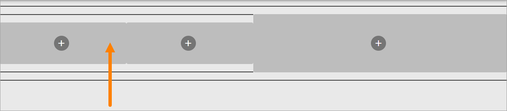
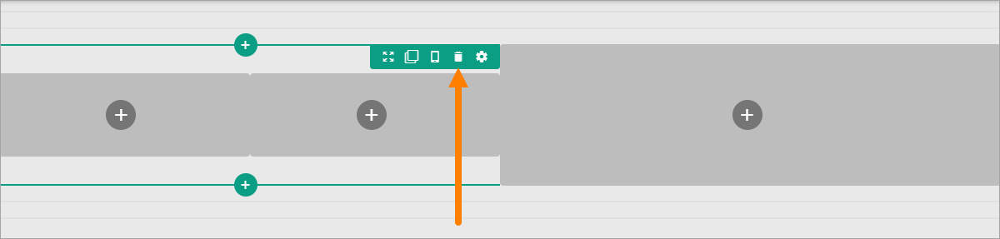
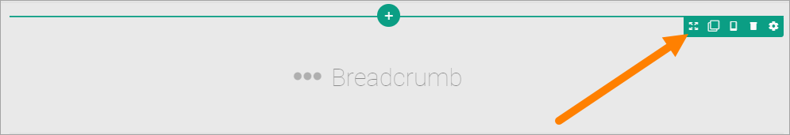
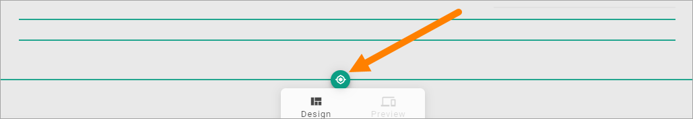
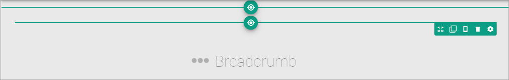
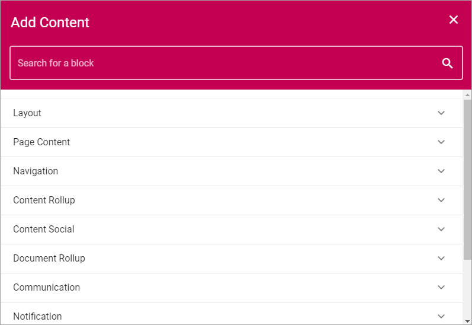
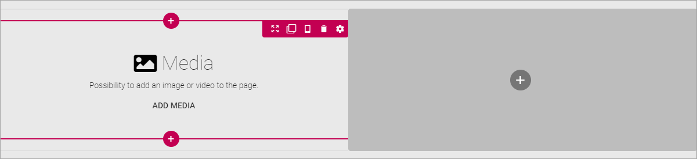

Working with Sections and Blocks
=================================

This describes how to work with Sections and Blocks for a Page Type.

Create a Section in a Column
******************************
If needed, you can create a section in a column and then select a layout for the column and set all other section's settings. Here's how:

1. Click the plus for the column.

.. image:: column-layout-click-plus.png

2. Open the Layout list.

.. image:: column-layout-list.png

3. Select layout for the column.

.. image:: column-layout-list-open.png

4. Set the section's settings (see above).

If needed, you can even go a step further and create a new section in one of the new columns.

Delete a section
*****************
If you need to delete a section, here's how to do it:

1. Click in the section (not on any plus).

2. Click the dust bin for the section.

Move a section
***************
Do the following to move a section to another placement on the page.

1. Click the section.
2. Click the Move icon.

Icons now show where you can move the section, for example:

3. Click the icon where you want the section and it's moved there.

Copy a section
***************
If you need a section with roughly the same settings somewhere else on the page, you can copy a section and place the copy where you want it, and then edit the settings. Do the following:

1. Click the section.
2. Click the Copy icon.

.. image:: copy-icon-section.png

Icons now show where you can add the new section, the same way as when you move a section, for example:

3. Click the icon where you want the copied section and it's placed there.
4. Edit the settings that you want to change.

Adding blocks to a Section
***************************
Here's how to add a block to a section:

1. Click the plus for the section.
2. Select block to add.

Here's an example with a block added:

You add additional blocks, work with the settings, move or delete blocks the same way as editors do when editing a page, see: :doc:`Working with Blocks </blocks/working-with-blocks/index>`

**Note!** When editing a page, blocks that belong to the Page Type is locked, meaning they can not be moved or deleted, and settings for those blocks can't be edited. But content can be edited, if applicable, using Write mode. 

.. image:: using-write-mode.png

More information on editing blocks when editing a page, is found here: :doc:`Edit a Page </pages/edit-page/index>`

**Note!** For blocks that can be edited in Write mode, you can add default content and set if this content could be edited or not, see the description of the blocks in question.

Decide to show a section on a device or not
**********************************************
When you're working on a section you can select to show it on different devices or not.

Click this icon:

.. image:: device-support-section-new.png

You can now use the following settings:

.. image:: select-device-section-new.png

To hide a section for a device, do the following:

1. Select the device.
2. Click the pen for Visibility.
3. Select Hide Section.

To add som padding for the section, for a specific device, do the following:

1. Select the device.
2. Click the pen for Section Padding.
3. Set the padding.