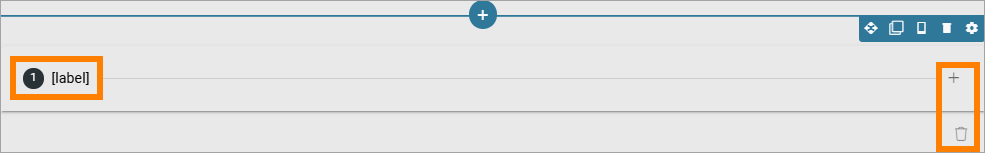
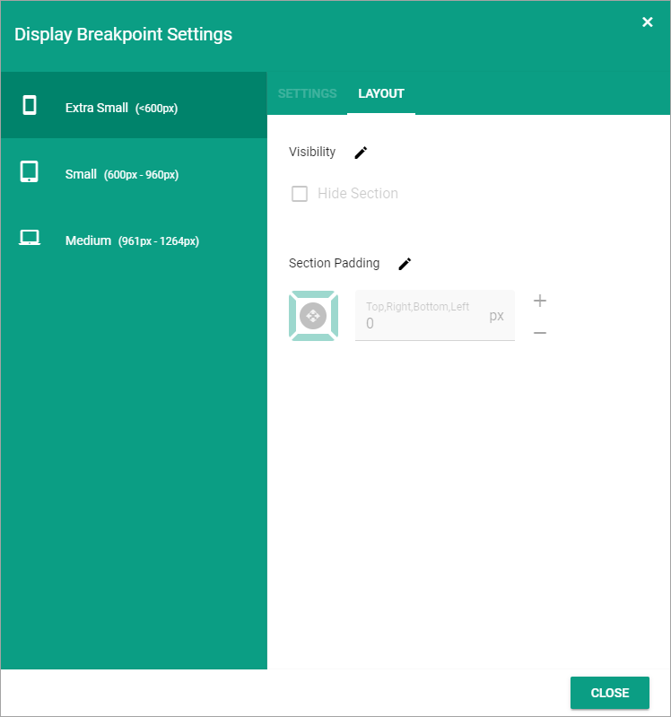
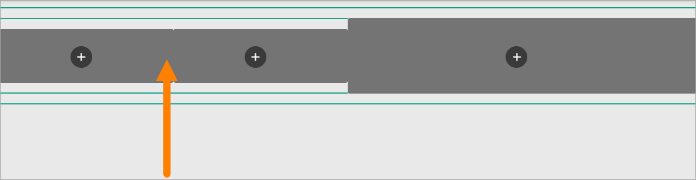
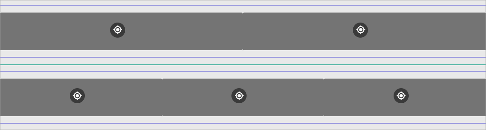
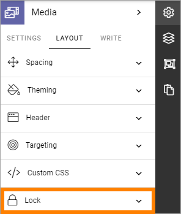

Sections and Blocks on a Page Type
=================================================

This describes how to work with Sections and Blocks for a Page Type. You work the same way with Local Page Types and Tenant Page Types.

For the very first steps when creating a new Page Type, see: :doc:`Create new Page Type </pages/page-types/create-new-page-type/index>`

Create a Section in a Column
******************************
If needed, you can create a section in a column and then select a layout for the column and set all other section's settings. Here's how:

1. Click the plus for the column.

.. image:: column-layout-click-plus-new.png

Note that it's the same dialog for both sections and blocks you can add to a page or a page layout. The sections are found under "Layout".

2. Open the Layout list.

.. image:: column-layout-list-new.png

3. Select layout for the column.

.. image:: column-layout-list-open-new.png

4. Set the section's settings.

For a description of available settings for the section, see: :doc:`Settings for sections </pages/page-types/section-settings/index>`

If needed, you can even go a step further and create a new section in one of the new columns.

**A tip!** The Stepper section is useful when organizing information in steps. It's also used with the new Forms functionality. See below for more information.

Using the Stepper section
***************************
A Stepper section is one of the sections you can use.

.. image:: stepper-section.png

A Stepper section makes it possible to organize content in a layout in a wizard-like style. It is possible to configure the Stepper to allow for an author to add new steps in Write mode.

Here's an example where a Stepper section is used:

.. image:: working-with-stepper-example.png

All settings for sections are available for the Stepper section.

Decide to show a section on a device or not
**********************************************
When you're working on a section you can select to show it on different devices or not.

Click this icon:

.. image:: device-support-section-new.png

You can now use the following settings:

To hide a section for a device, do the following:

1. Select the device.
2. Click the pen for Visibility.
3. Select Hide Section.

To add som padding for the section, for a specific device, do the following:

1. Select the device.
2. Click the pen for Section Padding.
3. Set the padding.

Delete a section
*****************
If you need to delete a section, here's how to do it:

1. Click in the section (not on any plus).

2. Click the dust bin for the section.

.. image:: delete-section-2-new2.png

Move a section
***************
Do the following to move a section to another placement on the page.

1. Click the section.
2. Click the Move icon.

.. image:: move-icon-section-new2.png

Icons now show where you can move the section, for example:

3. Click the icon where you want the section and it's moved there.

Copy a section
***************
If you need a section with roughly the same settings somewhere else on the page, you can copy a section and place the copy where you want it, and then edit the settings. Do the following:

1. Click the section.
2. Click the Copy icon.

.. image:: copy-icon-section-new.png

Note that you can also copy blocks this way. Sections are indicated with a green color and blocks with a blue color, so you can see what is what.

Icons now show where you can add the new section, the same way as when you move a section, for example:

.. image:: section-can-be-copied-new.png

3. Click the icon where you want the copied section and it's placed there.
4. Edit the settings that you want to change for the copy.

Copy a section from the clipboard
-----------------------------------
THere's also a clipboard available, that can be used to copy sections between pages or page types, see: :doc:`Clipboard for sections and blocks </general-assets/layout-explorer/clipboard-sections-blocks/index>`

Adding blocks to a Section
***************************
Here's how to add a block to a section:

1. Click the plus for the section.

.. image:: addblock-1.png

2. Select block to add.

.. image:: section-add-block-new.png

Here's an example with a block added:

.. image:: section-block-added-new2.png

You add additional blocks, work with the settings, move or delete blocks the same way as editors do when editing a page, see: :doc:`Working with Blocks </blocks/working-with-blocks/index>`

**Note!** When editing a page, blocks that belong to the Page Type may be locked, meaning they can not be moved or deleted, and settings for those blocks can't be edited. But content can be edited, if applicable, using Write mode. For more information on this, see *Lock a blick or not*, below.

Copy a block from the clipboard
---------------------------------------------
There's also a clipboard available, that can be used to copy blocks between pages or page types, see: :doc:`Clipboard for sections and blocks </general-assets/layout-explorer/clipboard-sections-blocks/index>`

Lock a block or not
************************
Additional settings for locking of blocks are available, under "Lock" in the LAYOUT menu:

You can decide if it should be possible to unlock the settings for a block. The block can still not be moved and can not be deleted.

The following options are available here:

.. image:: lock-menu-options.png

+ **Locked by default**: If this option is selected, and not the following, it works as before; settings for the block can not be changed but content can be edited. If this option is NOT selected and the next is, the block's settings are simply not locked. Design permission is still needed to be able to change settings.
+ **Lock can be edited**: If this option is selected, editors (Design permission) can unlock or lock the settings for the block - and if unlocked, can edit the block's settings.

**Important Note!** Editing contents of a block works as before; content can be edited, if applicable, using Write mode.

