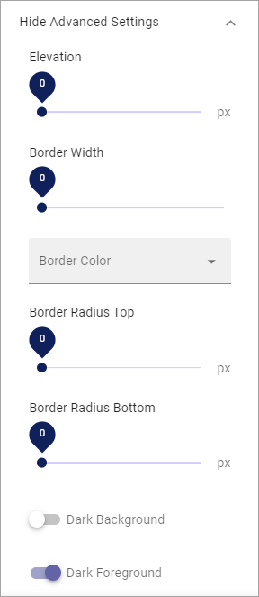

Block Theming
==============

Here you can choose a custom theme for blocks on this page:

.. image:: block-theming-v6.png

If you chose to set a Custom Theme, you can click the icon to select a theme.

.. image:: block-theming-theme.png

The themes are set up for the Business Profile in Omnia Admin, see: :doc:`Theme </admin-settings/business-group-settings/settings/theme/index>`

When you have chosen a theme you can edit colors using the Color fields available. For example:

.. image:: block-theming-theme-set.png

Advanced Settings
------------------
If you choose to show advanced settings, here's what you can do:

When you try them out, previews are shown in the blocks on the page.

