Publish page changes
===========================================

(This documentation is ongoing, all is not fully tested yet)

As an editor you can work on a new version of a page as long as needed and publish the new version when you decide to do so. Besides that, you can schedule the publishing of a new page version at a later date.

You can check earlier versions of a page and even revert to an earlier version if needed.

Preview the page
*****************
A very good idea is to Preview the page befor publishing. Do the following:

1. Edit the page.
2. Select Preview.

.. image:: preview-page.png

(More info will be added soon.)

Publish a page
***************
To publish a page, do the following:

1. Enter Edit mode.
2. Make sure all changes to be page has been done.
3. Save the draft.

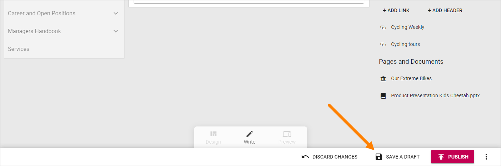

(You can publish directly but saving the draft first is a safer way.)

4. Click Publish.

.. image:: click-publish-png

Schedule publishing
********************
If a new version of a page needs to be published on a certain day and time, you can use a scheduled publish. 

1. Activate Edit mode.
2. Open the action menu at the bottom right.
3. Select "SCHEDULE".

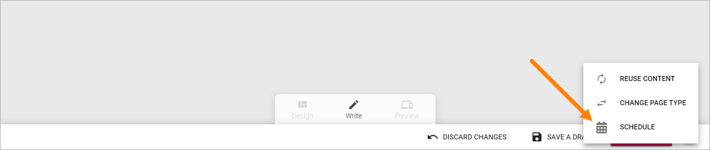

4. Click the plus.

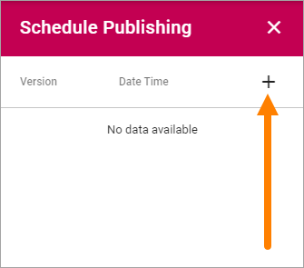

5. Set the day for publishing.

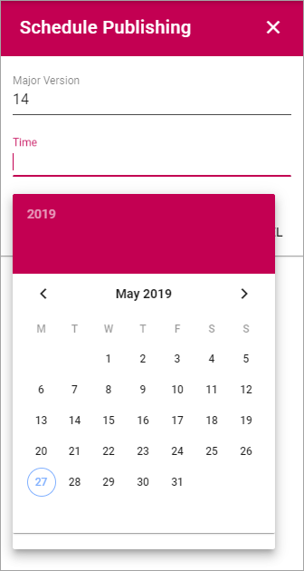

6. Set the time for the selected day.

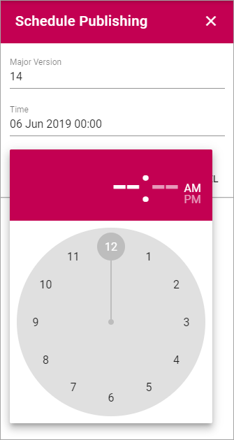

7. Save the settings.

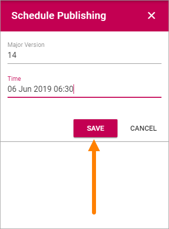

8. Publish.

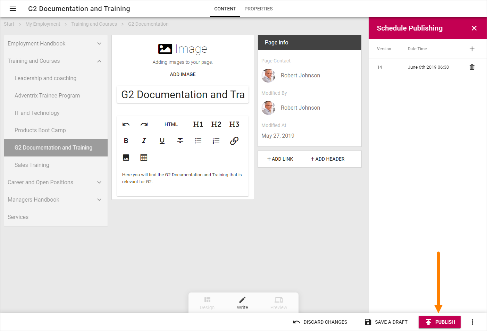

Now the version of the page that is the latest aved version when the date and time arrives, will be automatically published. 

You can have more than scheduled publishing active in the list. If you, for example, will publish an update to a certain page on a monthly basis you can set up a scheduled publish each month and the publishing will be done automatically. You still have to update the page between publishing times, ofcourse.

When a scheduled publish is executed it's noted in the list this way:

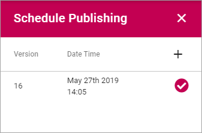

Maual publishing and scheduled publishing
--------------------------------------------
You can still publish "manually" before a scheduled publishing. If you have set a schedule, it just means that on this date and time, an automatic publish will be made. It's perfectly to fine tom combine that with manual publishing.

Remove a scheduled publishing
------------------------------
To remove a scheduled publishing that is not yet executed, just select scheduling as above and delete the date and time post. 

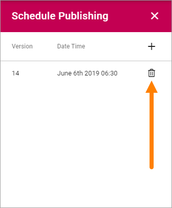

Version history
******************
Every time you save changes to a page (including when you publish) a new version history node for the page is created. You can check earlier versions and you can revert to an earlier and continue working with that, if needed.

Do the following to see version history:

1. Got to the page.
2. If you're editing the page, save the draft or the Version History option will not be available.
3. Open the action menu and select "VERSION HISTORY".

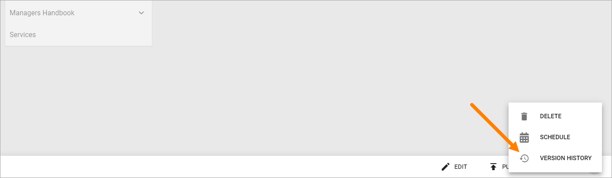

Something like this is shown:

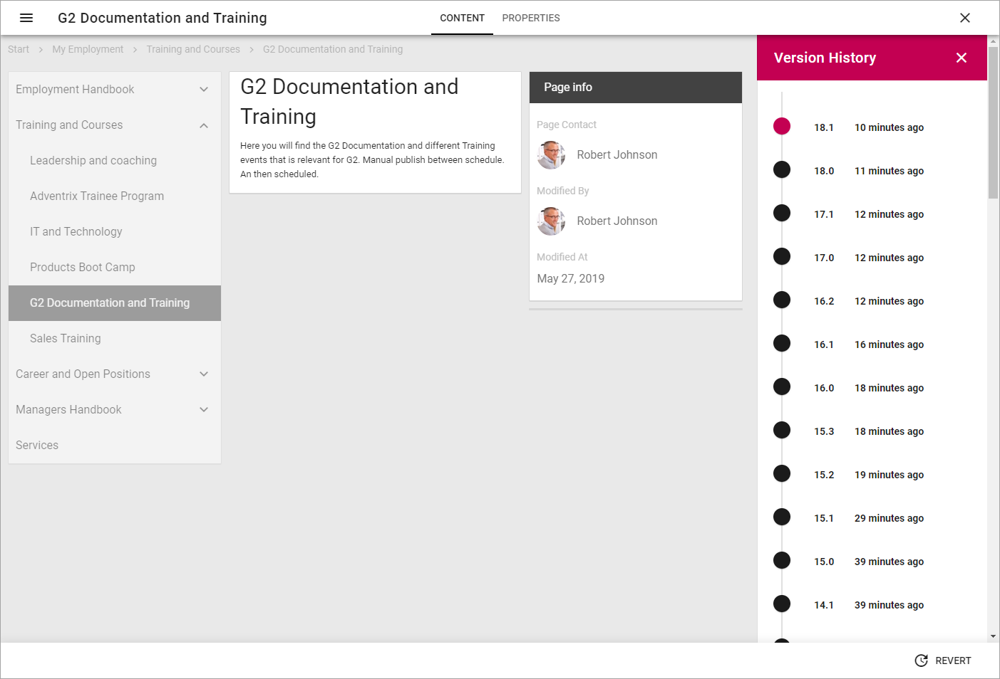

Published editions are noted with an integer, work in progress with a decimal.

.. image:: page-version-history-published.png

Click the information about when the version was saved, to see who made the changes:

.. image:: page-version-history-editor.png

.. image:: page-version-history-who.png

To check that version of the page, click the version number. The dot is red for the version being shown.

.. imnage:: check-version.png

If needed, you can revert to an earlier version on continue working on that instead.

1. Click the version number for the desired version so the dot turns red.
2. Click "REVERT".

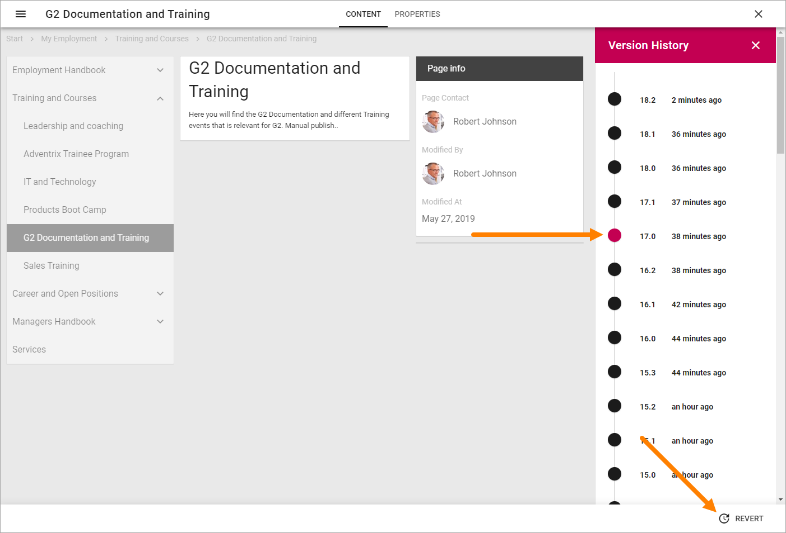

