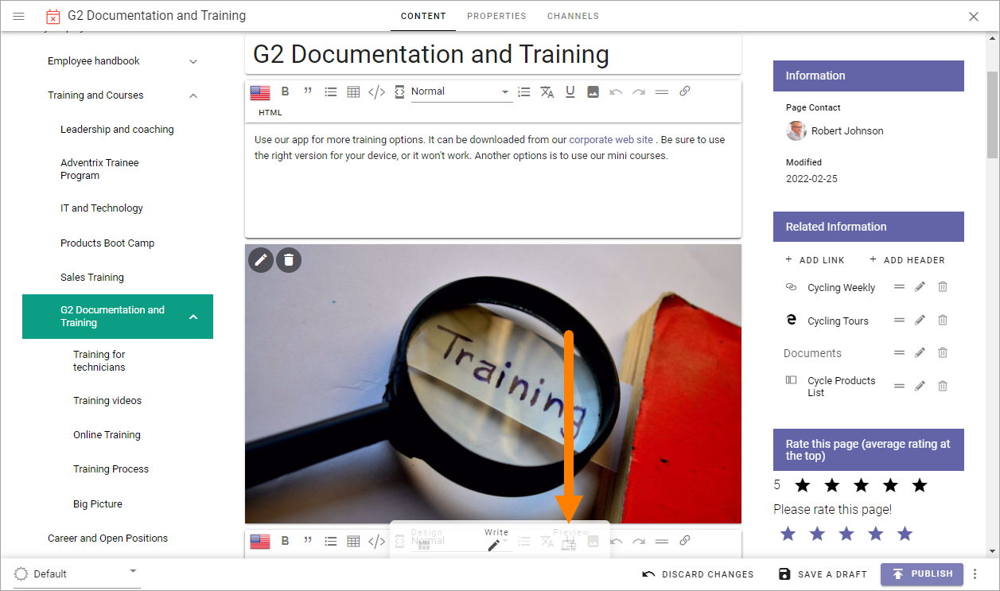
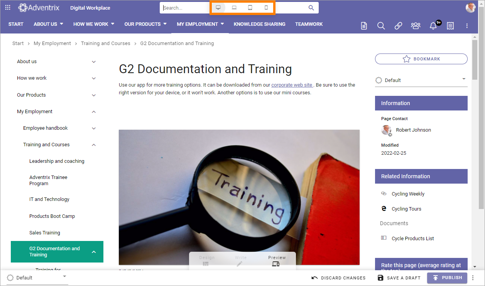
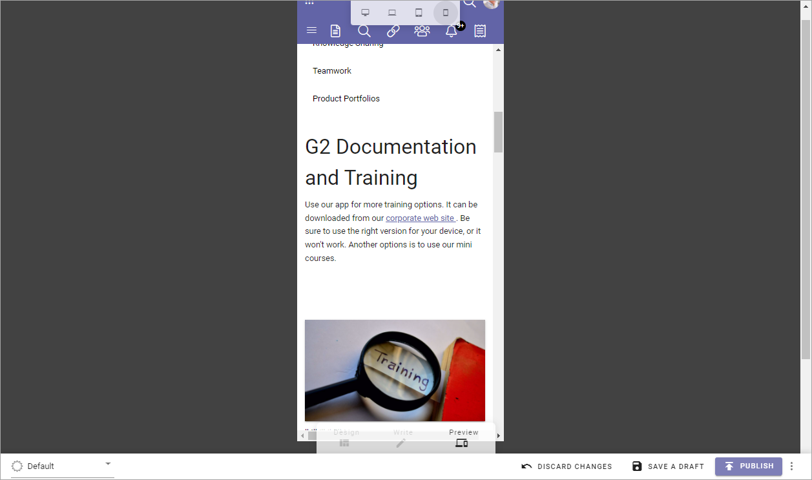
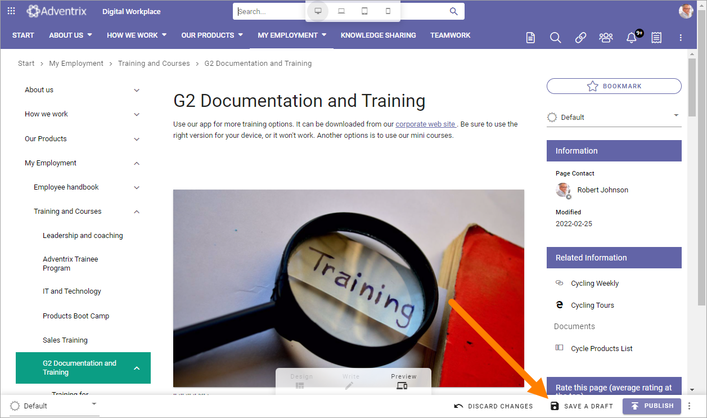
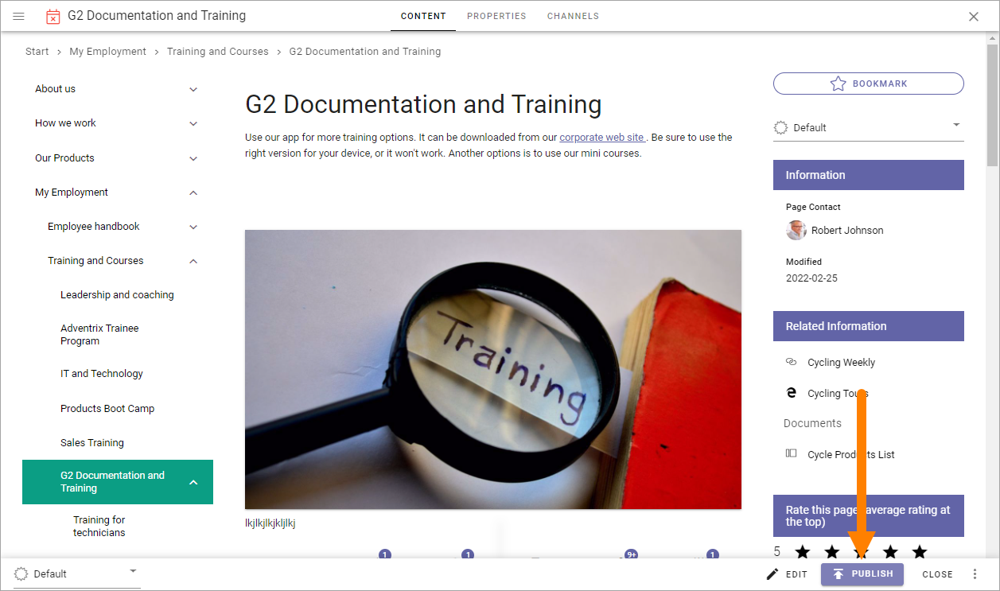
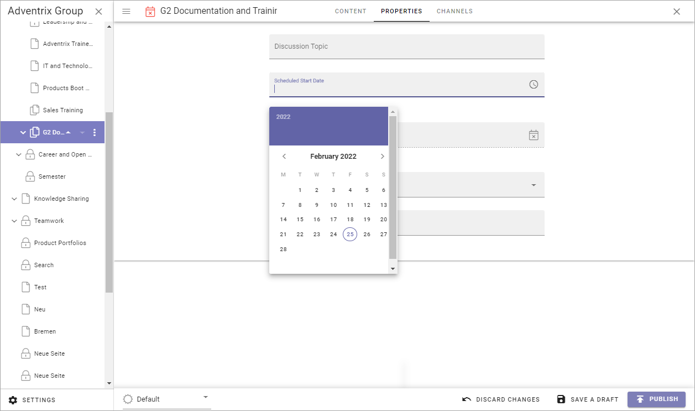
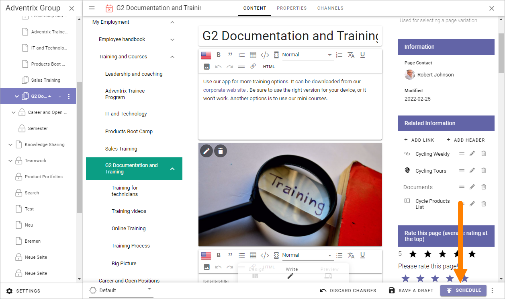
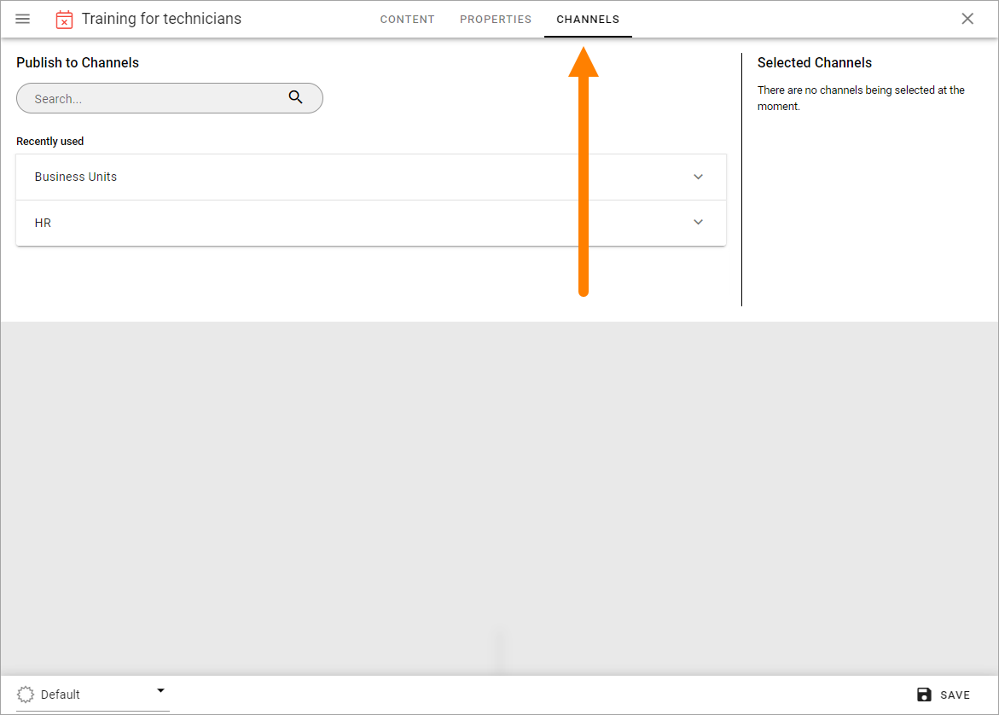
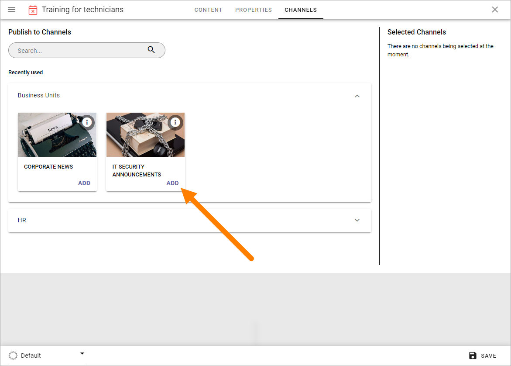
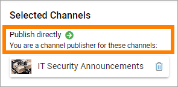

Publish page changes
===========================================

As an editor you can work on a new version of a page as long as needed and publish the new version when you decide to do so. If allowed (set in Page Collection settings) it's possible to se a Scheduled Publishing if you don't want to publish directly.

**Note!** Edits to a page are never shown to users of the site until the page is published.

Preview the page
*****************
A very good idea is to Preview the page before publishing. Do the following:

1. Edit the page.
2. Select "Preview".

You can now see how the page will look on a computer screen, a notebook, a tablet or a phone.

Here's a preview for a phone as an example:

Publish a page
***************
To publish a page, do the following:

1. Enter Edit mode.
2. Make sure all changes to the page has been done.
3. Save the draft.

(You can publish directly but saving the draft first is a safer way.)

4. Click PUBLISH.

If approval has been activated you must instead send for approval and the button's label indicates that:

.. image:: send-for-approval-button-new2.png

Fore more information about Page Approval, see: :doc:`Approve Pages </pages/page-approval/index>`

Scheduled Publishing
*********************
If Scheduled Publishing has been activated for the Page Collection you can choose to set publishing at a later date, and, if the property allow it, time.

**Note!** Even if Scheduled Publishing has been activated, it is never mandatory. You can always publish directly, as described above.

If you would like to schedule publishing, do the following:

1. Edit the page.
2. Go to the PROPERTIES tab.

.. image:: publish-properties.png

The property used for scheduling is identified by a clock icon.

3. Click in the field and set acheduled publishing with the options available for the property, for example:

When a scheduled publishing has been set it's noted by the publishing button, now saying SCHEDULE.

4. Click the SCHEDULE button to publish.

The settings for Scheduled Publishing are described on this page: :doc:`Page Collections </pages/page-collections/index>`

Scheduled Publishing and Variations
--------------------------------------
You can also set scheduled publishing for a variation, the same way as decribed above. Note that you must set the publication for the variation at a later date/time than for the main page, for this to work.

Publish to channels
**********************
If any channels are setup you can choose to publish a page to one or more channels. If you are a Publisher for a channel, the page is published to that channel directly upon publishing the page. If you're not a Publisher for a channel you select, an administrator must approve the publication to that channel before it's done.

This does not have any effect on the page's availability through navigation. That part of the publishing process works the same way as always.

If you want to publish a page to a channel, use the the CHANNELS tab in the settings for the page. Avaialble channels differ depending of what has been set up. Here's an example:

Here's how to select one or more channels:

1. Use the list(s) to select one or more channels. Click ADD to select a channel.

2. The selected channels or shown to the right.

.. image:: publish-to-channel-shown.png

Note that information about your status, publisher or not, is shown for the channel.

3. When you're done here, click SAVE.

For more information about Channels, see this page: :doc:`Publishing Channels </admin-settings/tenant-settings/webcontent-managament/publishing-channels/index>`

A list of pages belonging to one or more channels can be created using the Page Rollup block: :doc:`The Page Rollup block </blocks/page-rollup/index>`

Users can subscribe to channels, as described on this page: :doc:`My Subscriptions </user-options/my-subscriptions/index>`

