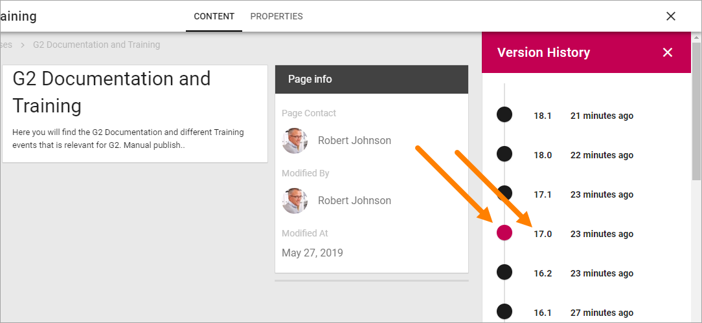

Publish page changes
===========================================

As an editor you can work on a new version of a page as long as needed and publish the new version when you decide to do so. You can check earlier versions of a page and even revert to an earlier version if needed.

**Note!** Edits to a page are never shown to users of the site until the page is published.

Preview the page
*****************
A very good idea is to Preview the page before publishing. Do the following:

1. Edit the page.
2. Select "Preview".

.. image:: preview-page.png

You can now see how the page will look on a computer screen, a tablet or a phone.

.. image:: preview-all.png

Here's a preview for a phone as an example:

.. image:: preview-phone.png

Publish a page
***************
To publish a page, do the following:

1. Enter Edit mode.
2. Make sure all changes to the page has been done.
3. Save the draft.

.. image:: save-draft.png

(You can publish directly but saving the draft first is a safer way.)

4. Click "PUBLISH".

.. image:: click-publish-new.png

If approval hase been activated you must instead send for approval and the buttons label indicates that:

.. image:: sen-for-approval.button

Fore more information about Page Approval, see: :doc:`Page Approval </pages/page-approval/index>`

Version History
******************
Every time you save changes to a page (including when you publish) a new Version History node for the page is created. You can check earlier versions and you can revert to an earlier version and continue working with that, if needed.

Do the following to see Version History:

1. Go to the page.
2. If you're editing the page, save the draft or the Version History option will not be available.
3. Open the action menu and select "VERSION HISTORY".

.. image:: page-version-history-menu.png

Something like this is shown:

.. image:: page-version-history-list.png

Published editions are noted with an integer, work in progress with a decimal.

.. image:: page-version-history-published.png

Click the information about when the version was saved, to see who made the changes:

.. image:: page-version-history-editor.png

.. image:: page-version-history-who.png

To check a version of the page, click the version number. The dot turns to red for the version being shown.

If needed, you can revert to an earlier version on continue working on that version instead.

1. Click the version number for the desired version so the dot turns red.
2. Click "REVERT".

.. image:: page-version-revert-1.png

