Reports
==========

A number of reports are available for pages in the active Publishing App. Note that some settings must be made for the reports to work, see below.

Select "Reports" here:

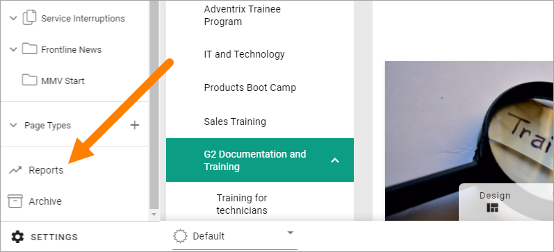

The following reports are available:

.. image:: pages-reports-all-new3.png

All reports can be exported to Excel by clicking here:

.. image:: reports-excel-new3.png

You can sort the lists on most column headings by clicking the heading, for example:

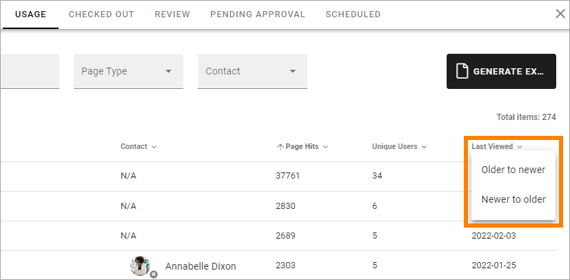

You can use the links in the "Page" column to go to a page, and the links in people columns (for example "Contact") to click the name to see more information about that colleague, for example contact information. The User Profile Card will then open, if it's used within your organization. If it's not, the colleague's Delve page will be displayed.

Also note that the icon on the lower right of a person image indicates Microsoft Teams presence. The icon in the image above indicates that Annabelle Dixon is offline.

Usage
*********
This list contains all pages in the Publishing App. You can filter the list by using the fields and lists at the top.

.. image:: reports-usage.png

Checked out
************
In this list you can see all pages that are currently checked out, meaning someone is working on them. New pages are shown here as well, even if they are not published yet, as long as a draft has been saved.

.. image:: pages-reports-checked-out-new3.png

Use the lists at the top to filter the Checked out-list.

Review
********
If a property for review date for pages is being used, this list displays all pages that has a review date set.

.. image:: pages-reports-review-new3.png

You can filter the list on Contact (Page Contact). If the Review Date has passed, it's indicated by a black triangle, so in the example above, the Page Editors has a lot of work to do!
 
Pending Approval
**********************
If Approval for pages has been set up, this list will show all pages with pending approval.

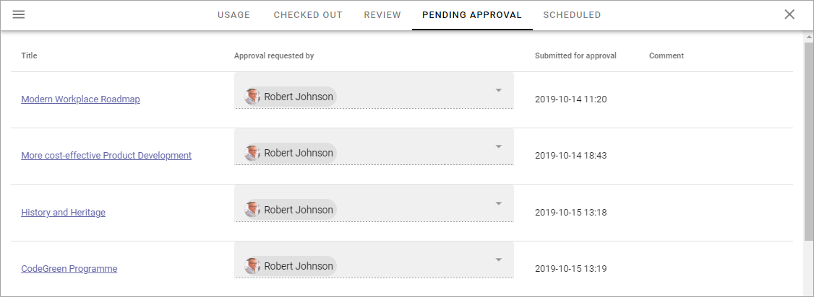

(This image is from a test environment, these requests should normally not be that old.)

How to approve or reject here is described on this page, where you can find more information about approval: :doc:`Approve pages </pages/page-approval/index>`

Scheduled
***********
This report displays an overview of all pages that are scheduled for publishing, in the publishing app. Here's an example:

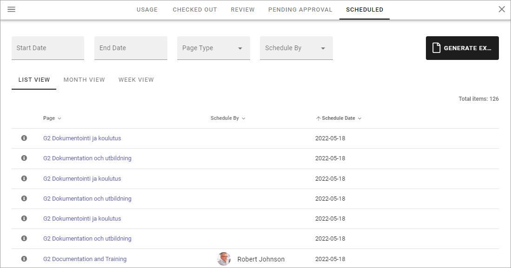

You can filter the list on dates, for a shorter list. Set Start Date and and End Date. You can also filter on Page Type and who the publication was scheduled by. 

Default is List View, as shown in the image above. You can also choose to see a calendar view, monthly or weekly. Here's an example with WEEK VIEW selected:

.. image:: pages-repoprt-scheduled-week.png

Analysis
***********
In Omnia 7.1 and later, OpenAI can be used for content analysis. If set up, this tab is available.

**Note!** An analysis can only be executed on pages within the active page collection.

The first you will see is a list of already created analysis, if any. here's a simple example:

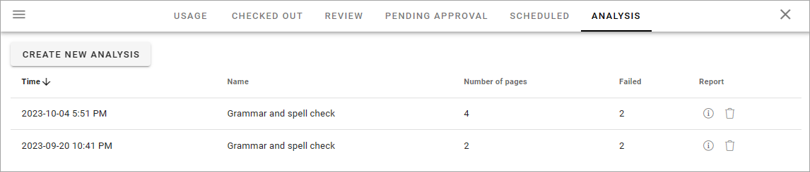

To remove an analysis that is no longer needed, click the dust bin, but rememeber that the report from the analysis can easily be updated, see below.

To read a report for the analysis, click the i-icon:

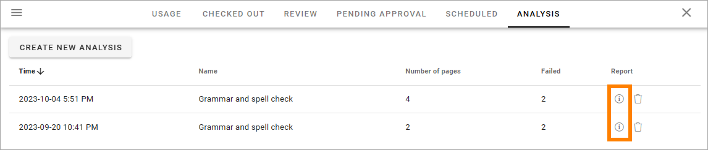

Here's an example of a report:

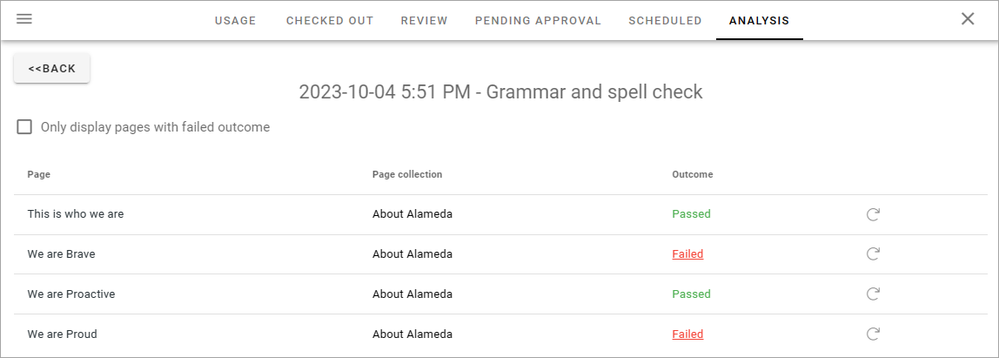

You can execute the analysis on the latest version of a page by clicking here, in effect updating the analysis:

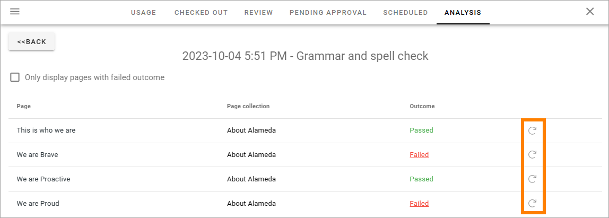

Create a new analysis
-----------------------
When you create a new analysis, the following settings are available:

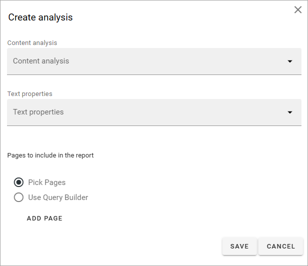

+ **Content analysis**: A number of analysis settings to execute can be available in this list. They are set up in Omni Admin, see: :doc:`Content Analysis (OpenAI) </admin-settings/tenant-settings/settings/open-ai/content-analysis/index>`
+ **Text properties**: Select one or more text properties to run the analysis on.
+ **Pages to include in the report**: You must also choose one or more pages to run the analysis on. You can either pick pages, using the page picker, or use the query builder. Either way, only pages belonging to the active page collection can be selected.

If you select "Pick Pages", click ADD Page to start the page picker. For more information, see: :doc:`Page picker </general-assets/page-picker/index>`

If you select "Use Query Builder", the following is shown:

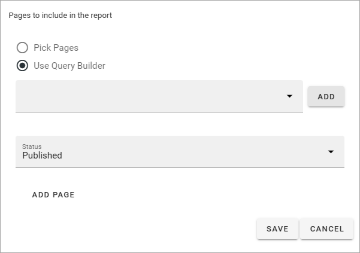

Add the query this way:

1. Choose "Dynamic" or the name of the page collection.
2. If you chose "Dynamic", select a token by clicking the i-icon.

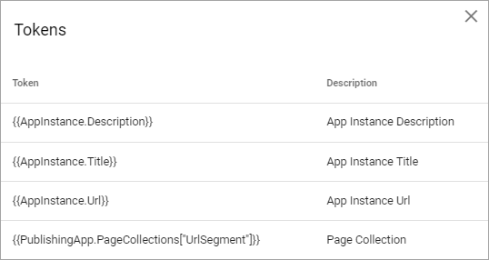

Note the description of the tokens in the column to the right.

3. Click ADD.
4. Repeat until all parts of the query is in place.

If you happened to add a query part you don't want, just click the dust bin to remove it.

5. Expand a query part for filter settings.

.. image:: analysis-new-query-filter-new.png

Doing so you can choose to run the query on specific pages only. Here's an example where the analysis should be executed on pages of the community types only:

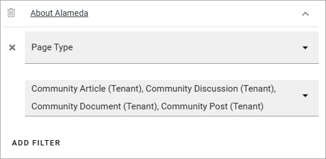

You can add several filters the same way, if needed.

6. Select status for the pages to be analyzed: Published, Never Published or Any status (meaning both).

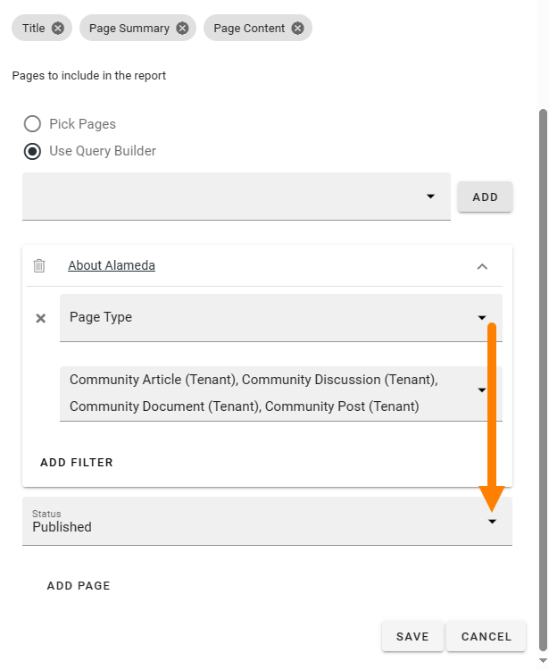

7. Click ADD PAGE to add the pages for the query. If there are pages that corresponds with the settings, they are listed here:

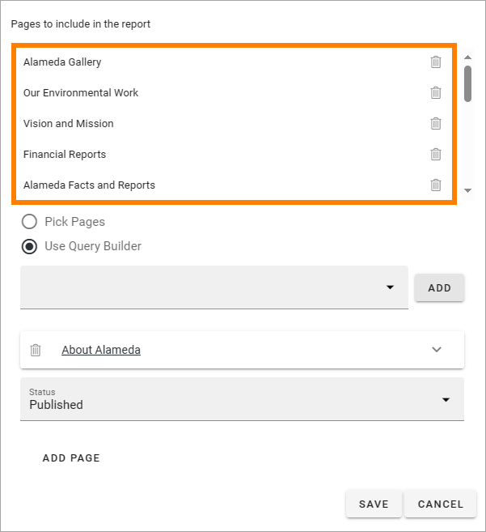

If any of these pages should be removed from the analysis, just click the dust bin for the page.

8. When all is done, click SAVE to save the analysis. 

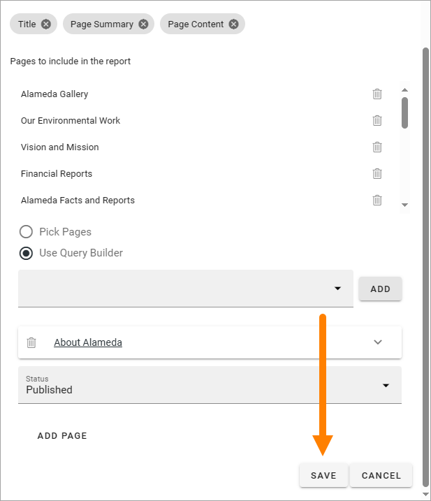

Settings for Reports
*********************
Two settings are needed for the reports to work.

A property for page contact has to have been set up in Omnia Admin, and a property for review date, if review date will be used for pages.

Go to the Publishing App Settings and the Advanced tab.

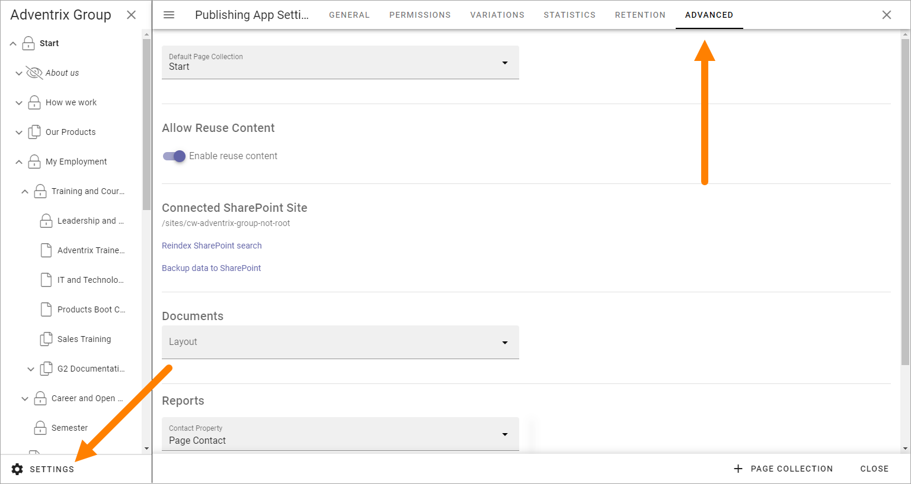

The correct properties must be selected here for the reports to work:

.. image:: reports-settings-lists-new4.png

