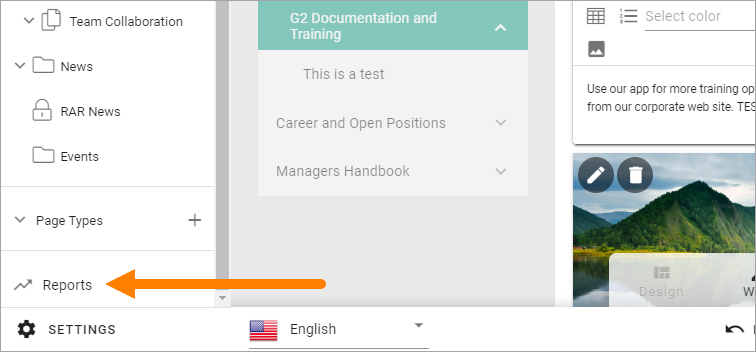
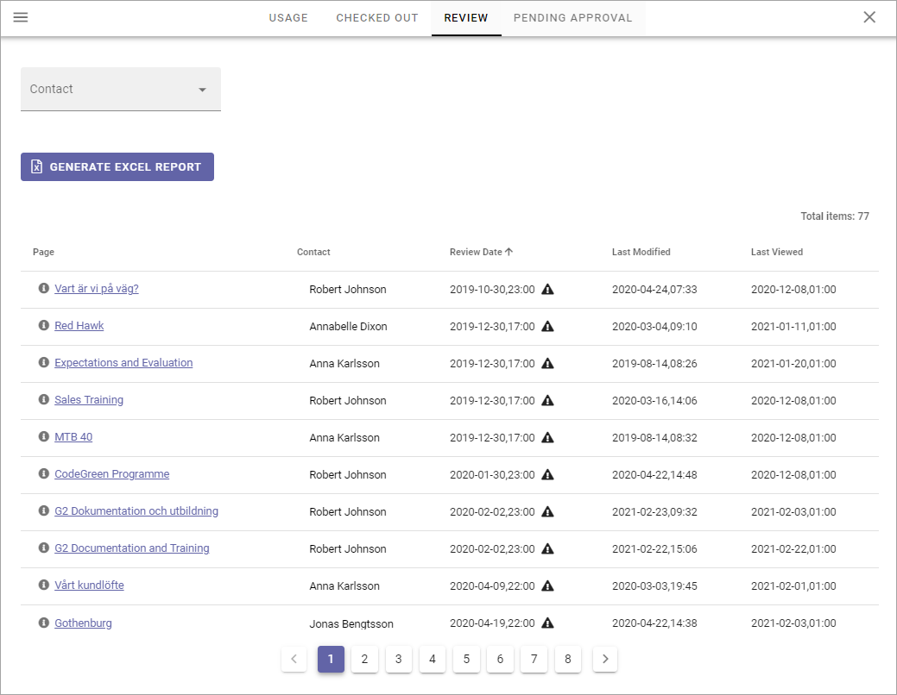

Reports
==========

A number of reports are available for pages in the active Publishing App. Note that some settings must be made for the reports to work, see below.

Select "Reports" here:

The following reports are available:

.. image:: pages-reports-all-new2.png

In Omnia 6.7 and later, an additional report is available - Scheduled. See below for more information.

All reports can be exported to Excel by clicking here:

.. image:: reports-excel-new2.png

You can sort the lists on most column headings by pointing at the heading and then clicking the arrow (not on the heading). An arrow pointing up indicates descending sorting, and an arrow pointing down ascending sorting, for example:

.. image:: reports-sort-new2.png

Usage
*********
This list contains all pages in the Publishing App (see image above). You can filter the list by using the fields and lists at the top.

You can use the links in the "Page" column to go to a page, and the links in the "Contact" column to go to a colleagues Delve page, where for example contact information is shown.

Checked out
************
In this list you can see all pages that are currently checked out, meaning someone is working on them. New pages are shown here as well, even if they are not published yet, as long as a draft has been saved.

.. image:: pages-reports-checked-out-new2.png

Use the lists at the top to filter the Checked out-list.

You can use the links in the "Page" column to go to a page, and the links in the "Contact" and "Checked Out To" columns to go to a colleagues Delve page, where for example contact information is shown.

Review
********
If a property for review date for pages is being used, this list displays all pages that has a review date set.

You can filter the list on Contact (Page Contact). You can use the links in the "Page" column to go to a page, and the links in the "Contact" column to go to a colleagues Delve page, where for example contact information is shown.

If the Review Date has passed, it's indicated by a black triangle, so in the example above, the Page Editors has a lot of work to do!
 
Pending Approval
**********************
If Approval for pages has been set up, this list will show all pages with pending approval.

.. image:: pending-approval-example-new.png

(This image is from a test environment, these requests should normally not be that old.)

How to approve or reject here is described on this page, where you can find more information about approval: :doc:`Approve pages </pages/page-approval/index>`

Scheduled
***********
This report is available in Omnia 6.7 and later. The report displays an overview of all pages that are scheduled for publishing, in the publishing app. Here's an example:

.. image:: pages-repoprt-scheduled.png

You can filter the list on dates, for a shorter list. Set Start Date and and End Date. You can also filter on Page Type and who the publication was scheduled by. And you can export to Excel the same way as for the other reports.

Default is List View, as shown in the image above. You can also choose to see a calendar view, monthly or weekly. Here's an example with WEEK VIEW selected:

.. image:: pages-repoprt-scheduled-week.png

Settings for Reports
*********************
Two settings are needed for the reports to work.

A property for page contact has to have been set up in Omnia Admin, and a property for review date, if review date will be used for pages.

Go to the Publishing App Settings and the General tab.

.. image:: reports-settings-new2.png

The correct properties must be selected here for the reports to work:

.. image:: reports-settings-lists-new2.png

