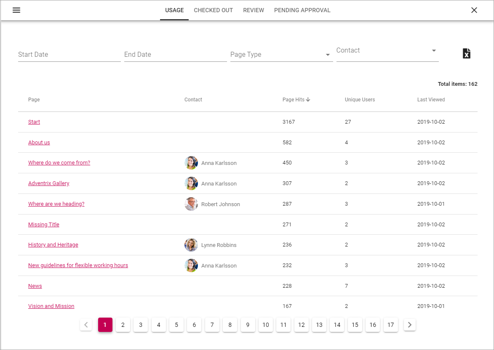
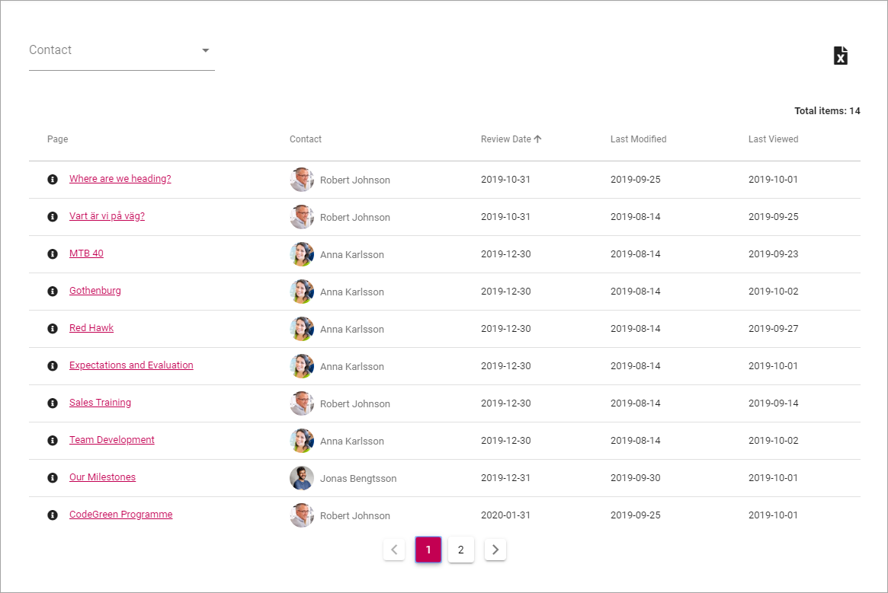
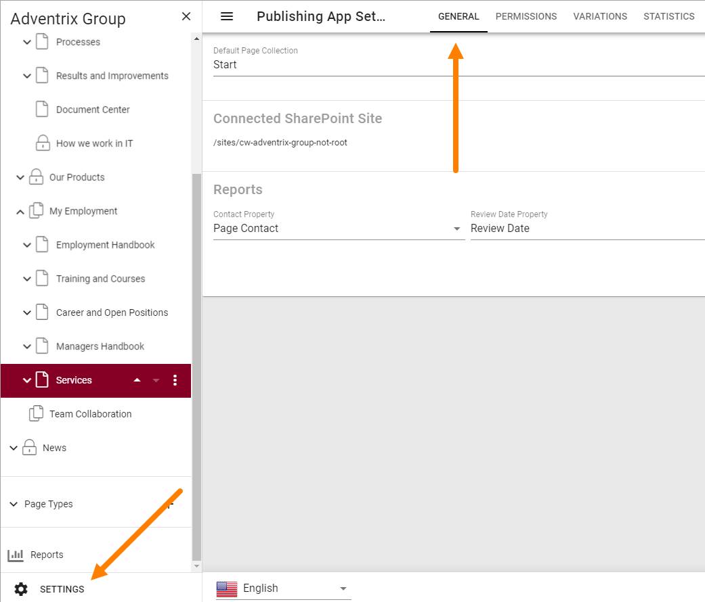
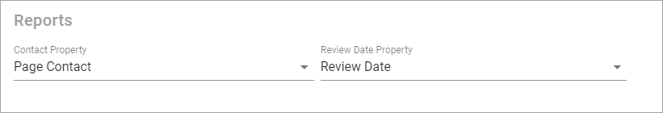

Reports
==========

A number of reports are available for pages in the active Publishing App. Note that some settings must be made for the reports to work, see below.

Select "Reports" here:

.. image:: pages-reports-menu.png

The following settings are available:

Usage
*********
This list contains all pages in the Publishing App (see the image above). You can filter the list by using the fields and lists at the top.

You can use the links in the "Page" column to go to a page, and the links in the "Contact" column to go to a colleagues Delve page, where for example contact information is shown.

Checked out
************
In this list you can see all pages that are currently checked out, meaning someone is working on them. New pages are shown are as well, even if they are not published yet, as long as a draft has been saved.

.. image:: pages-reports-checked-out.png

Use the lists at the top to filter the list.

You can use the links in the "Page" column to go to a page, and the links in the "Contact" and "Checked Out To" columns to go to a colleagues Delve page, where for example contact information is shown.

Review
********
If a property for review date for pages is being used, this list displays all pages that has a review date set.

You can filter the list on Contact (Page Contact). You can use the links in the "Page" column to go to a page, and the links in the "Contact" column to go to a colleagues Delve page, where for example contact information is shown.
 
Pending Approval
**********************
If Approval for pages has been set up, this list will show all pages with pending approval.

(More information on Page Approval will be added soon.)

Settings for Reports
*********************
Two settings are needed for the reports to work.

A property for page contact has to have been set up in Omnia Admin, and a property for review date, if review date will be used for pages.

Go to the Publishing App Settings and the Generel tab.

The correct properties must be selected here for the reports to work:

