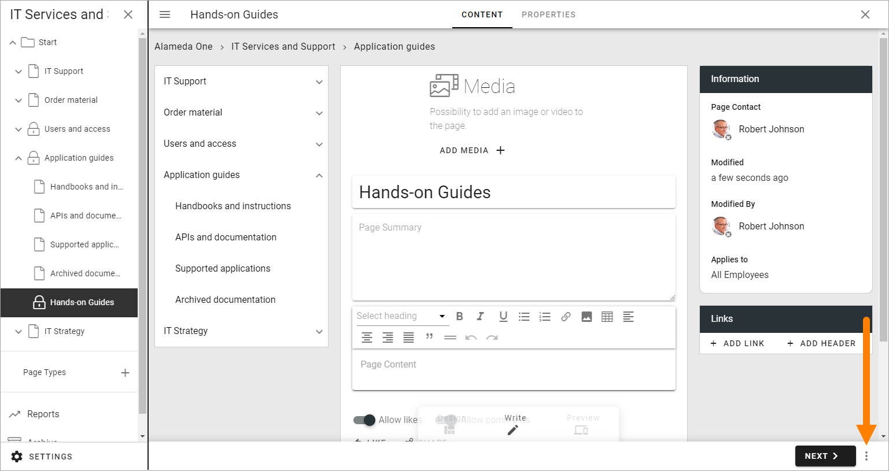
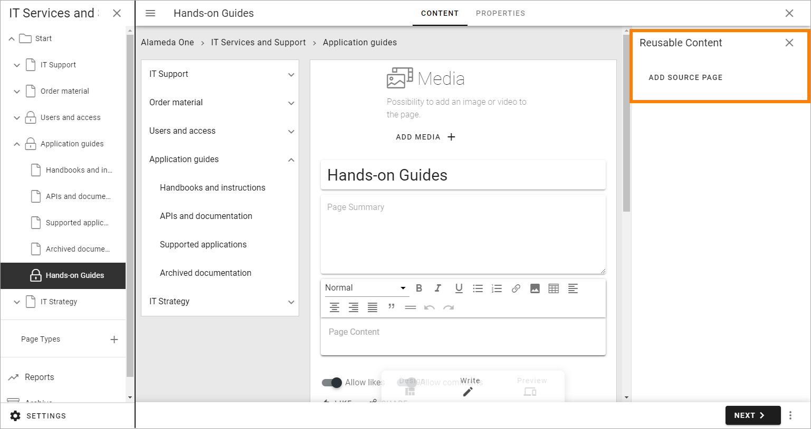
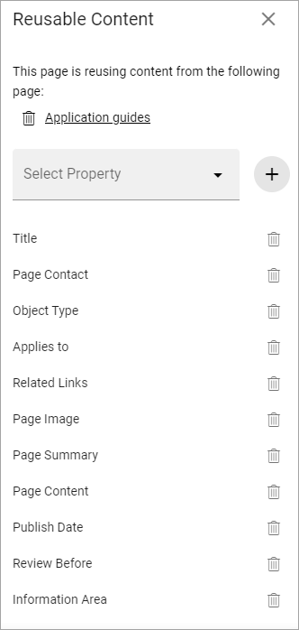

Reusable content
===================

Content from one Omnia page can be reused on another Omnia page. It's true for variations as well. To be more precise, it is content from defined properties that are being reused, so applicable blocks must be present on the target page, for information to show up. 

A property that are not shown for users can be reused as well, for example Review date.

A prerequisite for reusable content to be available, is that "Enable reuse content" is turned on in the publishing app settings, see: :doc:`Publishing app settings </pages/page-settings/index>`

Note that blocks with reused content are locked on the target page. They can not be edited there. Reused content can only be edited on the source page. 

Regarding permissions, the editor working with the reusable content on the source page must have editing permissions on the target pages as well, for publishing to the target pages to work.

Reuse content
*******************
When you are editing a page where you want to reuse content from another page, do this:

1. Open the action menu at the bottom right:

2. Select REUSEABLE CONTENT.

.. image:: select-reuse-content-new5.png

The following is shown:

3. Click ADD SOURCE PAGE.

The page picker starts and you use it to select a source page or variation. See this page for more information on how to use the page picker: :doc:`Page picker </general-assets/page-picker/index>`

**Note!** If an error message is shown saying "the page is not reusable", reausable content has not been activated for the publishing app, see above. 

The properties that are or can be reused on the target page are listed, for example:

If you don't want to reuse content from a certain property, click the dust bin to remove it from the list.

If additional properties are available, you can add any of them - so the content can be reused - using the "Select property" list. You can edit the reuse list any time you are editing the target page, so you can add or remove reusable properties as needed.

Also note that blocks reusing content are indicated this way, which you can see when editing a page:

.. image:: reuse-content-on-page-new.png

If you are reusing properties used for settings, that is indicated as well, with a dotted line at the bottom of the field, for example:

.. image:: reuse-content-on-page-settings-properties-new.png

In this example, three of the property fields are being reused from another page: Page contact, Applies to, and Preview before.

Editing the source page
*************************
When the source page is edited and then published, a check is executed. Published target pages are listed and it's noted if publication to the target pages worked. 

Here's an example:

.. image:: reuse-content-published.png

Automatic page creation
****************************
Content can also be reused in automatic page creation. For more information, see: :doc:`Automatic page creation </pages/automatic-page-creation/index>`
