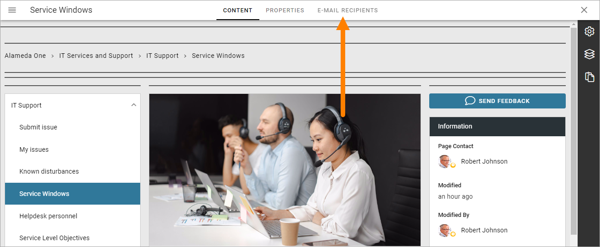
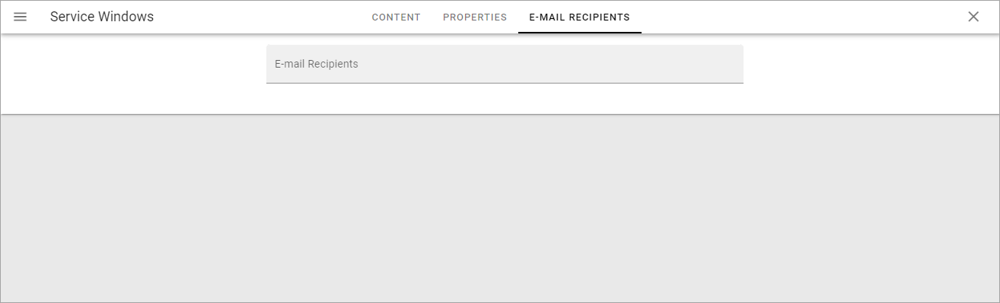
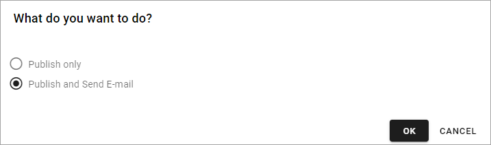

Send page as email
=============================================

If you should need it, you can send a page through email. To be able to do so the following must have been done:

+ The option "Enable Send as Email" must be activated in the page collection settings.
+ Email recipients must have been added for the page(s) you would like to send.

Every time you publish such a page you will be able to send the page if you want, or just publish without sending.

Information about the page collection settings are described om this page: :doc:`Page collection settings </pages/page-collections/page-collection-settings/index>`

Adding email recipients
*************************
When sending a page through email has been enabled, the following is available for all pages in the page collection:

(If "Enable Send as Email" has not been activated, this tab is simply not shown.)

Add all recipient's e-mails here, with semicolon as devider:

You save by publishing. You can change the recipients anytime.

Sending a page through email
*******************************
When you have edited a page and publish the changes the normal way, the following is shown:

Choose what you want to do - just publish or publish and send the page through email.

The page is always sent to all recipients, if you choose to do so.

