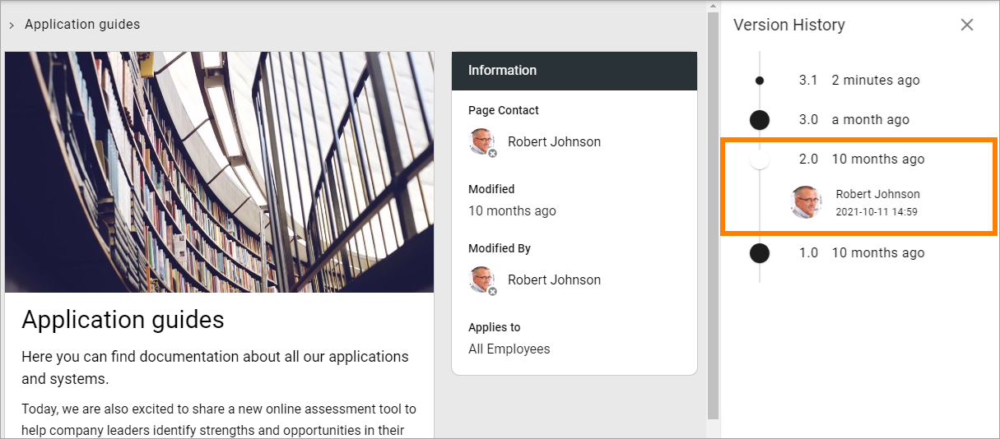
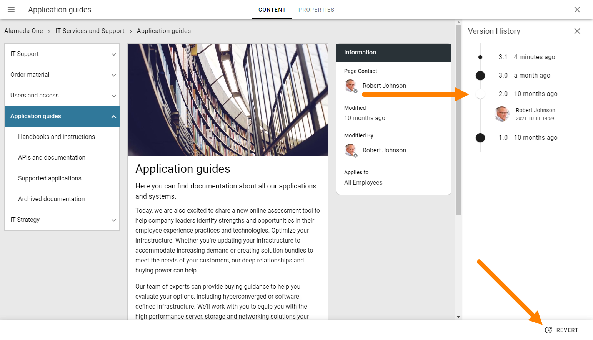

Check version history and use an earlier version
=================================================

Every time you save changes to a page (including when you publish) a new version history node for the page is created. You can check earlier versions and you can revert to an earlier version and continue working with that version, if needed.

Do the following to see version history:

1. Go to the page.
2. If you're editing the page, save the draft or discard changes, or the version history option will not be available.
3. Open the action menu and select VERSION HISTORY.

.. image:: page-version-history-menu-new3.png

Something like this is shown:

.. image:: page-version-history-list-new3.png

Published editions are noted with an integer, work in progress with a decimal. In the image above 3.0 is a published version, while 3.1 is a work in progress, meaning that the page is being edited. Changes have been saved but not yet published. 

To check a version of the page, click the version number. The version being shown are indicated by a dot in another color. You can see when the version was saved, if it's a work in progess, or published, if it's a published version.

Also note that the content of that version now is displayed in the content area.

.. image:: check-version-new2.png

If needed, you can revert to an earlier version and continue working on that version instead.

1. Click the version number for the desired version.
2. Click "REVERT".

