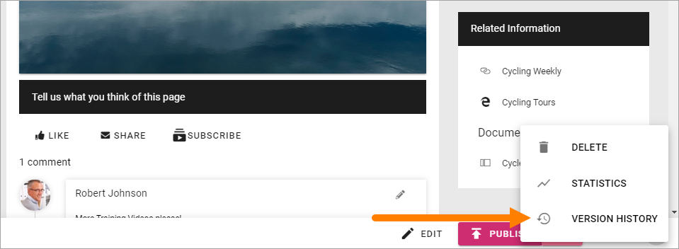
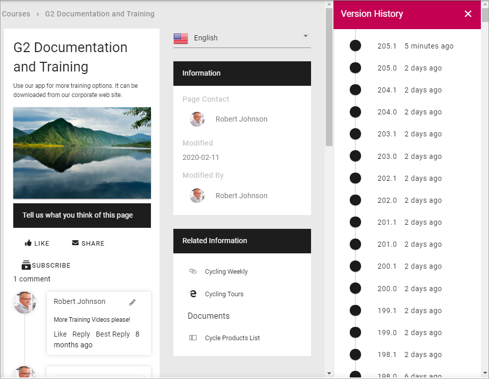
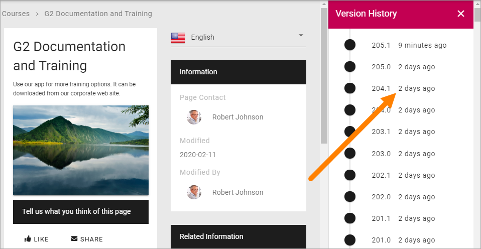
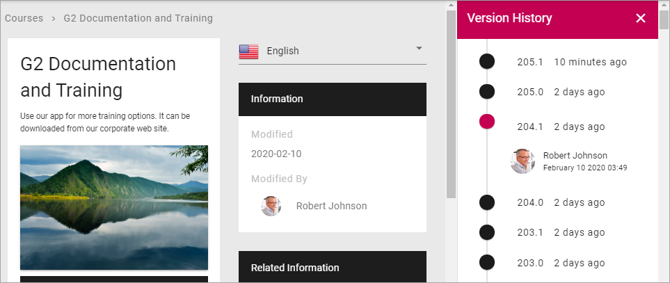

Check Version History and use an earlier version
=================================================

Every time you save changes to a page (including when you publish) a new Version History node for the page is created. You can check earlier versions and you can revert to an earlier version and continue working with that version, if needed.

Do the following to see Version History:

1. Go to the page.
2. If you're editing the page, save the draft or discard changes, or the Version History option will not be available.
3. Open the action menu and select "VERSION HISTORY".

Something like this is shown:

Published editions are noted with an integer, work in progress with a decimal. In the image above 205.0 is a published version, while 205.1 is a work in progress. 

Click the information about when the version was saved, to see who made the changes:

To check a version of the page, click the version number. The dot turns to red for the version being shown.

.. image:: check-version-new.png

If needed, you can revert to an earlier version and continue working on that version instead.

1. Click the version number for the desired version so the dot turns red.
2. Click "REVERT".

.. image:: page-version-revert-new.png
