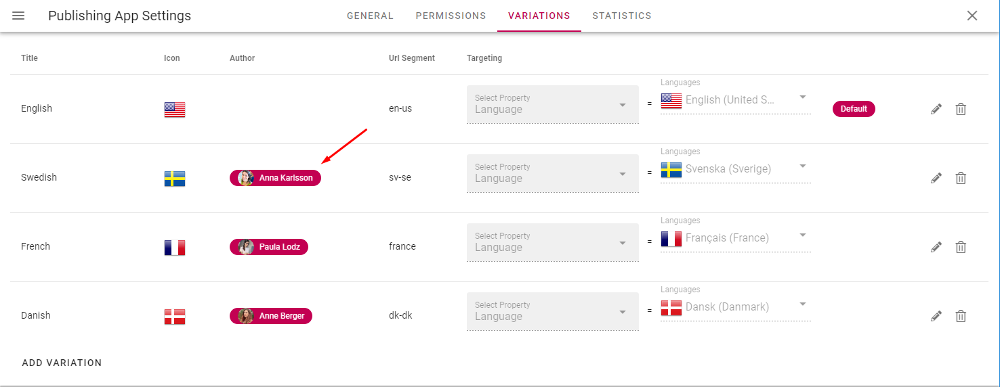
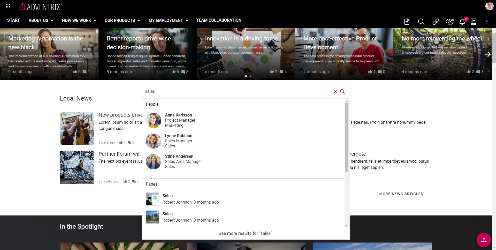
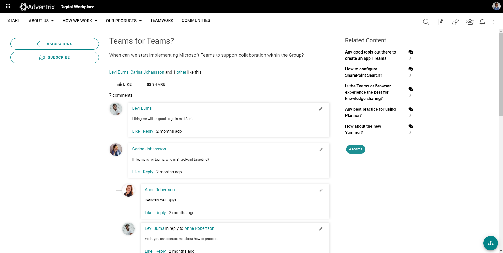
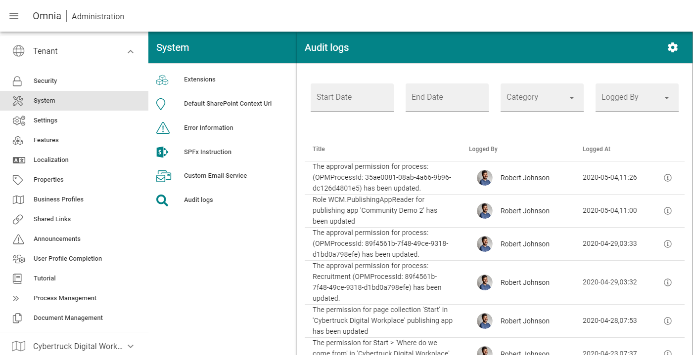

Upcoming Release 4.0.0 (Draft) 
========================================
*NOTE: These release notes are a draft. Items might be added, altered or removed.*

New features
----------------------------------------

Dynamic News Roller
************************************************

A new page rollup view is available that will make it possible, among other things, to show news on a start page in a horizontal scroll.

.. image:: dynamicroller.png

Pexels Connector
************************************************

It is now possible to enable Pexels images in the media picker. https://www.pexels.com provides high quality picture that are free to use.

.. image:: pexels.png

Note! This connector is not available for authors using Internet Explorer 11.

Tab control
*****************************************************************

A new section is now available in the web content management editor that makes it possible to create tabs instead of columns. Within a tab, more sections and blocks can be added. The tabs can also be displayed as accordions.

.. image:: wcm-tab-control.png

Translation Workflow
************************************************

Variation authors can now be registered to variations in a publishing app. A variation author is responsible for a specific variation and will be notified via e-mail when the default variation page is updated with a new major version.

Version Compare UI
************************************************

To help variation authors to translate a page, a new UI is available for comparing versions.

.. image:: compare-version-ui-icon.png

The UI will show the default variation page text on the left-hand side and the variation text on the right-hand side. It is possible to visualize changes that was made from the previous published major version of the default variation text. If you need to scroll the two texts separately, you can turn on the Scroll switch.

.. image:: compare-version-ui.png

Document Picker
************************************************

There is a new possibility to configure the Document Picker centrally in Omnia Admin to make different tabs available for the author. Two types of categories can be created, either you select a specific SharePoint document library or you create a Search Category that should be available.

.. image:: document-picker-administration.png

The new document picker will replace the old one when adding related 
s on web pages. It will also show any document library that has been configured for the current publishing app.

.. image:: document-picker-ui.png

The new document picker will also be available in the document rollup. This will make it possible to pick individual documents instead of using a query to display documents.

.. image:: documentrollup-pickdocuments.png

Improved Search
************************************************

(#116729)

It is now possible to configure a search box to be shown in the header of a business profile.

.. image:: search-in-header.png

The Advanced Search block has been replaced by a Search block that can be configured to show either a quick or advanced search view with some additional display settings.

A search category can be targeted to a specific group of people based on the targeting system in Omnia. The targeting settings will be used both in quick and advanced search.

.. image:: search-categories-targeted.png

Improved Teamwork Navigation and Administration
************************************************

(#116996, #114661, #114870, #117577, #114837, #116854, #117576, #118444, #117581, #117854)

Teamwork Administration in Omnia Admin has been improved. The list has sorting and paging and additional information columns have been added to the list. It is possible to search for a Teamwork based on the title and Teamwork properties can be edited.

.. image:: teamwork-administration.png

Process Management
************************************************

A new capability makes it possible to design and publish processes. Processes are managed in process libraries in team sites.

.. image:: processmgmt-library.png

.. image:: processmgmt-editor.png

Process steps can be related to information such as description, documents, links and tasks.

.. image:: processmgmt-developproducts.png

The end user can navigate in the process via process navigation or shapes in the process drawing.

.. image:: processmgmt-planning.png

Communities
************************************************

The community features in Omnia have been improved. A community includes makes it possible for any user to share their knowledge with others using knowledge articles and discussions.

Subscriptions and an activity feed makes it possible for users to stay up to date with changes within communities.

.. image:: community-knowledgearticles.png

.. image:: community-knowledgearticle.png

Improved Audit Log
************************************************

A UI to read the audit log is now accessible in Omnia Admin under System > Audit logs. The audit log includes all permission changes in Omnia.

User Profile Sync
************************************************

(To be added to release notes soon!)

Enable/Disable Business Profile Header (and Pre-allocated Height)
*****************************************************************

It is possible to enable/disable the business profile header and navigation on a team site or publishing app by activating/removing the feature "Show Business Profile Header".

When the Business Profile Header is shown on a team site, the height is now pre-allocated until the whole page is loaded.

Enhancements
------------------------------------

Omnia
***********************
- Fixes to remove certificate error in Firefox.
- Several fixes to align with WCAG 2.1 AA.
- Improved keyboard controls.
- Several performance improvements for both Omnia and SPFx.
- Stability improvements to the color picker.
- Improvements to block background color settings.

Web Content Management
***********************
- Now possible to use @mentions in page comments. An email will be sent to the mentioned user. (#113114)
- New Tab Section component, use it to create tabbed views on your pages.
- Deleting a page now gives correct UI feedback.
- Ensured correct label on the edit link and edit header in related links.
- Picking a document in related links can now support libraries with more than 5000 documents. 
- Auto rolling of the news roller will be disabled if accessibility mode is turned on.
- Custom block header size now starts at 1px instead of 30px.
- The page rollup now works correctly in SPFx (#118051).
- Scheduled pages can now be edited even after the schedule is set (#118473).
- The news roller can now be configured to not automatically rotate.

Document Management
***********************
- Support for vsdx icons.
- The Tabs Drafts, Tasks, and Published now has a larger click area (#117861).
- Built in properties are now visible in the properties dialog (#118418).
- Its now possible to define a tenant wide base query for what Omnia considers a document. This base query will be used by omnia when loading documents from SharePoint. This will make it possible to show more filetypes in the document rollup. (#118655). 

Tenant Administration
***********************
- Better handling for long display names on enterprise properties. (#114375, #114783, #117172).

Workplace
***********************
- It is now possible to base search queries on page variation url segment. 
- Targeting for search categories. It is now possible to use the targeting engine on search categories. (#115142, #115263).
- Date refiners now work as expected in advanced search (#114577, #115570).
- Updated design in advanced search (#117305, #116824).
- Updated design for action bar item tabs.
- Updated design for shared links. (#116056).
- Action button has received many updates and multilingual support has been improved and it can now be used to create pages (#117303, #114101, #118480, #117730).

Fixes 
***********************
- Fixed a design glitch in document libraries when the omnia header is used. 
- People rollup roller view now auto rotates correctly (#117277).
- Page rollup column adjustment now works when having only one column (#117154, #117304).
- Correct default setting on date format when setting up a new environment (#114587).
- Several fixes to the document rollup, including taxonomy properties now work correctly in the query builder (#117598).
- Fixed an issue when related links settings would be unavailable after adding a link (#117580).
- Corrected email content from comment on important announcement (#117825).
- Background color on Shared Links is now set correctly when using the color picker to remove the color (#117646).
- Site Design is now hidden from the end user when creating a site (#113598).
- Improvements to term picker in dialogs.
- Fixed a problem that would cause the browser to hang if resized.
- Fixed alignment of top header for nodes without children.
- Fixed a z-index problem that would sometimes occur in SPFx.
- Padding now works as expected on the button link (#116905).
- Fixed a problem in the term picker for controlled documents (#117247).
- Fixes to the document rollup query builder to have better default values.
- Several fixes to margins and padding on the action button.
- Fixes to block margins, border radius and breadcrumb margins (#117653).
- Placeholder behavior is now correct on the accordion.
- Corrected UI in Document Management authoring sites to make tick boxes align (#117430).
- Corrected mobile navigation when using multiple page collections in one navigation structure (#115759).
- Document rollup now shows sorting arrows correctly when sorting (#117793, #118277).
- Document rollup now correctly hides when there is no content in the rollup (#117827).
- Advanced search now always shows the correct item count. Also impacts results and paging in some scenarios (#114072, #115352, #116723, #114039, #115789, #117802, #115121, #115250).
- External links in Shared Links now work correctly on IOS (#117048).
- Adding documents through related links now correctly lists deleted users (#117801).
- Now possible to create two enterprise properties with the same display name (#115627).
- Fixed the page properties block to correctly row break properties that does not fit (#118275).
- Azure AD groups with special characters in their name now correctly show up in people pickers (#118570).
- Default date page properties now correctly work with days as a time setting (#118450).
- Create new page via the page rollup now correctly works in all multi page collection scenarios (#115498, #117822).
- Getting default properties for documents from site properties now work correctly (#117774).
- Fixed alignment in some menus of Omnia admin (#118445).
- Fixed a problem where navigating between ODM authoring sites would not work correctly when my sites was used for the navigation (#118034).
- Team News Rollup now has correct localization for social dates. (#117788).
- Auto publish now works correctly on all page collection configurations (#115434).
- Stability improvments to connect site to omnia (#117468).
