Release 5
========================================

Newsletter
-----------------------------------------
You can now setup a Page Collection to allow for pages to be sent out by e-mail.

.. image:: newsletter-settings.png

This makes it possible to build a Newsletter solution for authors.

.. image:: newsletter-archive.png

An important part of a newsletter is to be able to manually pick which news that should be shown in a rollup. A new feature makes it possible to configure a page type to pick pages in write mode.

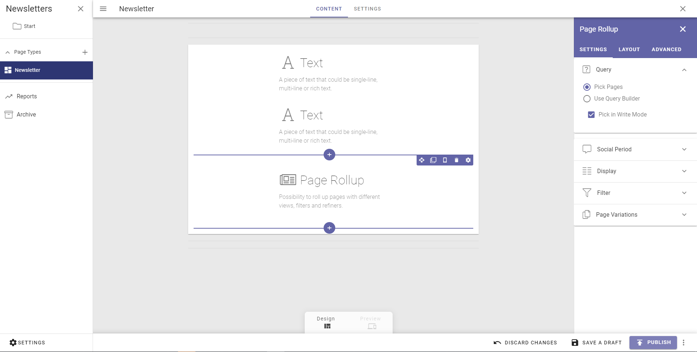

The author can now create a newsletter, write an introduction and pick the news articles that should be sent out.

.. image:: newsletter-pick-pages.png

A new tab is available where it is possible for an author to decide the target group for the newsletter by putting in one or more e-mail addresses.

.. image:: newsletter-recipients.png

Before a newsletter is sent out, the author can send a preview to any e-mail address.

.. image:: newsletter-send-preview.png

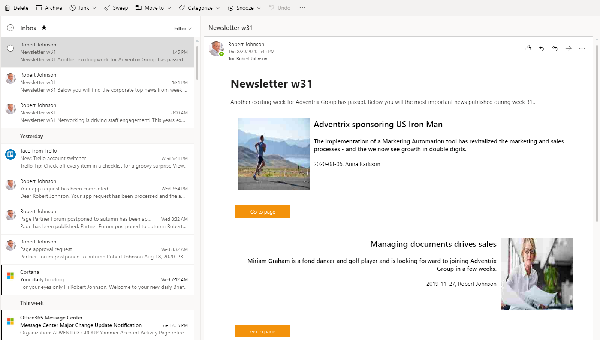

Page Lifecycle Improvements
-----------------------------------------

It is now possible for an editor to hide pages. This can be used to temporary unpublish a page or to prepare a new part of the intranet content structure before it goes live.

.. image:: page-lifecycle-hide.png

When a page is hidden, all sub pages will also be hidden.

.. image:: page-lifecycle-hide-2.png

When a page is hidden, it is not only hidden in navigation, but also when trying to access the page using the full url and/or search.

.. image:: page-lifecycle-hidden-404.png

At any point it is possible for the editor to show a page and all its sub pages again.

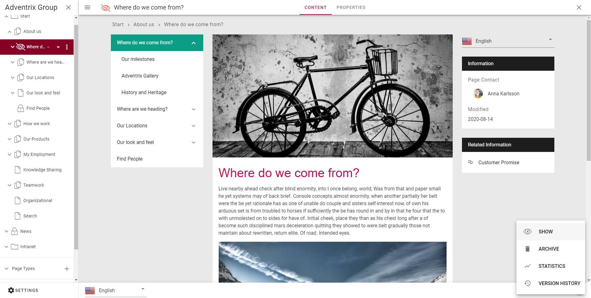

The Delete page action has been replaced with an Archive page action.

.. image:: page-lifecycle-archive.png

When a page is archived, you should provide a comment on why the page or pages should be archived.

.. image:: page-lifecycle-archive-confirmation.png

It is possible to archive a single page, a number of pages, a whole page collection or a page type. All archived objects will end up in the section Archive that can be accessed in the left-hand side menu.

.. image:: page-lifecycle-archive-pages.png

It is possible to restore pages, page collections and pages types from the archive. You can also decide to terminate the archived item. This action is irreversible.

.. image:: page-lifecycle-archive-restore.png

Text Block Improvements
-----------------------------------------

The text block rich text editor has been improved based on feedback from our customers.

Tables
*****************************************

A new drop down for table styles is now available in the table toolbar. This makes it possible to select a predefined style for the table based on grayscale or the primary color.

.. image:: rtf-table-styles.png

It is also possible to style a specific cell with a background color and border style.

.. image:: rtf-cell-style.png

Media
*****************************************

When adding an image or video in rich text using the media picker, it is now easier to edit it by selecting the media and use the action buttons on the media.

.. image:: rtf-media-tools.png

By default, the media will use 100% of the text block width, but it is possible to set a fixed width if needed.

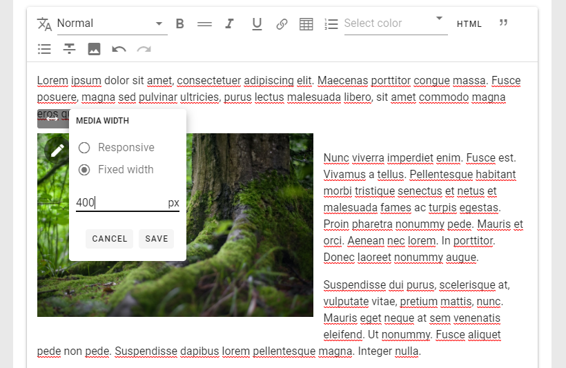

When a fixed width is set, it is possible to align the media within the block and decide how the text should flow together with the media.

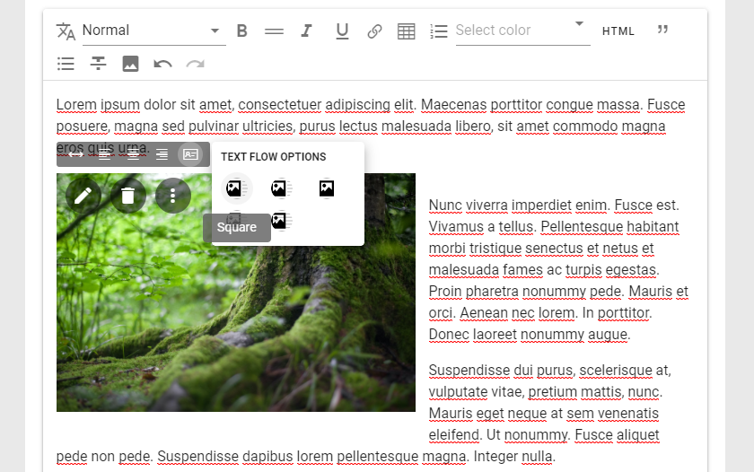

Links
*****************************************

This release makes it easier to manage links in rich text. It is possible to select a piece of text and quickly create a new link.

.. image:: rtf-links-add.png

.. image:: rtf-links-add-2.png

Once a link has been added, it is easy to remove or update the link using the action buttons next the link.

.. image:: rtf-links-update.png

Paste
*****************************************

When you copy html from a web site or Word or likewise and paste it into a rich text block...

.. image:: rtf-copy-from-web-site.png

.. image:: rtf-keep-text-only.png

...it is now possible to keep the text only.

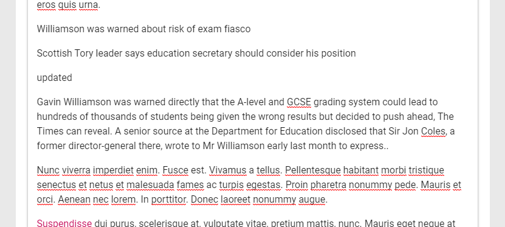

You can also select a portion of the rich text and clear the formatting by clicking on the keep text only action button.

Alignment
*****************************************

It is now possible to align paragraphs within a text block.

.. image:: rtf-text-alignment.png

Floating Toolbar
*****************************************

If the text block that is edited is longer than the page and you need to scroll down on the page, the toolbar of the rich text block will float on top of the page.

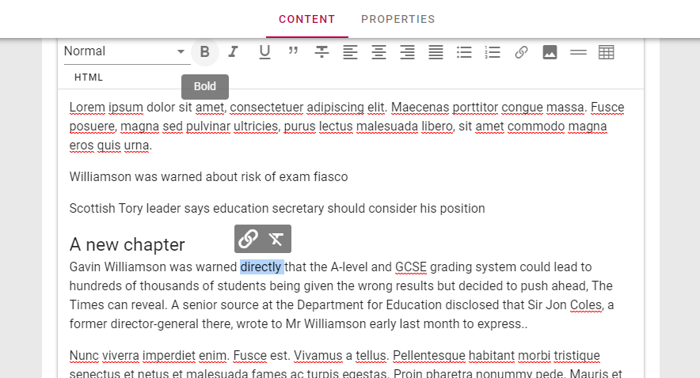

Central Text Styles
*****************************************

Text styles that are used in text blocks can now be configured in Omnia Admin. It is possible to add custom styles that can be used in the solution. If the styles are set to Inherit, it will use default system styles.

.. image:: rtf-text-styles.png

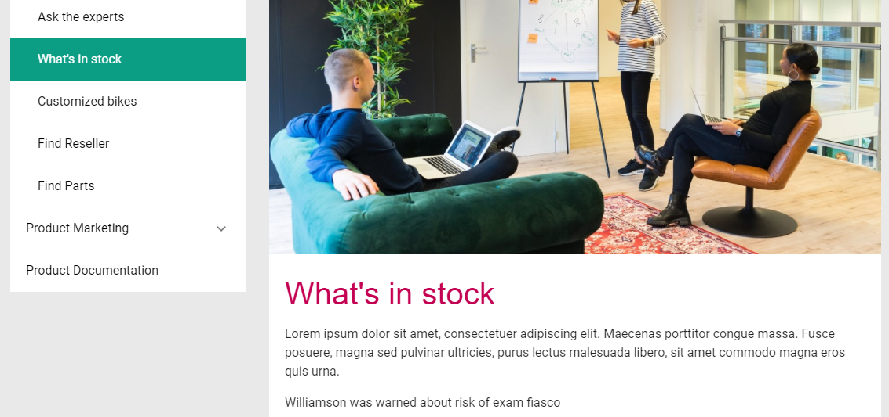

Design Improvements
-----------------------------------------

This release includes a number of design improvements. Some of the improvements are listed below.

Page Style
*****************************************

A new level of branding has been added to web content management. It is now possible to add a specific style to a single page or page type. Among the settings that are supported are background image and style and the possibility to set a specific theme for the blocks on the page.

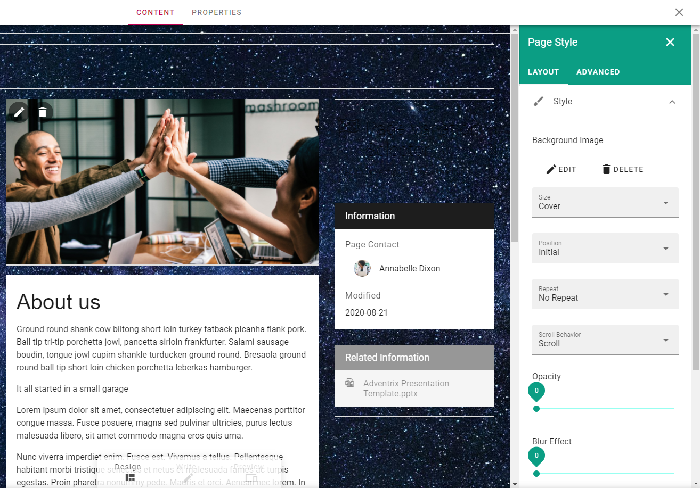

Card View
*****************************************

The People Rollup and Page Rollup blocks have a new card based view that can be configured based on needs.

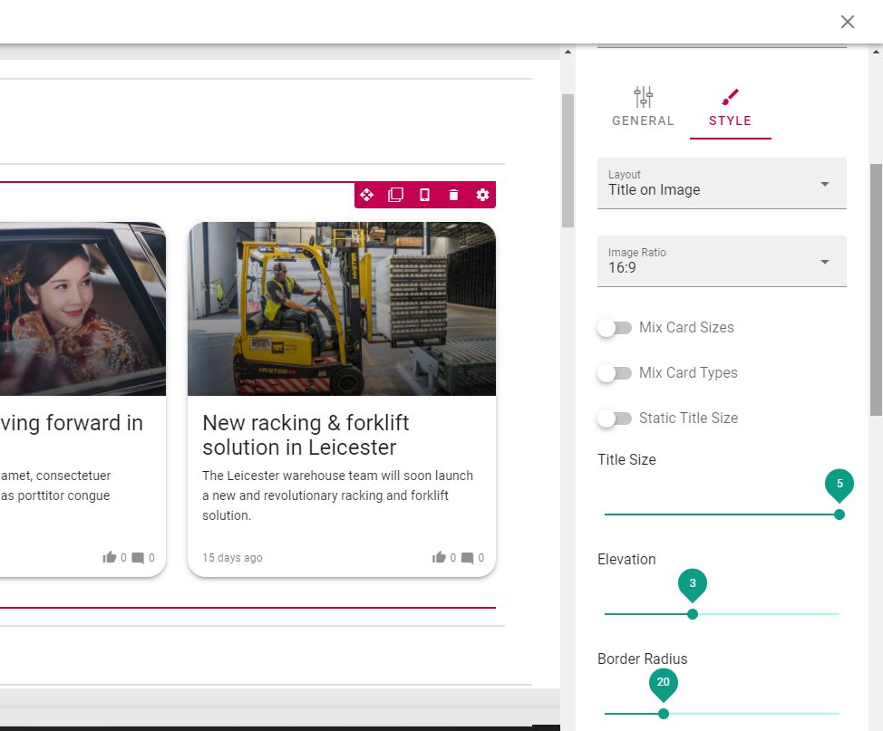

.. image:: designupdates-people-cards.png

Microsoft Teams Integration
-----------------------------------------

.. note:: A new app consent is needed to allow Microsoft Teams Single sign on. It contains the following added permissions:

          - **offline_access (Delegated)** Maintain access to data you have given it access to
          - **openid (Delegated)** Sign users in
          - **profile (Delegated)**	View users' basic profile

It is possible to take your intranet to Microsoft Teams using one or many Teams Apps.

.. image:: teams-start-page.png

Omnia supports single-sign-on in Teams Apps in order to fully support the Microsoft Teams mobile app experience.

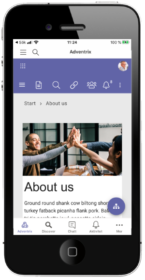

Links that are created in Omnia (quick links, related links etc) support the possibility to use deep links in the Microsoft Teams client.

.. image:: teams-deep-links.png

Deep links can take you to almost any item like channels, tabs and apps within Microsoft Teams.

.. image:: teams-deep-links-2.png

A new provisioning base template is now available for Teamwork. It is possible to configure a Microsoft Teams template with predefined channels, apps, tabs and settings.

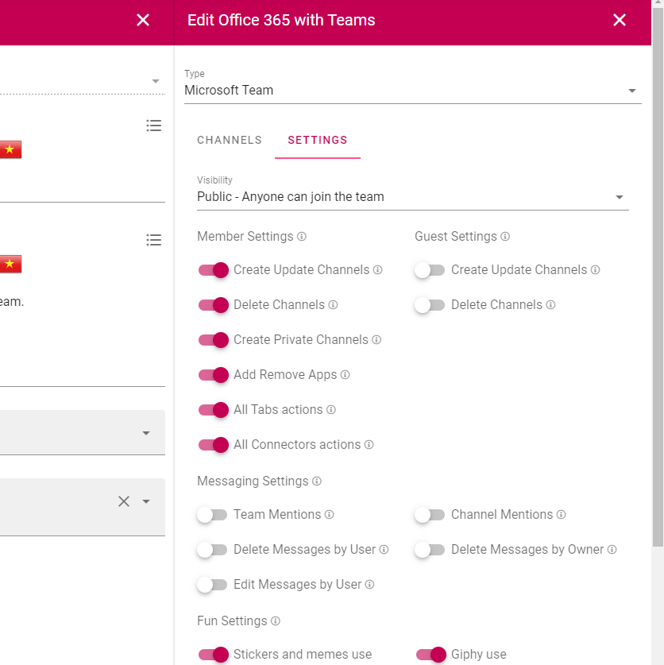

The Teamwork rollup can be used to create a specific Microsoft Teams app to allow a Teamwork directory to be published in the Microsoft Teams client.

.. image:: teams-teamwork-directory.png

From there, it is possible to run the Create Teamwork wizard as a block in horizontal mode.

.. image:: teams-create-teamwork.png

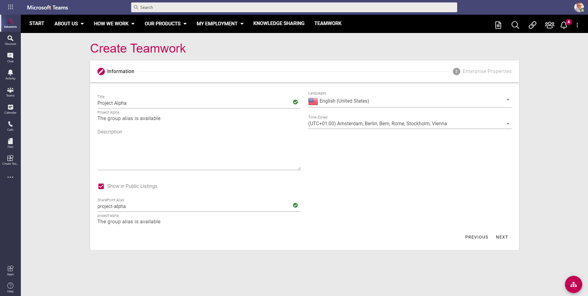

Microsoft Search Integration
-----------------------------------------

It is now possible to configure the sync from Publishing Apps in Omnia to SharePoint Site Pages. The configuration includes mapping of properties to specific fields in SharePoint, and the possibility create redirect Site Pages that will take the end user to the Omnia page instead of the backend Communication Site Page.

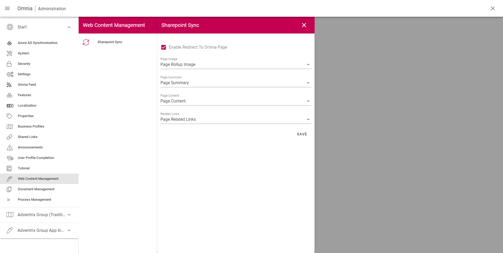

These synced pages will be picked up by and displayed by Microsoft Search. When the user clicks on an item in the search result, the user will be redirected to the correct Omnia page.

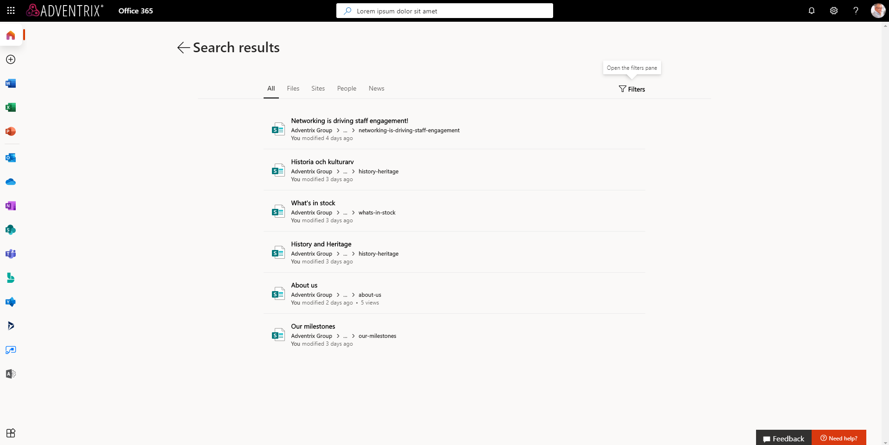

Governance Dashboards
-----------------------------------------

A new block, Governane Dashboard, is now available and can be used to show important metrics in the solution. The first couple of metrics that is shipped with Omnia is targeted to pages, communinities and teamwork. Each area also support specific filters that can be applied to the metrics.

.. image:: governancedashboard-pages.png

When the user clicks on a specific metric, a report will be shown. In this example, all pages that are waiting approval is shown.

.. image:: governancedashboard-waiting-for-approval.png

Specific metrics are targeted to communities in order to identify how comments and ratings are used by end users.

.. image:: governancedashboard-communities.png

Other metrics are targeted to teamwork. This will make it possible to identify how much Teamwork that is created within the solution based on different timespan.

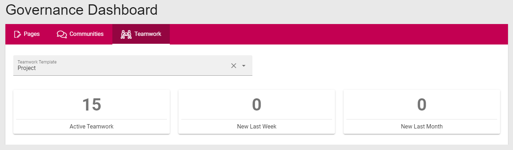

More metrics will be deployed to Omnia going forward.

Omnia Tenant Contacts
-----------------------------------------

There are three roles that can be added as tenant contacts in Omnia Admin:

* Main Contacts: Will receive important announcements from the product team regarding for retirement of features or major service interruptions.
* Security Contacts: Will recieve a message from the product team on any suspected or ascertained security breach in the system.
* Update Notification: Will receive an automatic e-mail from the system whenever the tenant has been updated with a new version of the core product or any extension.

.. image:: tenantcontacts.png

.. note:: It is very important that a main contact is registered in the tenant.

.. note:: The e-mails that are sent out to inform about updates are sent from no-reply@omniacloud.net. Make sure to check your junk mail or create a new rule in your e-mail system to trust this e-mail address.

Stacked Processes
-----------------------------------------

A new setting has been added to the Process Drawing block to allow the process drawings to be stacked on top of each other when the user navigates the processes.

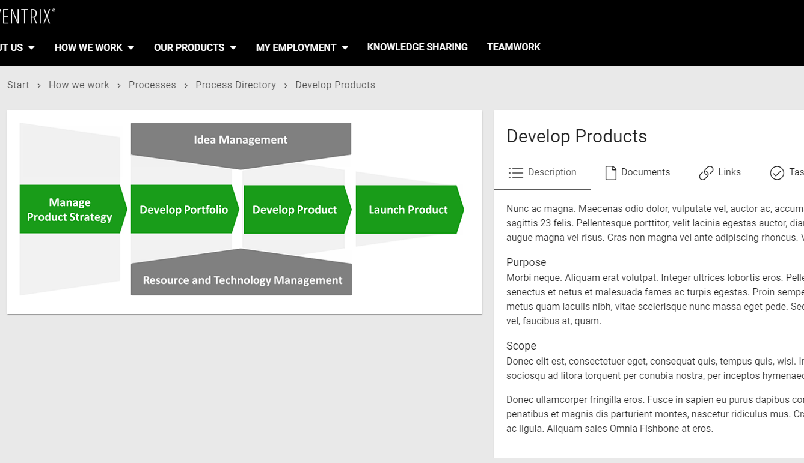
.. image:: stackedprocesses-step-2.png

Versions
-----------------------------------------

.. toctree::
   :titlesonly:

   versions

