Release 6.12
========================================

Search
----------------------------------------

It is now possible to include tokens in a search category query. The tokens will be replaced with values
when the query is executed. This new feature makes it possible to create context dependent queries based on the
underlying SharePoint site, app instance or user properties.

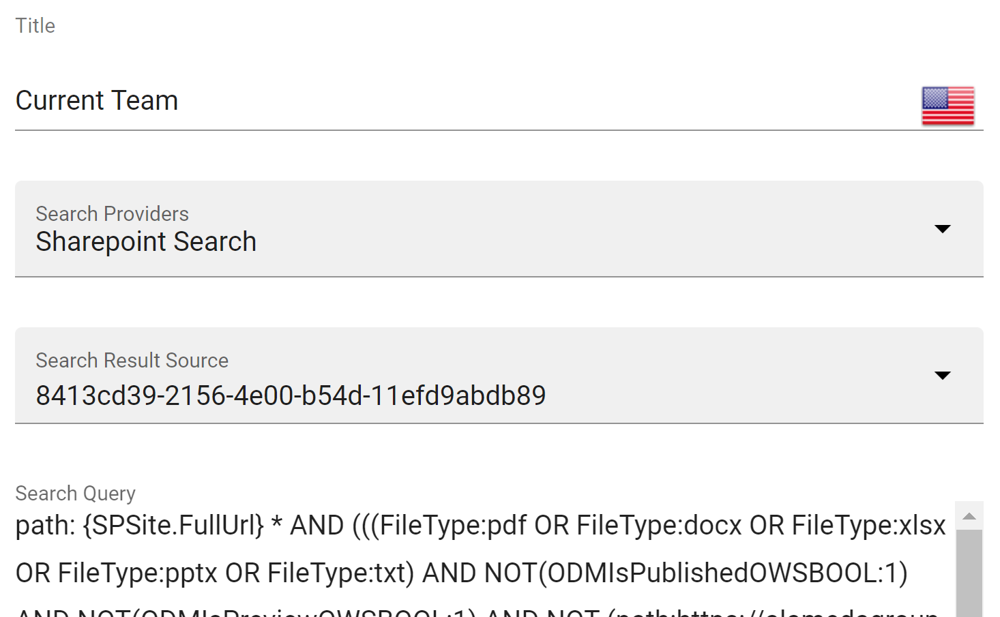

It is possible to enable spell check in search. If enabled, the user will get a suggestion on potentially misspelled words
with the possibility to search on the correctly spelled word.

.. image:: search-spellcheck.png

Quick search has been improved to show the total result count for each category in the result.

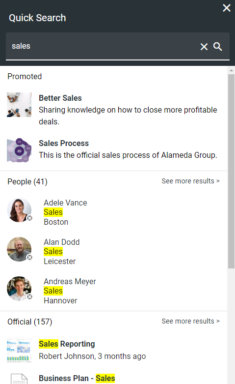

Search statistics can now be enabled on all locations where a search block is being used (Header, Quick Search, Advanced Search etc).
Once statistics is enabled, the system will start collecting information about how users use search. The following metrics can be used to follow up on the statistics.

* Total no of queries: Shows the total no of queries with the top most used queries on top in the details view.
* Abandoned queries: Queries that was abandoned by the user. (The user did not click on any result).
* No result queries: Queries that didn't generate any result.

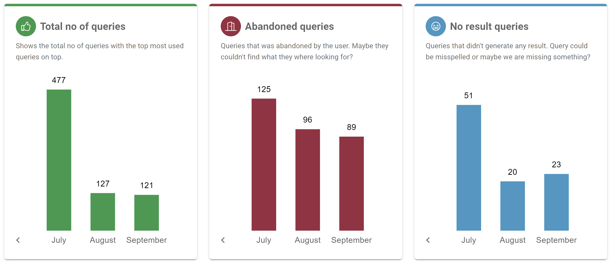

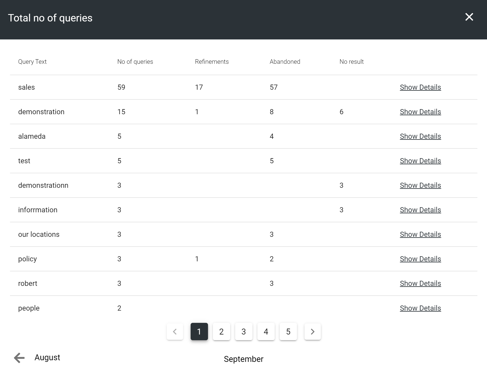

To be able to have a distributed ownership of search related features, a new search administrator role has been added in Omnia Admin.

.. image:: search-administrator.png

It is possible to set a default value on date refiners in search. This can be used to filter out old documents by default.

.. image:: search-defaultvalue-dates.png

Metrics
-----------------------------------------

The design of metrics has been updated and it is now possible to provide an icon and a description to a metric.

.. image:: metrics-updateddesign.png

Apart from the new search metrics above, a number of new teamwork metrics are now also available.

.. image:: metrics-teamwork.png

WCM editor
-----------------------------------------

Copy content from Microsoft Word has greatly improved and now supports multiple images.

The panes within the WCM editor are now adjustable to allow for more space to administrate the navigation structure
and properties dialog.

Approval can now be set up to apply to authors only. This makes it possible to invite a number of authors to a page collection
to write articles without affecting the productivity of editors within the same.

.. image:: wcm-approval-applytoauthorsonly.png

The Central Image Locations feature in Omnia Admin > Settings > Media Picker has been renamed to Central Media Locations
and now supports new Stream (on SharePoint).

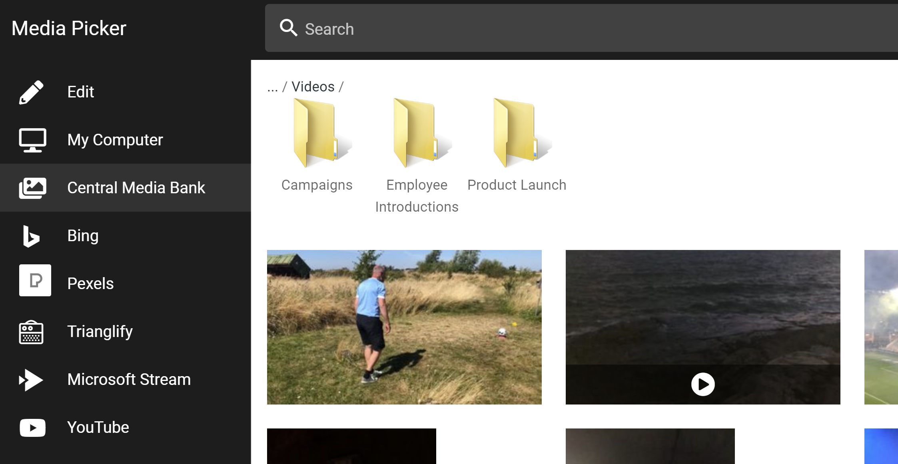

It is now possible to switch between the page collection type Flat and Navigation Structure.

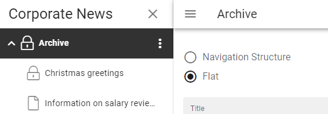

A new page collection setting makes it possible to connect it to a taxonomy. Whenever a page is created in the page collection, a term
will be created in the connected taxonomy and the page will automatically be tagged with the newly created term.

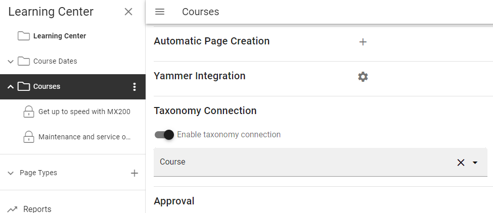

A publishing app can now be configured to have promoted tags/terms for certain properties.
Promoted tags/terms will be displayed on top of the tag/term picker both for the author when working with pages
and for the end user when filtering in a page rollup.

.. image:: promotedtags-tagpicker.png

Text blocks can now be configured to enable the creation of #tags inside the text.
Any #tag that is added in the text block will be set in the configured corresponding property.

.. image:: wcmeditor-tagsintextblock.png

You can enable the possibility to work with controlled documents within a publishing app.

.. image:: publishingapp-controlleddocuments.png

The different document management settings that you can configure for a publishing app have been moved into one location.

.. image:: publishingapp-dmsettings.png

If you use the Omnia file storage in Azure for your publishing app to allow for front-line workers to access related documents
in a page, it is now possible to allow document upload to the file storage.

.. image:: publishingapp-dmfilestorage.png

Social
-----------------------------------------

It is now possible to turn on social reactions in your tenant. Social reactions will replace the like feature on areas such as comments, discussions and posts.

.. image:: socialreactions.png

When you activate the social reactions feature, existing likes will be shown as a thumbs up (like) social reaction.

Two new buttons are now available in the RTF editor:

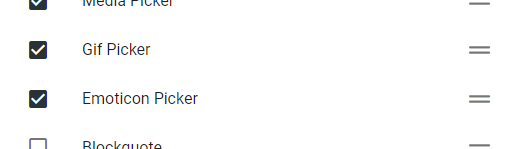

Emoticon Picker: Possibility to add emoticons to the rich text.

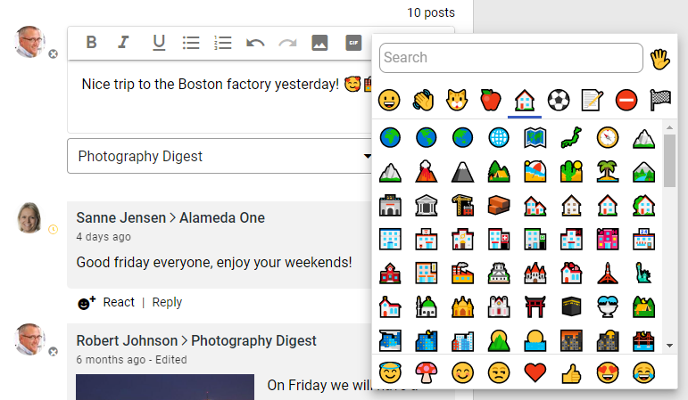

Gif Picker: Possibility to add an animated gif from Giphy.

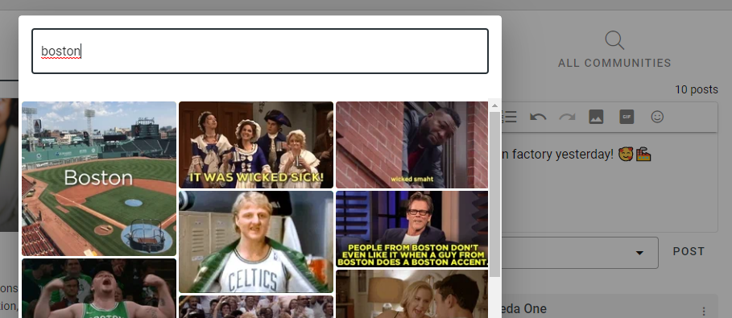

Page Rollup
-----------------------------------------

It is now possible to sort the Page Rollup on [Last Activity]. Last Activity includes the modified date,
but also activities such as new comment, reply to a comment and mark as best reply.

The Last Activity feature can be used in combination with showing the last comment on the card view.

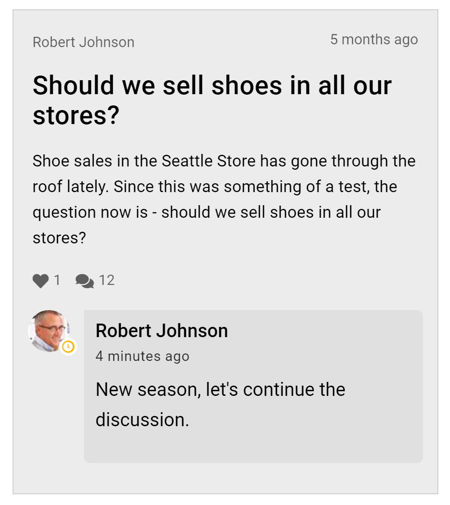

The card view now allows for dynamic layout of properties.

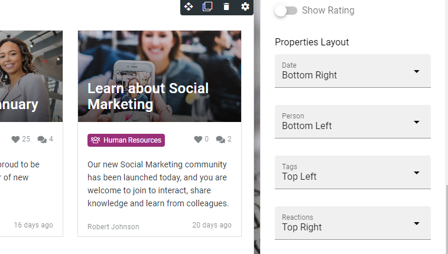

Social reactions and Share are now available in the dialog display.

.. image:: pagerollup-socialreactionsindialog.png

The Page Rollup block can now be used to create metrics. The total count of pages in the rollup can be displayed as a metric.
When you click on the metric, the page rollup view will be shown in a dialog.

.. image:: pagerollup-metrics.png

.. image:: pagerollup-metricsdialog.png

The [Unique Users] built-in column can now be configured with a goal. The column will indicate whether the goal is met or not.
If the solution has been configured to collect detailed statistics based on user properties, it is possible to show those details for each page.

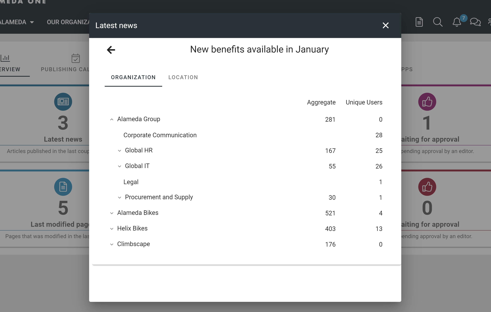

The image preview in the card view now supports document data properties. This makes it possible to preview contents from a shared document in communities.

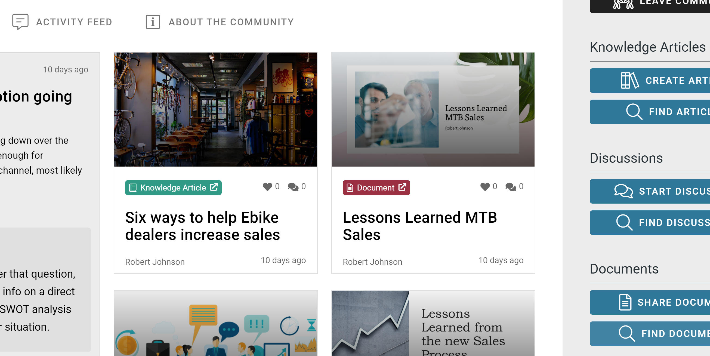

Management system
-----------------------------------------

A document type can now be configured for records.

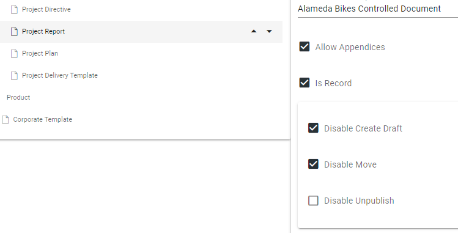

If a controlled document (using such a document type) is published, it will be marked as a record.
Records can be filtered out with a new property in document rollups. Any restrictions configured on the document type will prevent certain activities on the document such
as creating a new draft, move the document or deleting it.

.. image:: dm-restrictionsonrecords.png

When a controlled document has been published, it is possible to provide a signed copy of the document.

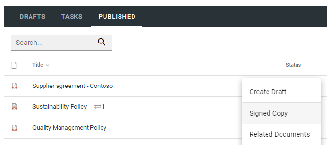

The signed copy can be either a digitally signed copy or a scanned copy of the document.

.. image:: dm-signedcopy-dialog.png

An icon will show to the end user if there is a signed copy available for the document.

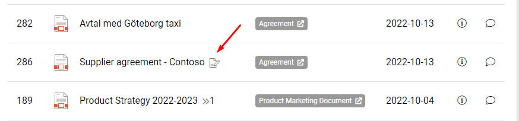

A process can now be shown in the context of a teamwork. This makes it possible to set the status on the different steps in the process for a the teamwork.

.. image:: pm-teamwork-stepstatus.png

The different tasks in a process step can now be assigned to members of the teamwork using Microsoft Planner.

.. image:: pm-teamwork-assigntasks.png

The feature that replace property placeholders inside documents on publishing now also supports Excel and PowerPoint.

The Process Context block now supports the possibility to select a specific process that should be put into context.

Omnia is now integrated with the best-in-class document comparison tool from `Draftable <https://draftable.com/>`_.
This makes it possible to compare the latest published edition of a controlled document to a work in progress.
The integration has been added to all workflows available on drafts.

.. image:: dm-integrationdraftable..png

The feature will also be available to end users to compare the current published edition with the previous published edition.

The review reminder task has been updated. If a new edition/revision of a controlled document is published or the published document is deleted, any associated review reminder task will be automatically completed.
If the review is completed, the review comment will be added to the document history and a new review date will be calculated based on the review reminder rule set on the document type.

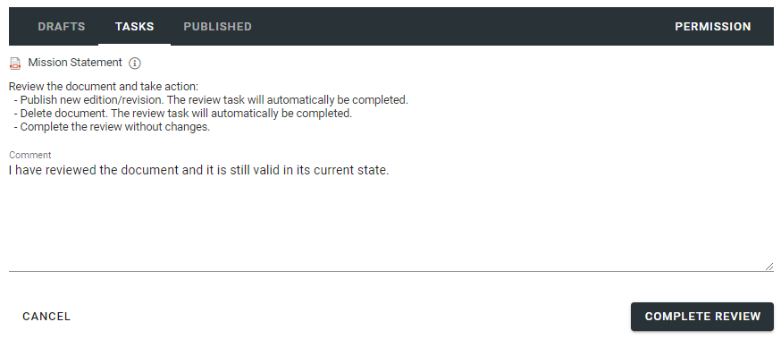

Other
-------------------------------------------

A new action "Add to my calendar" can be added to pages. When clicking on the button, an ics file will be downloaded.

A new QR Code block is now available. The QR Code can either be used to generate a code based on the current page or a specific url.

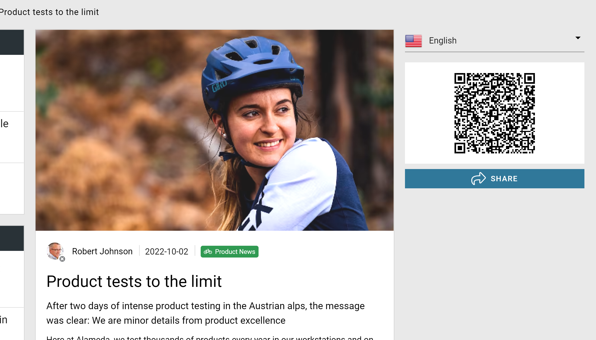

QR codes have also been added to the Digital Signage feature.

The People Rollup block has a new query scope that makes it possible to get all upcoming birthdays.

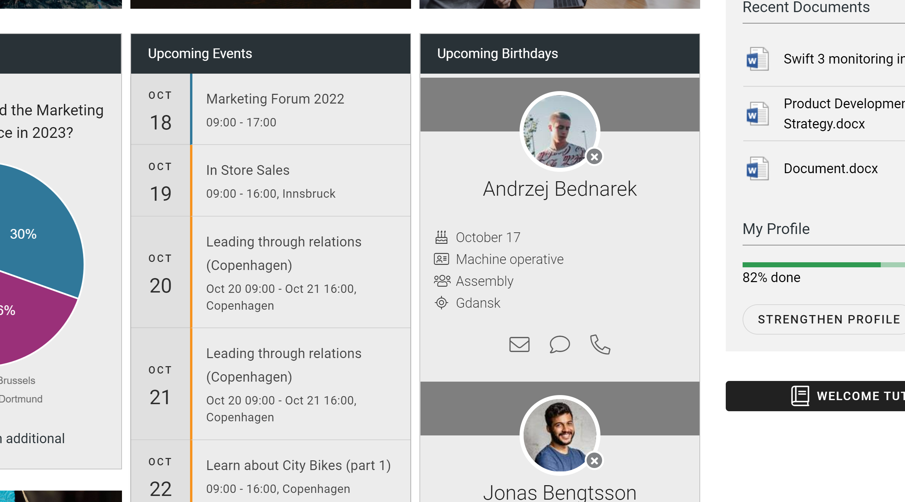

Versions
-----------------------------------------

.. toctree::
   :titlesonly:

   versions
