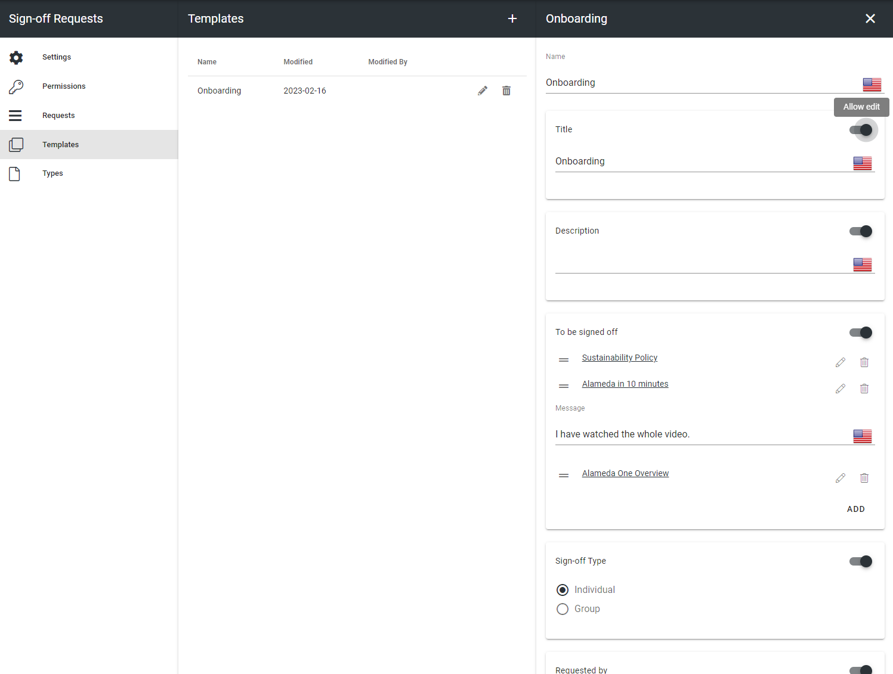
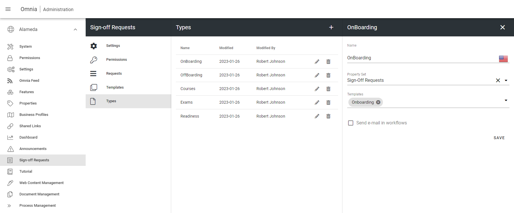
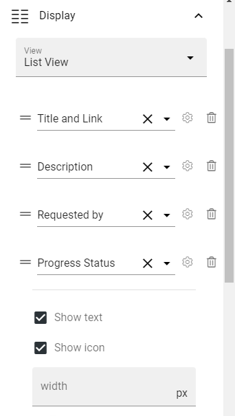
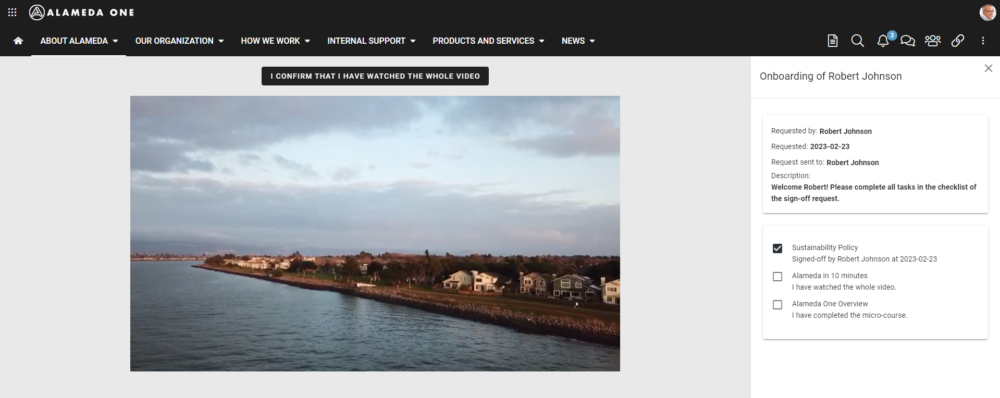
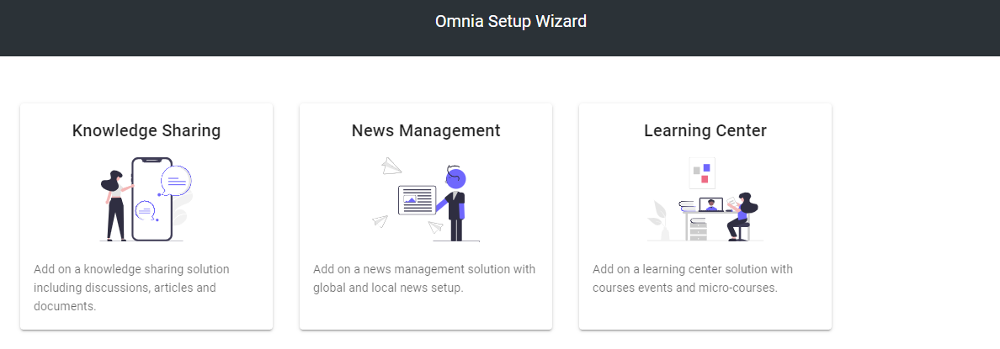

Release 6.13 - Draft
========================================

Sign-off reuqests improvements
----------------------------------------

It is now possible to create individual or group requests. Each item in a group request, can be signed off by anyone in the group.

It is also possible to send a request from a group making it possible for anyone in the group to follow up on the request.

.. image:: sign-off-request-form.png

The sign-off request templates have been improved to support more predefined settings such as Title, Description, Requested by etc.
Each individual setting can be configured to be editable or not. A non-editable setting will not show up in the sign-off request form.

Each item in the "To be signed off" section can have a custom message that are presented to the end user.

It is possible to add different types of sign-off requests that can have a set of properties related to it.

The sign-off request rollup block has been improved to make it possible to filter out specific sign-off requests both from the context of an admininstrator and from the
context of an end user. A list view has been added for better flexibility.

.. image:: sign-off-request-rollup-query.png

The navigation for the end user within the sign-off request has been improved a lot. It is now possible to browse through the different items in the sign-off request while still keeping
the sign-off request open.

Setup wizard
----------------------------------------

The setup wizard now supports the setup of Knowledge Sharing, News Management and Learning Center on a business profile.

Recycle bin in Document Management
----------------------------------------

The controlled documents library now has a recycle bin. A controlled document that is unpublished will be sent to the central archive and also end up in a
local recycle bin. A controlled document can be restored from the recycle bin. A draft will then be created for the controlled document keeping the 
current document id and history.

.. image:: dm-recycle-bin.png 

Digital Signage layouts
----------------------------------------

The digital signage feature now supports the possibility to combine layout pages with page rollups when presenting a digital signage screen for web browsers.

.. image:: digital-signage-layouts.png

.. image:: digital-signage-steps.png

Versions
-----------------------------------------

.. toctree::
   :titlesonly:

   versions