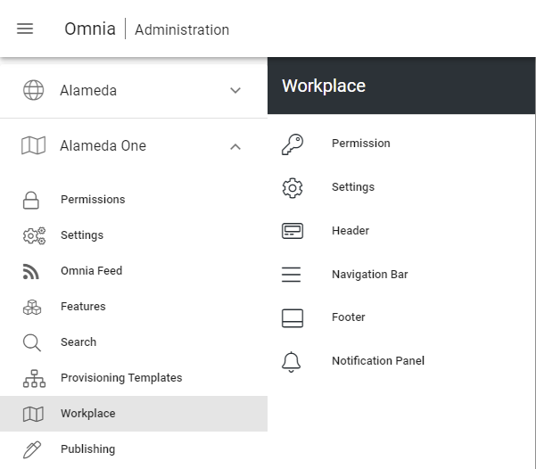

Release 6.5 (Preview)
========================================

Tenant Header
------------------------------------------

It is now possible to configure a header on Tenant level that can be inherited by Business Profiles.

.. image:: tenant-header.png

You can break the inheritance to the Tenant settings for different parts of the header on a Business Profile.

.. image:: break-inheritance-header.png

After the upgrade, existing Business Profiles will use broken inheritance to Tenant level. New Business Profiles will be set by default to inherit from Tenant level.

Workplace
------------------------------------------

When you create a new Business Profile, the system will create a workplace for the profile.

.. image:: add-bp-workplace.png

After the upgrade, existing Business Profile will run in classic mode. In order to take advantage of the new workplace features, the Business Profile needs to be updated. You can do this by going in to the Business Profile and Create a new Workplace.

.. image:: create-bp-workplace.png

Once you have created a Business Profile workplace, a new menu will appear in Omnia Admin called "Workplace".

The Business Profile Workplace provides a new possibility to work with access and navigation in your digital workplace.

In the Workplace Settings, you can decide the behavior of the chrome in different device breakpoints. You can also have different behavior on the Header and Navigation Bar in Web Browser and MS Teams client.

.. image:: workplace-settings.png

[Navigation Bar]

Enterprise Glossary
------------------------------------------

A new feature has been introduced in the Properties section in Omnia Admin, called Enterprise Glossary. In the Enterprise Glossary, it is possible to register taxonomies (term sets) that are of global interest in the solution.

.. image:: enterprise-glossary-menu.png

Each term in a taxonomy can be then be mapped to a page that gives detailed information about that term.

.. image:: enterprise-glossary-map-taxonomy.png

It is also possible to change the look and feel of a term.

.. image:: enterprise-glossary-look-and-feel.png

Once a taxonomy has been registered and mapped in the Enterprise Glossary, the properties will come alive in the solution.

.. image:: enterprise-glossary-terms-in-action-1.png

The user can click on any mapped term to get more information about the term.

.. image:: enterprise-glossary-terms-in-action-2.png

User Profile Card
------------------------------------------

A new user profile card will be shown whenever you click on a user name in Omnia. The user profile card is designed to align with user profile cards in other services in Microsoft 365.

.. image:: user-profile-card.png

The new user profile card also includes the possibility to browse who reports to who in the organization.

.. image:: user-profile-card-2.png

Taxonomy Navigation (Organization Charts)
------------------------------------------

A new block can be used, together with the Enterprise Glossary, to navigate taxonomies. The most common area of use is to create an organization chart.

.. image:: org-chart.png

Query on Navigation Path
------------------------------------------

A new scope has been added to the Page Rollup query section which makes it possible to query pages based on a navigation path.

.. image:: page-rollup-query-on-navigation-path.png

The Card view has been updated to support the display of sub pages when using a navigation path query.

.. image:: page-rollup-navpath-card-view.png

There is also a new view available that is specifically designed to support the navigation path query to create a mega menu style of the page result.

Properties in Card View
------------------------------------------

Automatic Page Translation
------------------------------------------

Stepper
------------------------------------------

Scheduling based on Property
------------------------------------------

Create draft on archiving
------------------------------------------

Save filter state on Page Rollup
------------------------------------------

Publishing Rollup
------------------------------------------

Layout templates and self-service
------------------------------------------

Community Rollup
------------------------------------------

Community Shared Documents
------------------------------------------

Comments and Activity Feed UX
------------------------------------------

Subscription improvements
------------------------------------------

Polls
------------------------------------------

Surveys
------------------------------------------

(Micro-Courses with) Knowledge Checks
------------------------------------------

Sign-off Requests
------------------------------------------

Governance Dashboard
------------------------------------------

Teams and Yammer Share
------------------------------------------

Teams Channel and Yammer Feed
------------------------------------------

Graph Client in Script/HTML
------------------------------------------

Microsoft Search Provider
------------------------------------------

Search Box Improvements
------------------------------------------

Shared Links Search Provider
------------------------------------------

Comments Search Provider
------------------------------------------

