Release 6.5
========================================

Tenant Header
------------------------------------------

It is now possible to configure a header on Tenant level that can be inherited by Business Profiles.

.. image:: tenant-header.png

On a Business Profile, you can break the inheritance to the Tenant settings for different parts of the header.

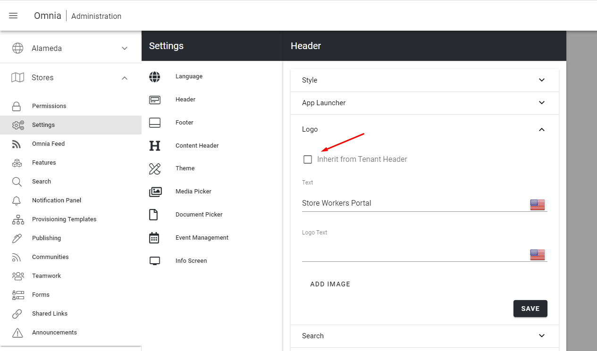

After the upgrade, existing Business Profiles will use broken inheritance to Tenant level.
New Business Profiles will by default be set to inherit from Tenant level.

Workspace
------------------------------------------

When you create a new Business Profile, a Workspace (including a start url) will be created for the profile.

.. image:: add-bp-workspace-new.png

After the upgrade, an existing Business Profile will run in classic mode. In order to take advantage of the new Workspace features, the Business Profile needs to be updated. You can do this by going in to the Business Profile and Create a new Workspace.

.. image:: create-bp-workspace-new.png

Once you have created a Business Profile Workspace, a new menu will appear in Omnia Admin called "Workspace".

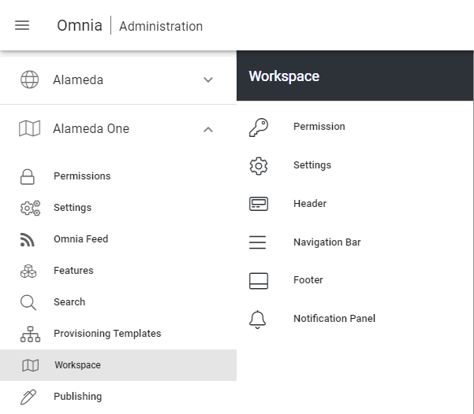

The Business Profile Workspace provides a new possibility to work with access and navigation in your digital workspace.

In the Workspace Settings, you can decide the behavior of the chrome in different device breakpoints. You can also have different behavior on the Header and Navigation Bar in Web Browser and MS Teams client.

.. image:: workspace-settings-new.png

Within the new Business Profile Workspace, you have the possibility to work with the Start Page, Mega Menu and Action Menu in a completely new way.

The layout of the Start Page can be designed outside the scope of a publishing app.

.. image:: workplace-startpage.png

Each main node in the Mega Menu has its own layout and can rollup content from different parts of your solution and include any block.

.. image:: workplace-megamenu-layout.png

.. image:: workplace-megamenu-settings_url.png

The Action Menu can include any action available in Omnia. (The action button and action menu now share the same infrastructure).

.. image:: workplace-actionmenu-settings.png

Both the mega menu and action menu items can be targeted to a specific audiences.

Enterprise Glossary
------------------------------------------

A new feature has been introduced in the Properties section in Omnia Admin, called Enterprise Glossary. In the Enterprise Glossary, it is possible to register taxonomies (term sets) that are of global interest in the solution.

.. image:: enterprise-glossary-menu.png

Each term in a taxonomy can be then be mapped to a page that gives detailed information about that term.

.. image:: enterprise-glossary-map-taxonomy.png

It is also possible to change the look and feel of a term.

.. image:: enterprise-glossary-look-and-feel.png

Once a taxonomy has been registered and mapped in the Enterprise Glossary, the properties will come alive in the solution.

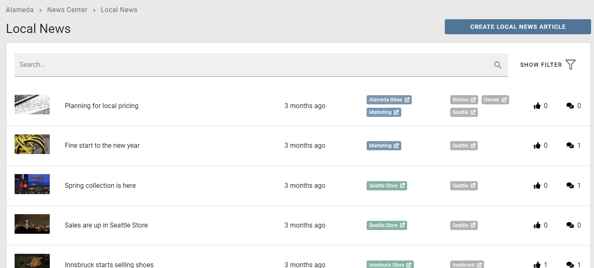

The user can click on any mapped term to get more information about the term.

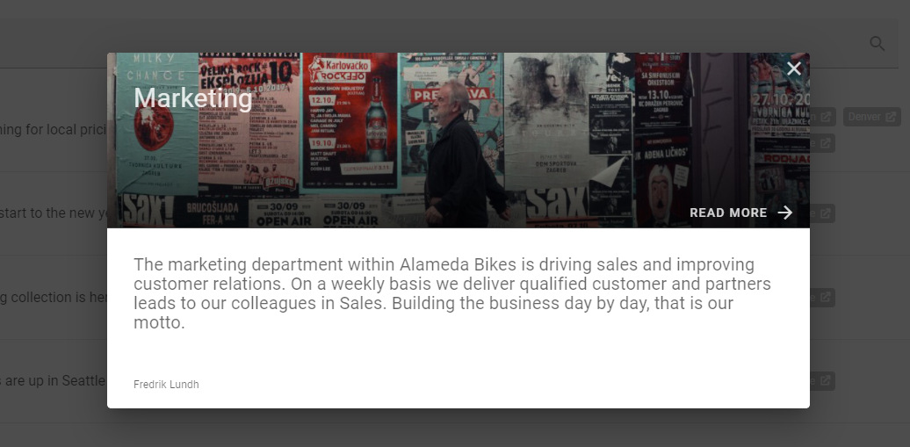

User Profile Card
------------------------------------------

A new user profile card will be shown whenever you click on a user name in Omnia. The user profile card is designed to align with user profile cards in other services in Microsoft 365.

.. image:: user-profile-card.png

The new user profile card also includes the possibility to browse who reports to who in the organization.

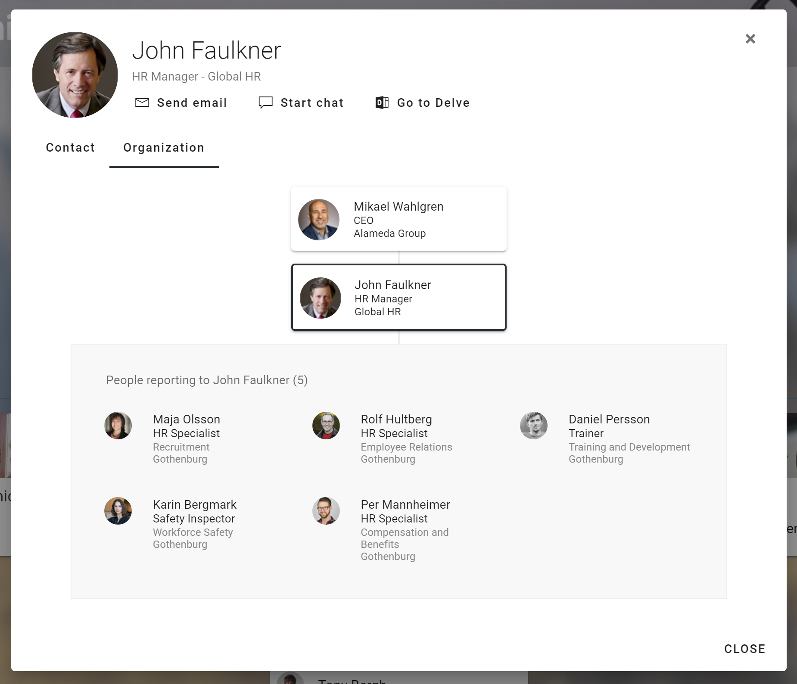

Taxonomy Navigation (Organization Charts)
------------------------------------------

A new block can be used, together with the Enterprise Glossary, to navigate taxonomies. The most common area of use is to create an organization chart.

.. image:: org-chart.png

Query on Navigation Path
------------------------------------------

A new scope has been added to the Page Rollup query section which makes it possible to query pages based on a navigation path.

.. image:: page-rollup-query-on-navigation-path.png

The Card view has been updated to support the display of sub pages when using a navigation path query.

.. image:: page-rollup-navpath-card-view.png

There is also a new view available that is specifically designed to support the navigation path query to create a mega menu style of the page result.

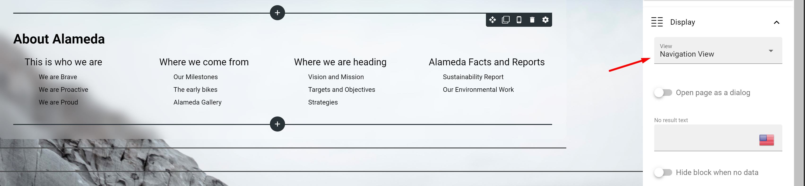

Properties in Card View
------------------------------------------

The card view in the Page Rollup block now supports a dynamic number of properties that can be displayed in the card.

.. image:: pagerollup-cardview-terms.png

Automatic Page Translation
------------------------------------------

It is now possible to set whether a variation should be translated by a Variation Author or automatically by the system.

.. image:: automatic-page-translation.png

**Note!** This feature is not available in Omnia on-prem.

If a variation is translated automatically by the system, a disclaimer will be added on top of the page.

.. image:: automatic-page-translation-disclaimer.png

Stepper
------------------------------------------

A layout section can now be set to one of four different types: Column, Tab, Accordion or Stepper.

A Stepper section makes it possible to organize content in a layout in a wizard like style. It is possible to configure the Stepper to allow for an author to add new steps in Write mode.

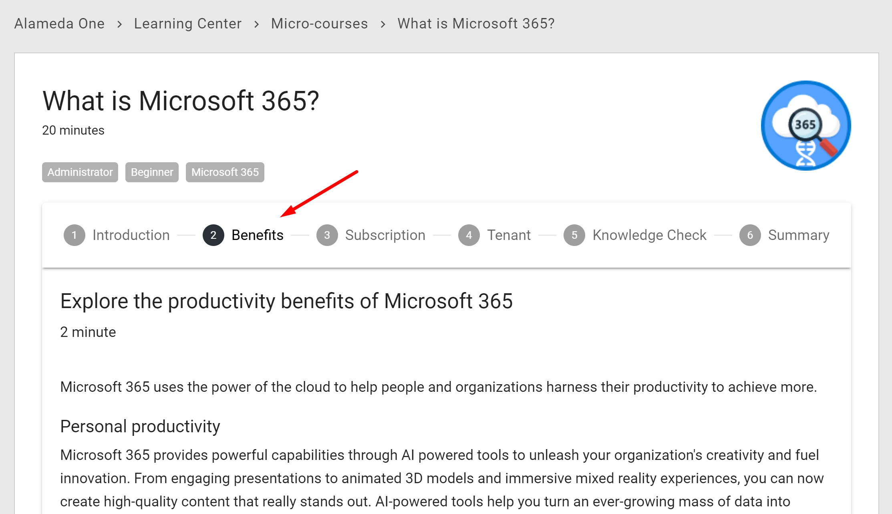

Scheduling based on Property
------------------------------------------

Scheduling can be turned on and off in a page collection and can be configured to be based on a property instead of the built-in scheduling start date.

.. image:: pagecollection-scheduling-settings.png

A scheduling icon will indicate which property that is used for scheduling. If the date is in the future the page will be scheduled for publishing.

.. image:: pageproperties-scheduling.png

Create draft on archiving
------------------------------------------

When you archive a page, it is now possible to create a copy of the page being archived and continue to work on a draft of the page.

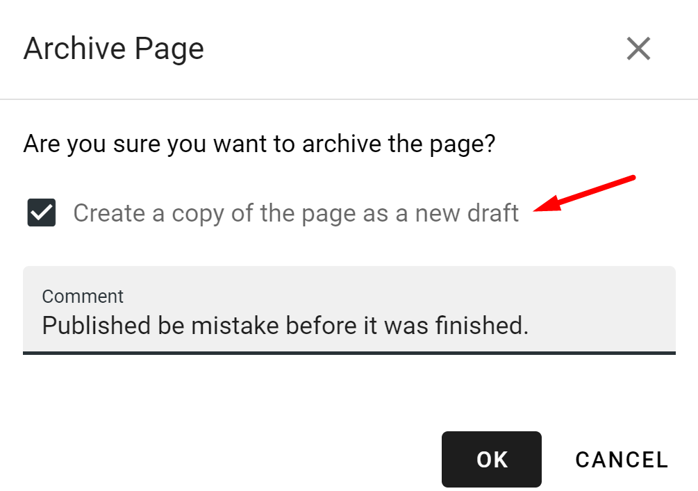

Save filter state on Page Rollup
------------------------------------------

It is possible to configure the Page Rollup filter to keep its state in the url of the page. The url can be used to prepopulate the page rollup.

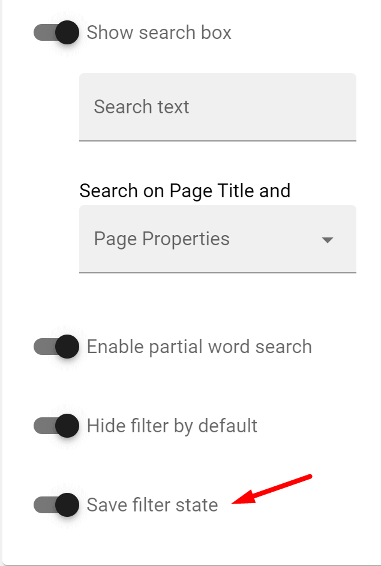

Publishing and Community Rollup
------------------------------------------

Two new rollup blocks are now available. One for showing Publishing Apps and one for showing Community Apps.

.. image:: publishing-community-rollup.png

It is also possible to add a description and an image to Publishing and Community Apps.

Layout templates and self-service
------------------------------------------

To support self-service of Publishing and Community Apps, the provisioning templates have been improved to support predefined layouts and content.

Centralized layouts can be used to decide the look and feel for landing pages in page collections.

.. image:: communities-layouts.png

.. image:: community-layout-editor.png

.. image:: community-start-page.png

A new Setup section in the provisioning templates can be used to preconfigure a number of page collections and settings on both publishing app and page collection level.

.. image:: provisioningtemplate-setup.png

Community Shared Documents
------------------------------------------

A new type of page property supports the possibility to quickly drop/upload a document that can be shared/viewed on the page.

.. image:: community-share-document.png

.. image:: shared-document-page.png

Comments and Activity Feed UX
------------------------------------------

The comments flow and activity feed have been updated to work better in mobile devices and small columns. The comments flow can be configured to render with oldest or newest comments first.

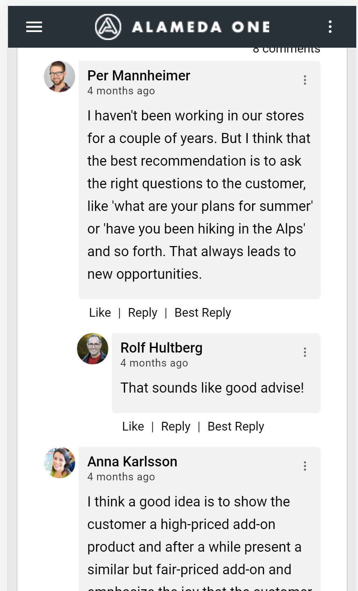

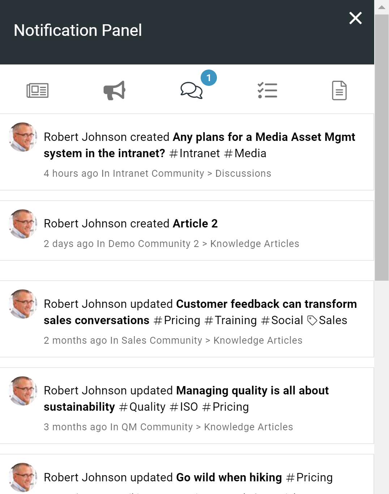

Subscription improvements
------------------------------------------

You can now use both structured taxonomies (term sets) and tags in communities. A user can subscribe to a term if it has been configured to allow subscription.

.. image:: my-subscriptions.png

Polls
------------------------------------------

A new feature makes it possible to create forms that can be used as a quick poll for example on a start page.

.. image:: quick-poll.png

Surveys
------------------------------------------

Forms can also be used to create more advanced surveys.

.. image:: forms-survey-editor.png

.. image:: survey-example.png

(Micro-Courses with) Knowledge Checks
------------------------------------------

Using the new stepper section and forms of type Knowledge Checks, it is possible to create self-service Micro-courses in your solution.

.. image:: knowledge-checks.png

Governance Dashboard
------------------------------------------

Omnia Admin has been improved to include a Governance Dashboard that can be configured by an administrator to include metrics relevant for you solution.

.. image:: governance-dashboard.png

New Metrics
-------------------------------------------

There are a number of new metrics that can be added to the governance dashboard.

* Active Readers: How many users access the solution each month.
* Active Contributors: How many users contribute within the solution each month. 

.. image:: metrics-active-reader-contributor.png

The definition of an Active Reader and Contributor can be set in the system.

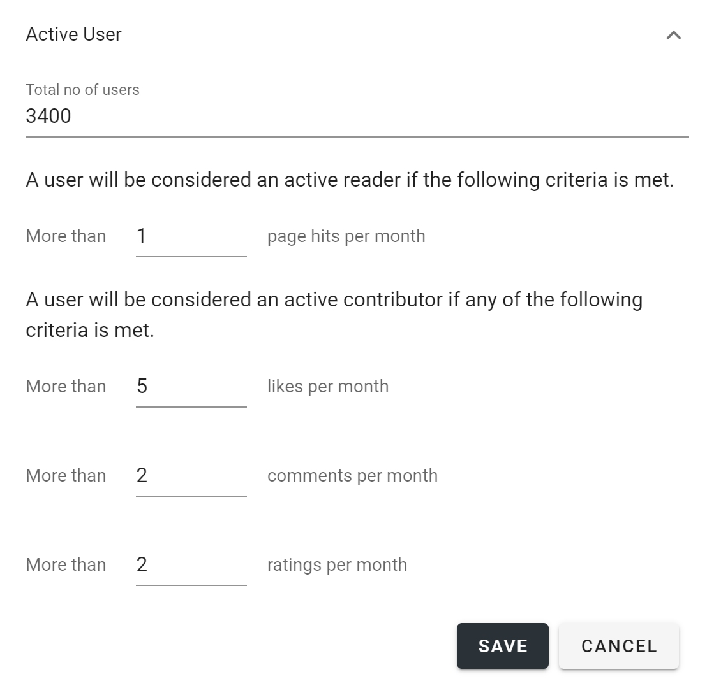

* Underused Content: Pages that are underused in the solution.

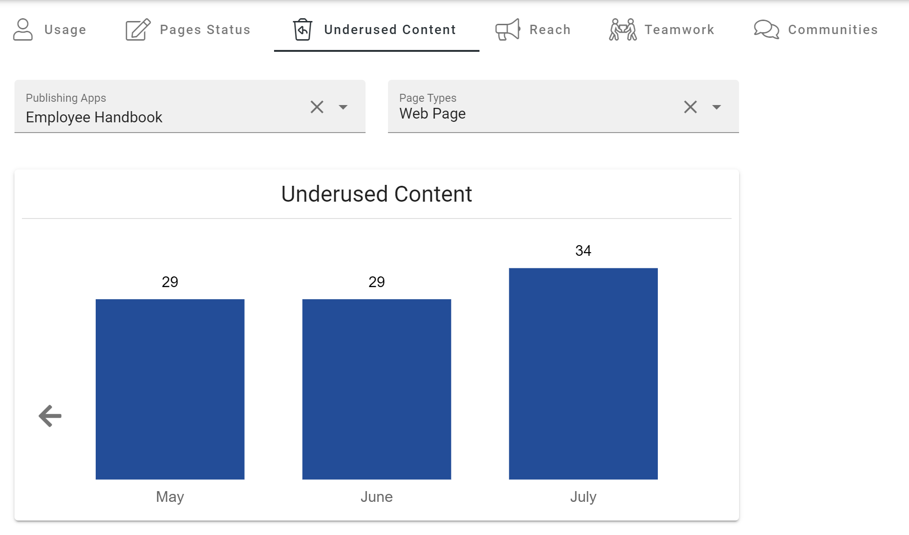

.. image:: metrics-underused-content-details.png

The definition of Underused Content can be set in the system.

.. image:: metrics-underused-content-settings.png

* Reach: How well do we reach our target audience based on what we expect.

.. image:: metrics-reach-global-news.png

The metric can be configured to a specific scope of pages and have a target nr of users.

.. image:: metrics-reach-settings-scope.png

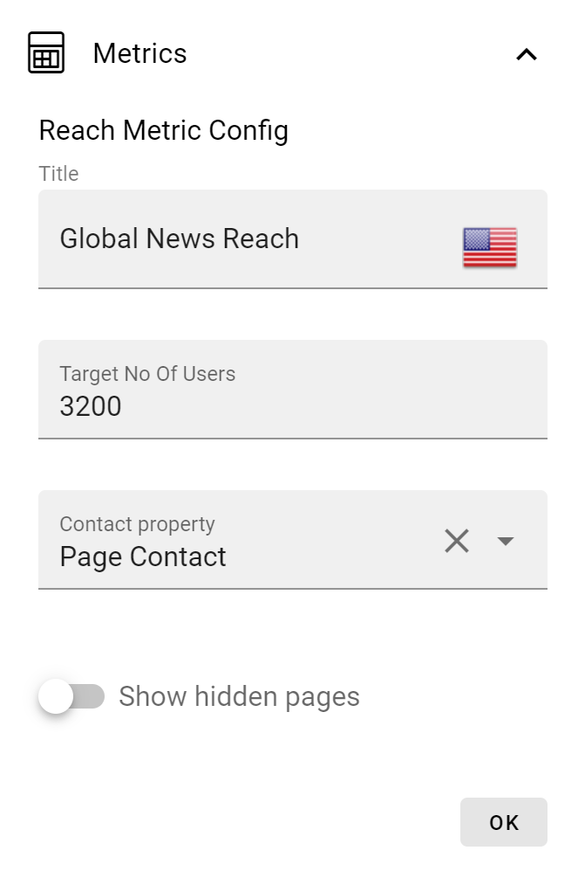

Teams and Yammer Share
------------------------------------------

A new type of action button can be added to layouts that makes it possible to share the page to Yammer and/or Teams.

**Note!** Not available in Omnia on-prem.

.. image:: share-to-yammer-teams.png

.. image:: share-to-teams-1.png

.. image:: share-to-teams-2.png

Teams Channel and Yammer Feed
------------------------------------------

Two new blocks are available that integrates with Microsoft Teams and Yammer. (Not available in Omnia on-prem).

A Teams Channel block makes it possible to show a read-only view on a page of a specific channel in Teams.

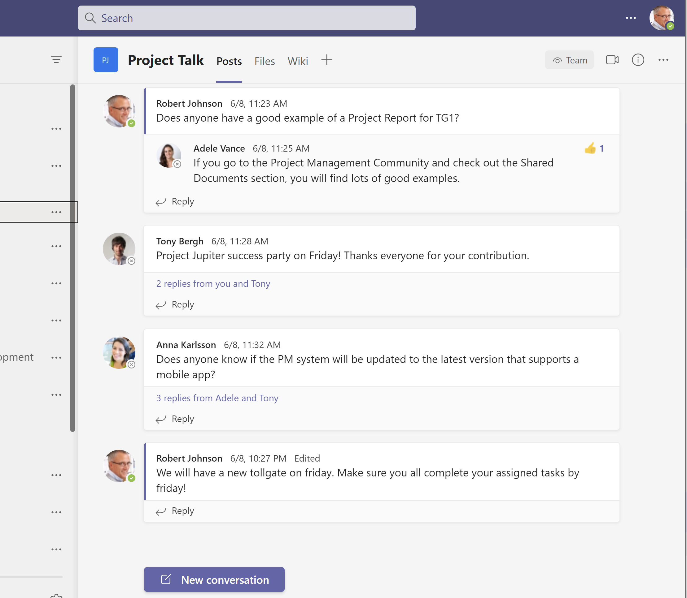

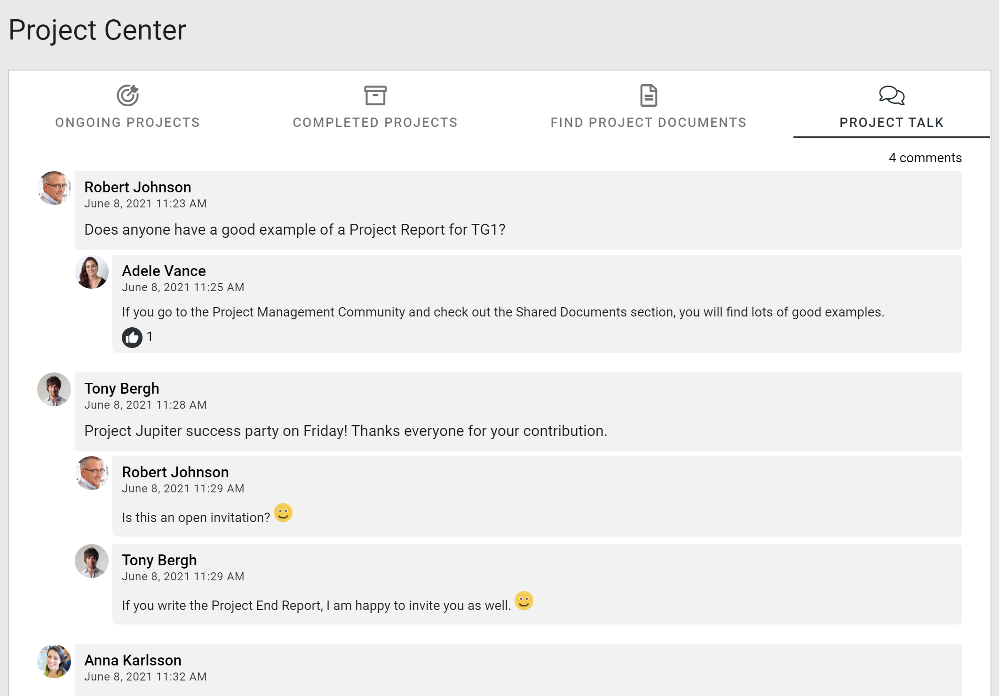

A Yammer Feed block makes it possible to show a specific community feed on a page.

Graph Client in Script/HTML
------------------------------------------

The Script/HTML block has been improved to support api endpoints to the Microsoft Graph and SharePoint REST API. This will make it possible to get data from the Graph and render it using the built-in vue.js framework in Omnia.

.. image:: script-html-new-api1-edited.png

Microsoft Search Provider
------------------------------------------

A search category in Omnia can now be based on Microsoft Search as a provider.

.. image:: search-microsoft-search-provider.png

This feature opens up the possibility to use external data sources to the enterprise search experience by using third-party search connectors.

Shared Links Search Provider
------------------------------------------

It is now possible to include Shared Links as a search category to be able to find important Apps and Links.

.. image:: quicksearch-shared-links.png

Comments Search Provider
------------------------------------------

A new provider in search can be used in a search category to search for comments (and discussions) in the solution. (Not available in Omnia on-prem).

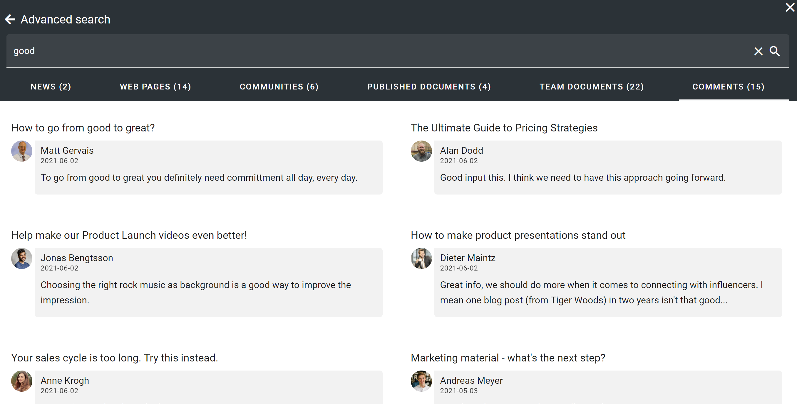

Search Improvements
------------------------------------------

The search block can now be configured to use its own search categories or inherit the once configured on a Business Profile.

.. image:: search-block-configuration.png

The search categories in quick and advanced search are now connected to be able to find more search results within each category. Search categories (tabs) that do not generate any result, will be hidden in Advanced Search.

.. image:: search-see-more-results-1.png

.. image:: search-see-more-results-2.png

It is possible to configure the icon size for quick and advanced search for better UI consistency.

Versions
-----------------------------------------

.. toctree::
   :titlesonly:

   versions

