Release 6 (DRAFT)
========================================

.. note::  These are draft release notes. Information might be added, edited and removed.

Tenant Page Types
--------------------------------------

It will now be possible to manage Page Types on tenant level.

.. image:: tenant-page-types-1.png
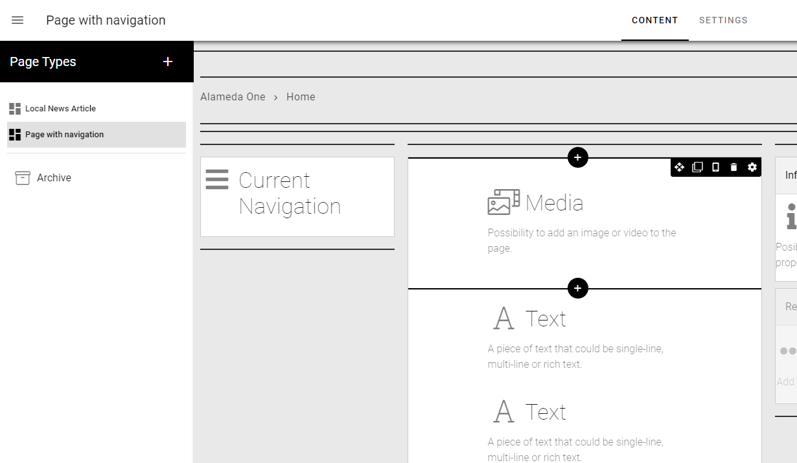

This allows for global use across Business Profiles and Publishing Apps.

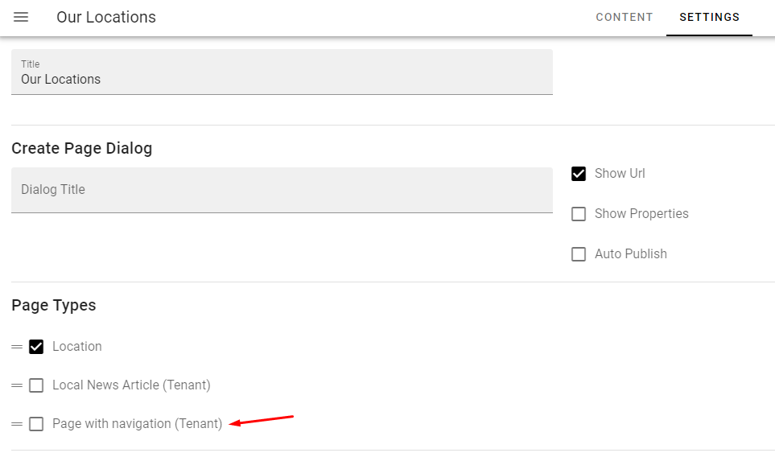

Default Content in Page Types
--------------------------------------

All blocks that allow content to be edited in write mode, now have the possibility to have default content.

.. image:: default-content-1.png

The default content can be allowed to be overwritten or not.

If the default content is allowed to be overwritten, it can be copied to the page on creation or used as a fallback if the author leaves the content empty.

If the default content is not allowed to be overwritten, the default content in the page type will always be shown on a page.

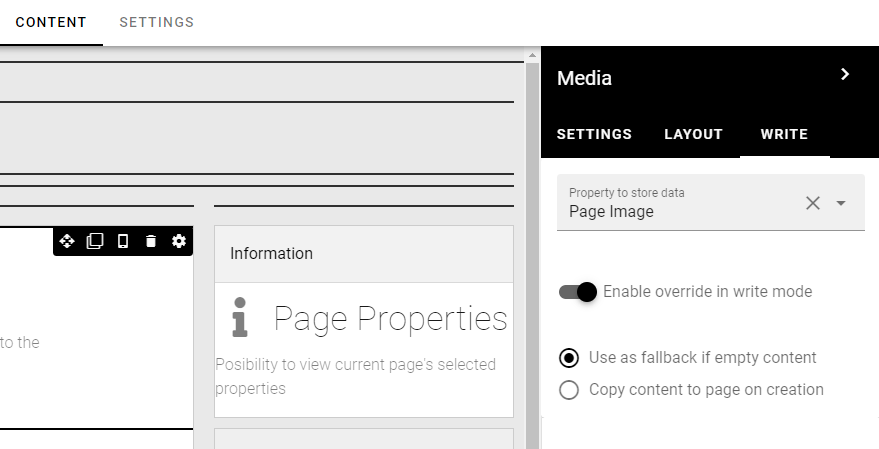

Media Picker improvements
--------------------------------------

The image scaling feature of the Media Picker has been highly improved. The author will be presented with a number of options on how to scale the image on selection.

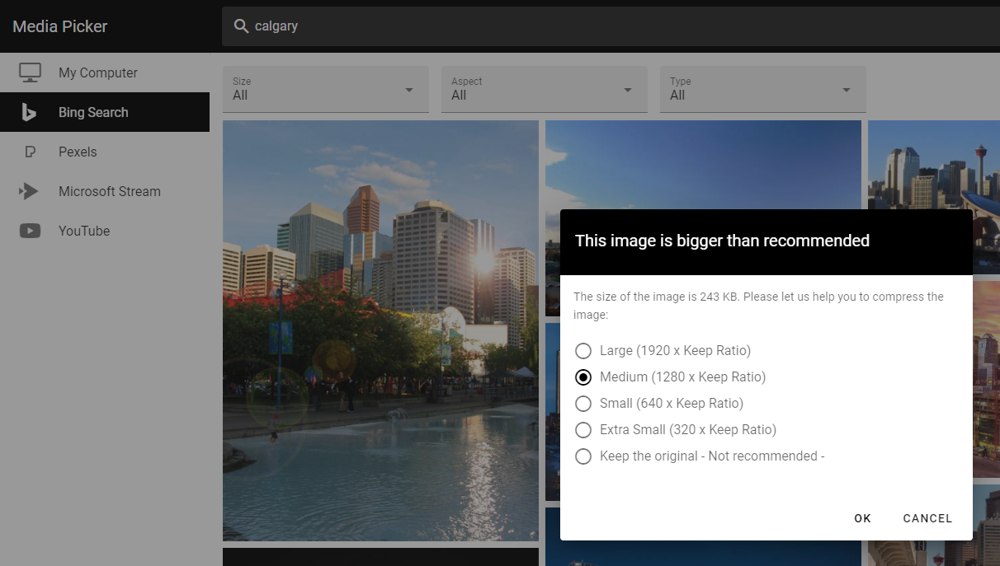

The scaling options included compression are configurable in Omnia Admin.

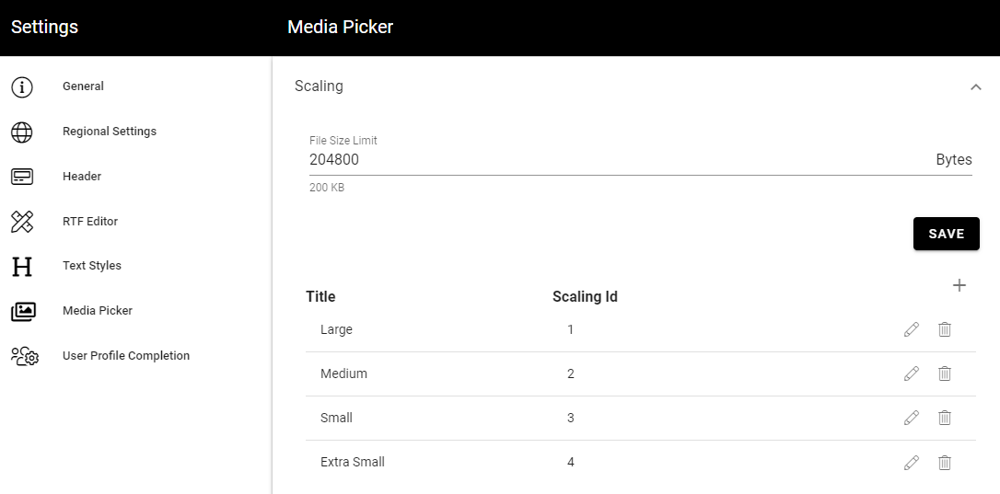

.. image:: mediapicker-settings-scaling-2.png

It is possible to force a specific scaling in media/banner blocks.

.. image:: mediablock-settings-forcescaling.png

The Media Picker UX has been improved. The rollup ratios are separated from the main image.

.. image:: mediapicker-cropping.png

The image ratios are configurable in Omnia Admin.

.. image:: mediapicker-settings-ratios.png

The available ratios within a media/banner block can be set in the block settings.

.. image:: mediablock-settings-cropratios.png

The Media Picker allows for light image editing using the possibility to flip and put filters on the image.

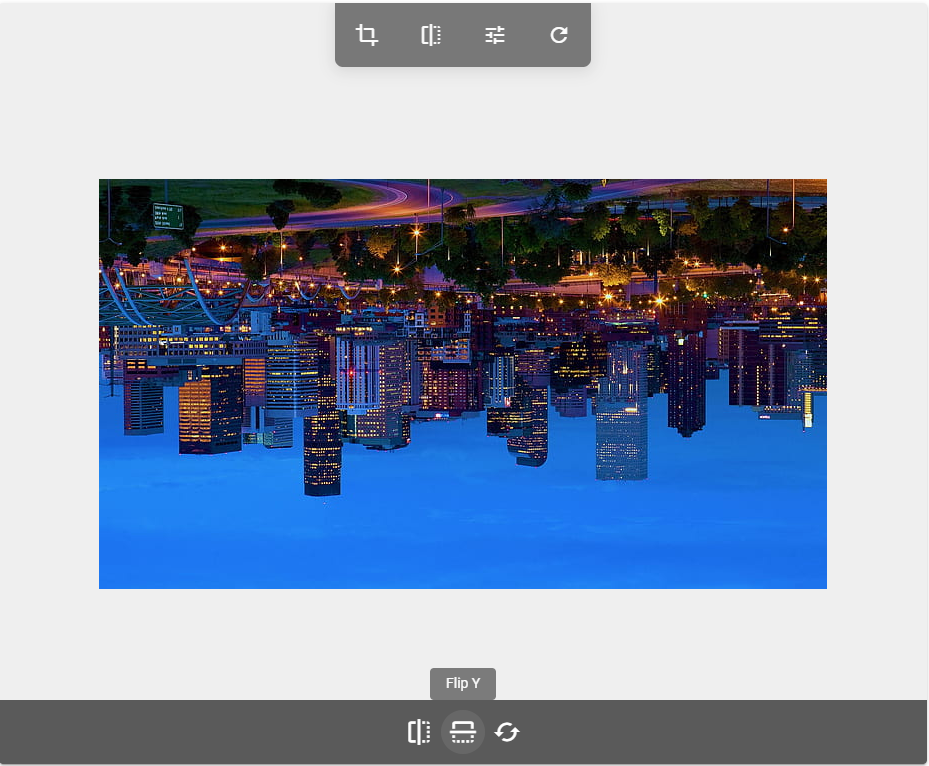

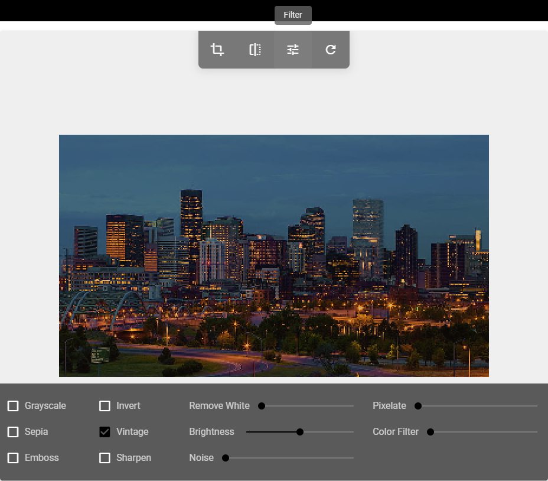

Reusable Content improvements
--------------------------------------

The reusable content feature in Omnia has been redesigned. It now allows reused pages to be found in search and the page author workflow has improved.

Automatic Page Creation
--------------------------------------

An administrator can setup rules on a Page Collection regarding automatic page creation.

Whenever a page is published in the Page Collection and match a specific rule, a copy of the page will be published to another Page Collection in the tenant.

This can be used to allow for news articles to be published to for example a partner or customer portal.

Team News Rollup improvements
--------------------------------------

The settings in the Team News Rollup has improved. It is now possible to provide a custom query in the Query section of the block.
The custom query can be used to only get team news with certain properties, such as "Show on start page". It can also be used to include or exclude certain sites.
In the example below, it is used to exclude all news from Communication Sites.

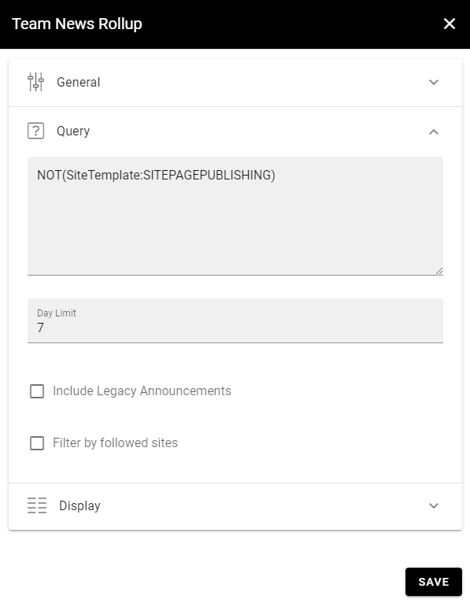

Enterprise Properties improvements
--------------------------------------

To simplify the administration of Enterprise Properties and Property Sets, they can now be categorized.

.. image:: enterpriseproperties-categories-admin.png

A set of categories are added out of the box and additional can be added later.

.. image:: enterpriseproperties-categories-admin2.png

The Enterprise Property Picker is updated to support categories.

.. image:: enterpriseproperties-picker.png

A recycle bin has been added for Enterprise Properties and Property Sets. This makes it possible to soft delete properties without breaking any current implementations.
In the recycle bin UI it is possible to restore properties or terminate them.

.. image:: enterpriseproperties-recyclebin.png

Member step in Create Teamwork wizard
--------------------------------------

A new step has been added to provisioning templates that allow users to add owners and members for different types of Teamwork.

.. image:: create-teamwork-membersstep.png

Layout Explorer and Templates
--------------------------------------

On the right-hand side in the design mode, a new toolbar has been added that includes the possibility to access all sections, columns and blocks using a layout explorer.

.. image:: layoutexplorer.png

In this new toolbar, you can also use a number of predefined layouts to get a quick start when creating new layouts for your start page or page type.

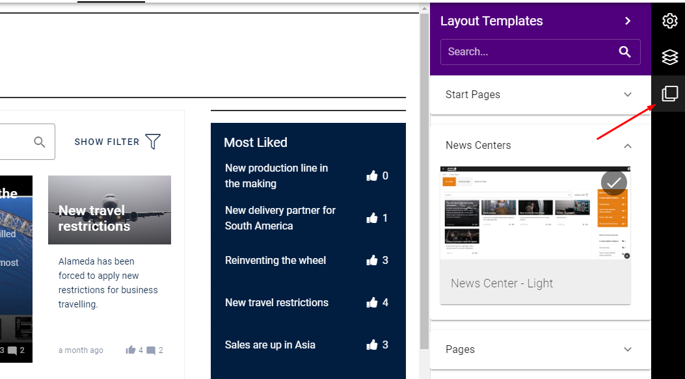

Page Properties Improvements
--------------------------------------

Process Management Improvements
--------------------------------------

The Action Button can be configured to allow feedback to a process.

.. image:: process-feedback.png

The feedback will be sent to the process owner and available in the team site where the process is located.

.. image:: process-feedback-teamsite.png

It is now possible to move a process from one team site to another.

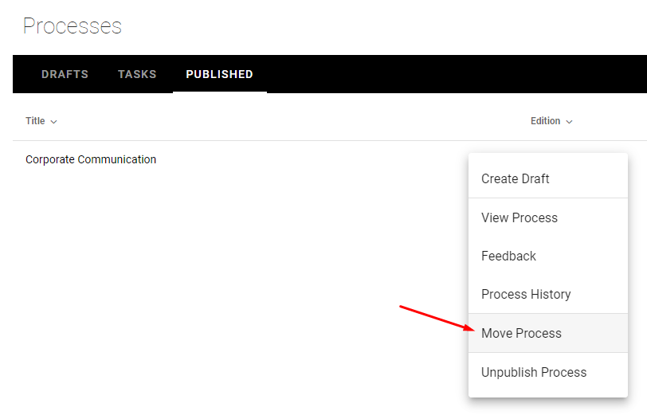

A process can now have one or more pages related to it using a page rollup.

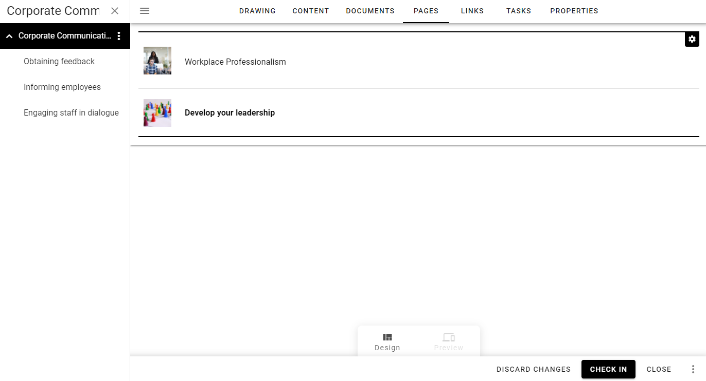

Document Management Improvements
--------------------------------------

A retention policy can be set on document types. The retention policy will calculate a rentention date when a controlled document is published.

.. image:: retention-policy.png

The retention date will be used as a basis to send information to a Retention Manager about expiring documents. The Retention Manager can take a decision whether to keep the document or terminate it from the system.

.. image:: document-termination.png

When a document is terminated from the system, all files that belong to the controlled document will be deleted and can not be restored.

An administrator can bulk update properties on Controlled Documents from within Omnia Admin.

.. image:: documents-bulk-update.png

Versions
-----------------------------------------

.. toctree::
   :titlesonly:

   versions

