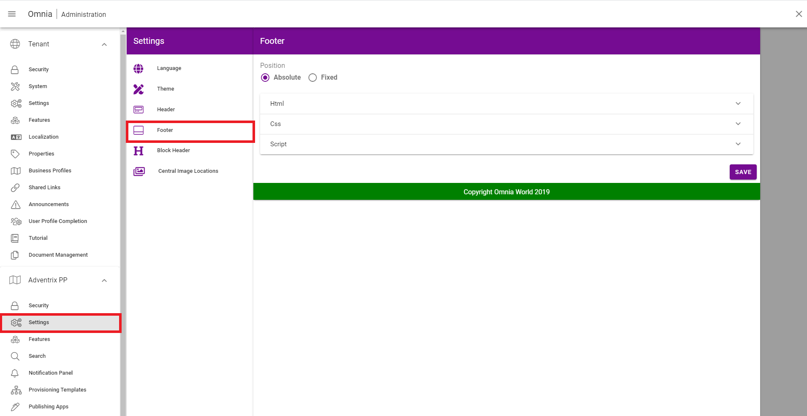

Release 3
========================================

New features
----------------------------------------

New feature: Footer
***********************

.. image:: footer.png
	
The footer is a feature that allows admins to display data at the bottom of every page throughout the business profile. The setup options 
for this feature can be found in Omnia admin > Business profile Settings > Footer. 

Here we can decide whether the position of the footer should be positioned at the bottom of the page (absolute) or the bottom of the screen (fixed), as well as create the footer using HTML/CSS and Javascript.

- It is now possible to disable comments and/or likes for specific pages. This feature is available for users with Author permissions or higher:

.. image:: allow-comments-and-likes.png

Enhancements
------------------------------------

Omnia
***********************

- It is now possible to control which image providers can be used.
- Added skeleton loaders to appropriate places.
- Keyboard controls of Omnia has been expanded.
- Calendar rollup has now recieved an updated design.
- It is now possible to download customer SPFx packages from Omnia admin. The download page includes a clear guide of how to do this.
- The Omnia HTML structure is now complient with WCAG 2.1. 
- The My Sites action menu component has been updated with the ability to search for SharePoint sites. This allows you to find sites that are not connected to omnia as Team Collaborations. You can enable the tab from Omnia Admin.

Web Content Management
***********************

- New Feature: Default page type. 
- Enhanced UI settings for blocks. 
- Possible to have date or datetime for page properties.

Document Management
***********************

- It is now possible to use the current user and/or the values from the current user's profile in queries.  
- Document rollup can now hide specific columns.

Workplace
***********************

- Improved onboarding experience when both User Profile Completeness and a Tutorial is used.

Fixes 
***********************

- Several UI Fixes for IE11.
- Several UI Fixes for Chrome. 
- Several fixes to display correct translation of labels. 
- It is now possible to edit an existing image in banner. 
- User's picture is now clickable in My profile.
- Calendar rollup events are now displayed on correct days.
- Fixed a bug where in some scenarios the page rollup blocks that display no data are now visable. 
- Properties tab is now displayed correctly.
- The rich text editor admin UI has now been fixed to display the correct order.
- The contact field in publishing app settings can now be left empty without causing issues.
- Fixes to image selection in Bing and Central Image Bank.*
- Fixes to UI issues in the Term picker. 
- Modern team site now works correctly when selecting location, default administrator, default second admin and default visitor. 
- Profile completeness block header now displays the correct colors.
- The issue with attach site in Team Collaboration where the team site could not be attached is now resolved.
- Issues that occure when delete pages are now resolved.
- Page variation settings is now displayed correctly in notification panel.

Versions
-------------------------------------

.. toctree::
   :titlesonly:

   versions

 

