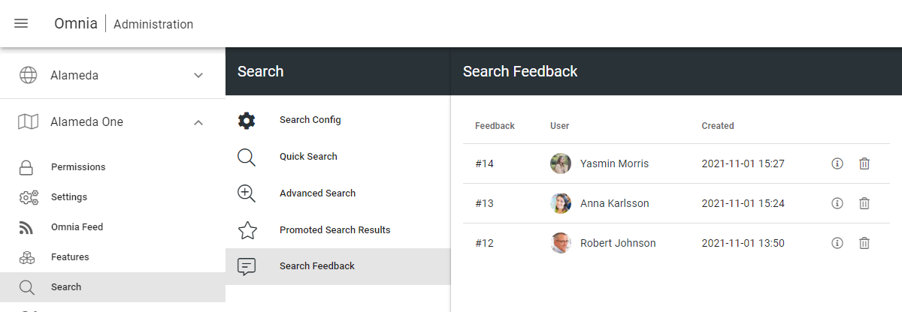
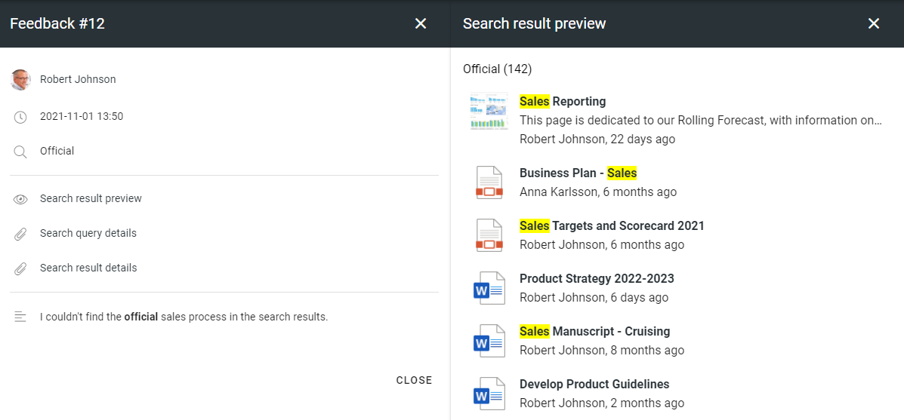
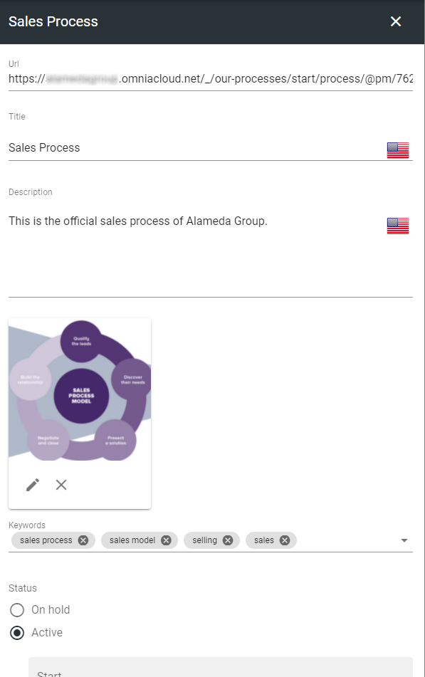
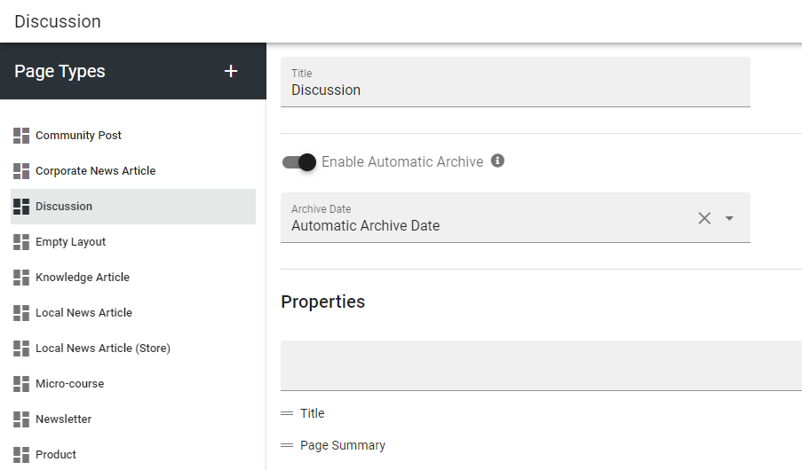
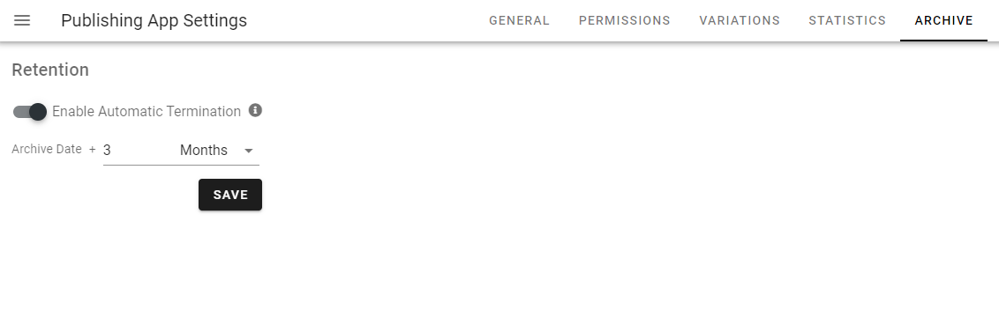
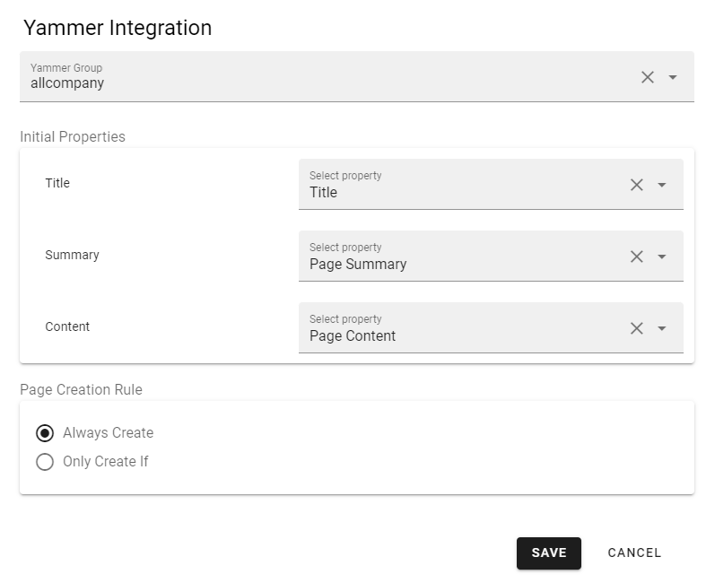
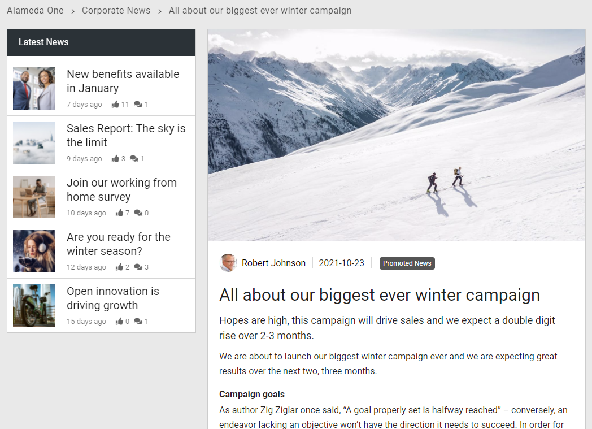
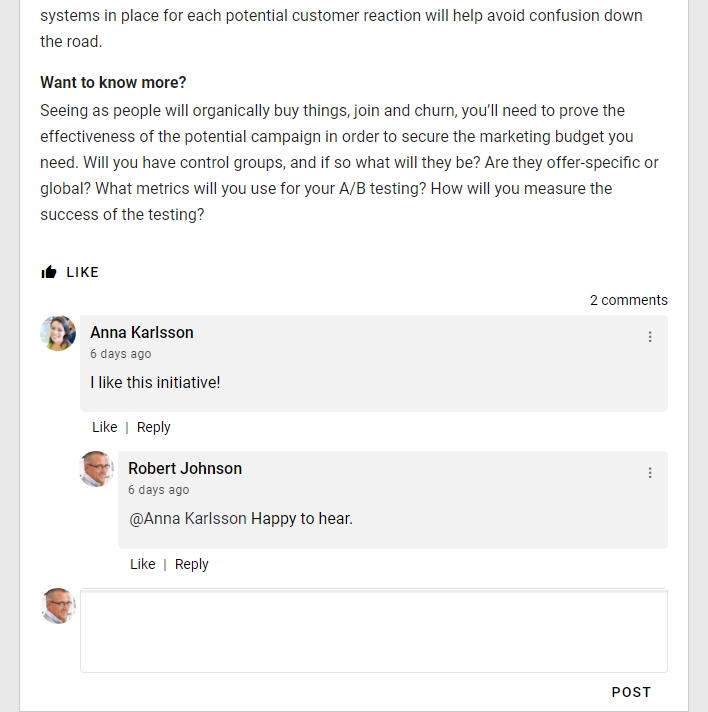
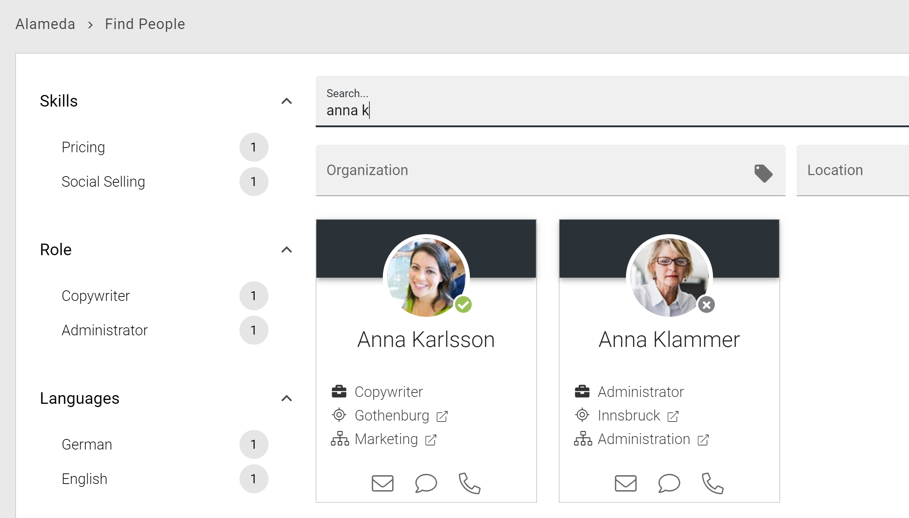

Release 6.7 / 6.8
========================================

Search Feedback
------------------------------------------

By default, it is now be possible for end users to provide search feedback. The feedback feature is available in Advanced Search.

.. image:: search-sendfeedback-1.png

.. image:: search-sendfeedback-2.png

A search administrator can access and analyze the feedback in Omnia Admin.

If submitted by the end user, the search administrator will get a snapshot of the first page in the search result.

The search query and results can be further analyzed using the search data from the end user query.

.. image:: search-feedbackreport3.png

Promoted Search Result
------------------------------------------

Based on search feedback, it is now easy for a search administrator to add promoted search results in Omnia Admin.

.. image:: search-promotedresults-admin1.png

Whenever a user search on any of the keywords of a Promoted Search Result, it will be shown on top of Quick Search and in the right-hand-side panel in Advanced Search.

.. image:: search-promotedresults-quicksearch.png

.. image:: search-promotedresults-advancedsearch.png

Sign-off Requests
------------------------------------------

Possibility to create sign-off requests that can be sent to individuals or groups of people. The request can be anything from a read receipt for a specific news article to onboarding of a new employee.

.. image:: create-sign-off-request.png

The end user can get an overview of pending sign-off requests in the notification panel.

.. image:: sign-off-resource.png

The requestor can get a full overview of pending sign-off requests that has been sent out.

.. image:: sign-off-request-follow-up.png

Publishing Channels
------------------------------------------

Publising Channels provide an alternative way of targeting information and putting pages into context. Publishing channels are maintained in Omnia Admin.

.. image:: publishing-channels-admin.png

If you enable Publishing Channels on a Page Collection, it will be possible for an author to decide which channels the page should be published in.
In some channels the author might have permission to publish directly and in some channels it might require approval from a channel administrator.

.. image:: publishing-channels-author.png

Publishing Channels can be used in page rollups to show news articles and pages in different parts of the intranet. The end user can also subscribe to channels of interest.

.. image:: publishing-channels-pagerollup.png

Automatic Archiving
------------------------------------------

It is possible to setup automatic archiving for pages of a specific page type based on a specific date or a calculated date (for example based on created date + X years).

You can also configure a retention policy in each Publishing App to decide how long the pages are allowed to be kept in the archive.

Bookmarks/Anchors
------------------------------------------

Anchors are now supported in Omnia. Anchors can be created on a heading or piece of text in the RTF editor.

.. image:: anchor-RTF.png

Anchors are also automatically applied to tabs, panels and steps in sections.

.. image:: anchor-tabs.png

The link picker and action button (link) support the possibility to link to an anchor on the page.

.. image:: link-to-anchor.png

Suggested Enterprise Terms in RTF
------------------------------------------

You can configure the RTF editor to be Enterprise Glossary aware. This means that whenever you write something in an RTF editor that match e term in the Enterprise Glossary, it will be highlighted.

.. image:: rtf-suggestedterms1.png

You can click on the highlighted text and decide whether you want to create a link or not to the Enterprise Glossary term. If you decide to create a link to the term, it will be possible for the end user to click on it and get detailed information about the term.

.. image:: rtf-suggestedterms2.png

Improved Yammer Integration
------------------------------------------

It is possible to setup Yammer integration on a Page Collection level.

When Yammer Integration is setup, a post will be created in the selected Yammer community whenever a new page, matching the selected criteria, is created.

.. image:: yammerintegration-yammerpost.png

Whenever Yammer Integration is enabled, the comments and likes section will be synced between the page in Omnia and the post in Yammer.

Scheduled Pages Report
------------------------------------------

A new report has been added to publishing apps. The report makes it possible to get an overview of all pages that are scheduled for publishing in the publishing app.

.. image:: scheduledreport.png

Copy Block/Section Clipboard
------------------------------------------

When you copy a block/section, it will now be put into a clipboard.

.. image:: clipboard.png

The clipboard makes it possible to copy the block/section to other layouts in the solution. It is also possible to export the content of the clipboard and import it into another tenant.

Power App Block
------------------------------------------

A new block makes it possible to embed a Power App in Omnia with settings to allow for dynamic theming of the app.

.. image:: powerapp.png

Organization Tree Block
------------------------------------------

A new block makes it possible to show an organization tree based on information in Azure AD about who reports to who.

.. image:: organizationtree.png

People Rollup Actions
------------------------------------------

The people rollup block supports three new actions: Send e-mail, Start chat and Start call.

Microsoft Teams Presence
------------------------------------------

All people components in Omnia now supports the possibility to show presence from Microsoft Teams.

.. image:: teams-presence.png

Azure AD Permissions
------------------------------------------

A tenant administrator can now get an overview of all consented permissions in Azure AD.

.. image:: azure-ad-permissions.png

From this view, it is also possible to invalidate all user tokens.

Versions
-----------------------------------------

.. toctree::
   :titlesonly:

   versions

