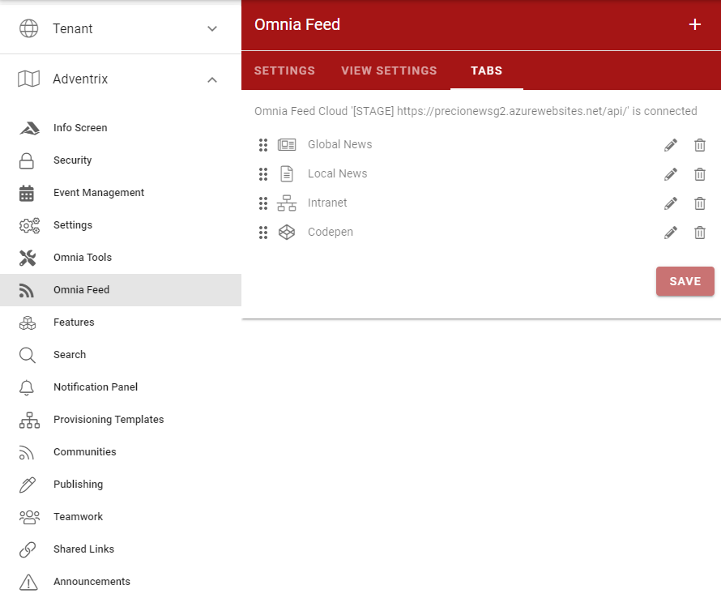
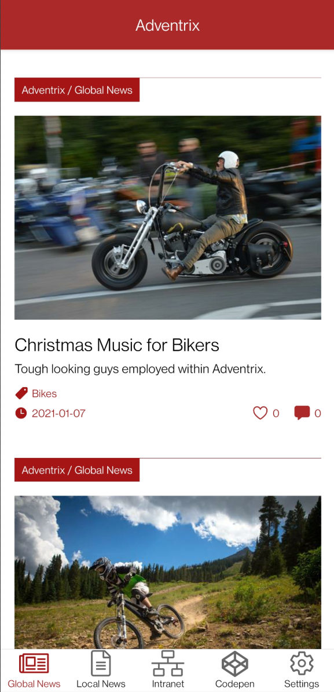
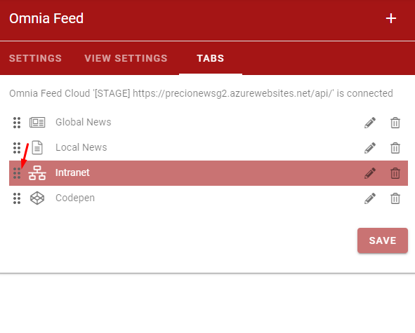
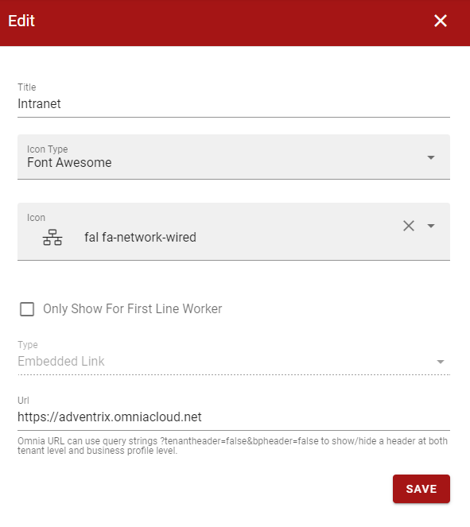
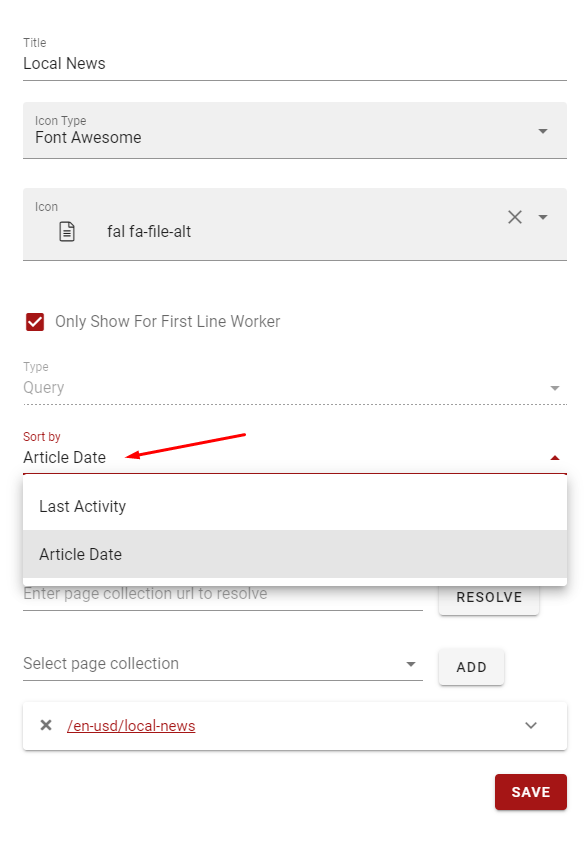
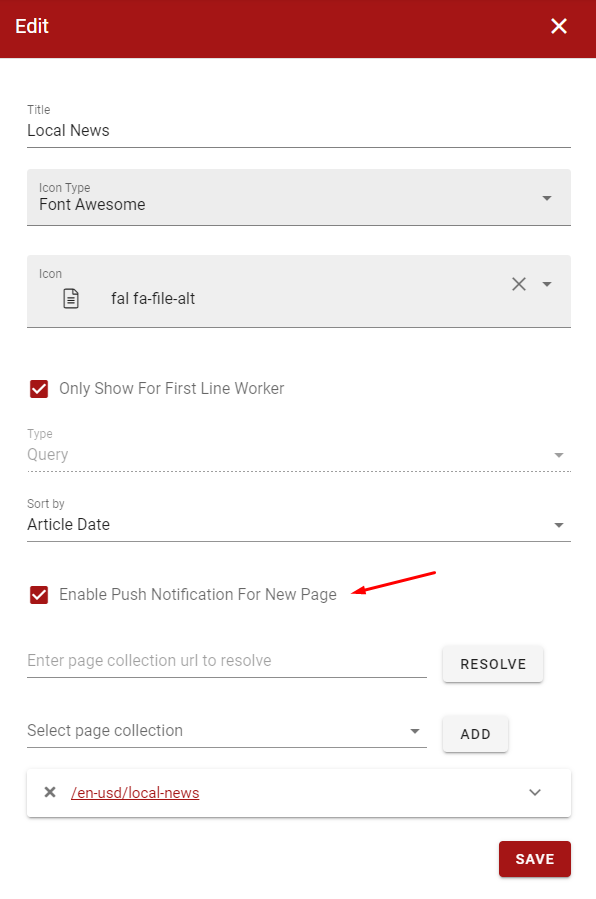
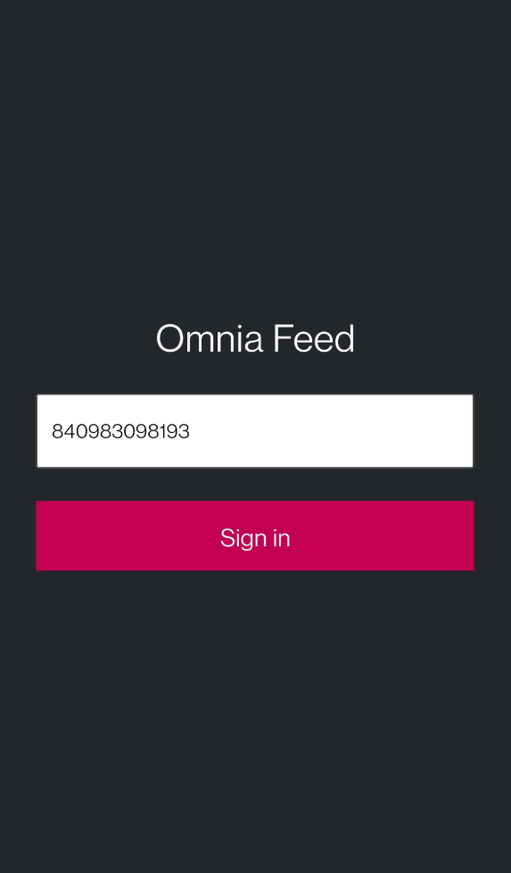
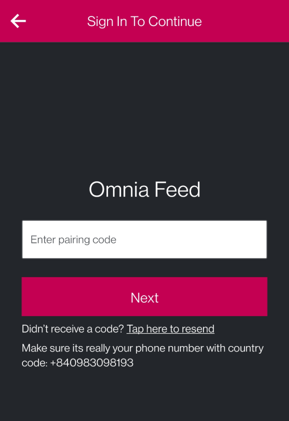
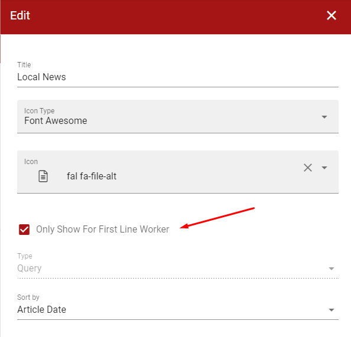

Release 5
========================================

Multiple Feed Tabs
--------------------------------------

When the new version is deployed, Omnia Feed settings will needed to be migrated to the new format before the new features can be used. Before the migration, the app will shown the same tabs as the previous version.

.. image:: admin-settings-migration.png

After the settings is migrated, it will now be possible to create multiple tabs in Omnia Feed.

The order of the tabs can be changed by dragging them in the tabs list.

Each tab can show a news feed from Omnia, an embedded link, or an external link.

.. image:: admin-settings-query-tab.png

.. image:: admin-settings-link-tab.png

Each news feed can now be ordered by latest activity date or article date from newest to oldest.

It is also possible to turn off push notifications for each tab.

Support for Kaizala Users
--------------------------------------

First line workers without an Office 365 account can now log in to Omnia Feed using an registered phone number.

.. image:: app-kaizala-login-2.png

It is possible to specify which tabs are shown to first line workers users.

Deep Linking Notifications
--------------------------------------

It will now be possible to click on push notifications about new articles or comments to open Omnia Feed app in the detail view of that article.

Related Links for News Articles
--------------------------------------

Related links from news articles will now be shown in the detail view in Omnia Feed.

.. image:: app-detail-view-with-related-links.png

New Functionalities for Rich Text Content
--------------------------------------

Omnia Feed will now display code block, qoute block, and image-text-flow from Omnia's page content correctly.

.. image:: app-detail-view-with-rich-text.png

Versions
-----------------------------------------

.. toctree::
   :titlesonly:

   versions