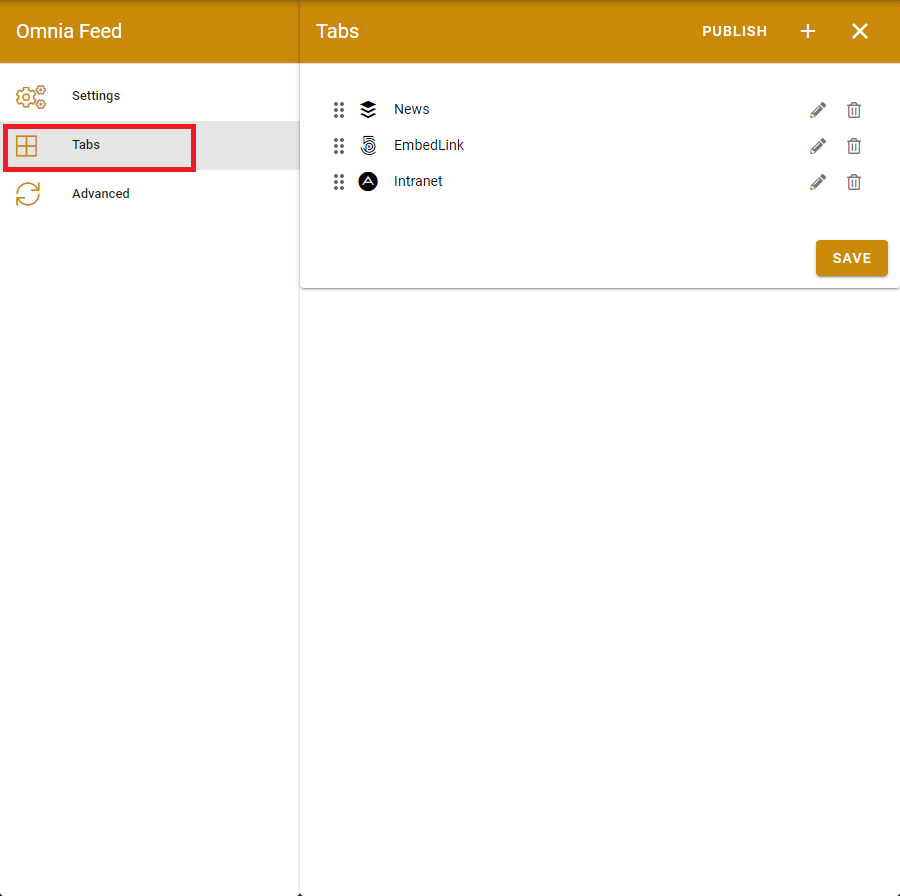
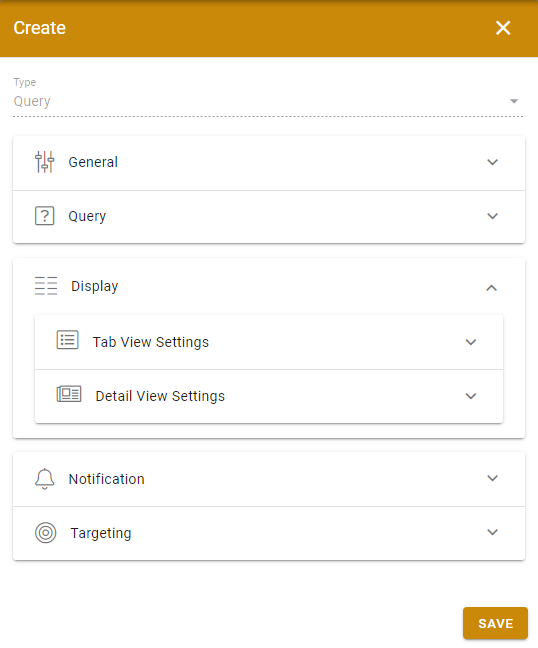
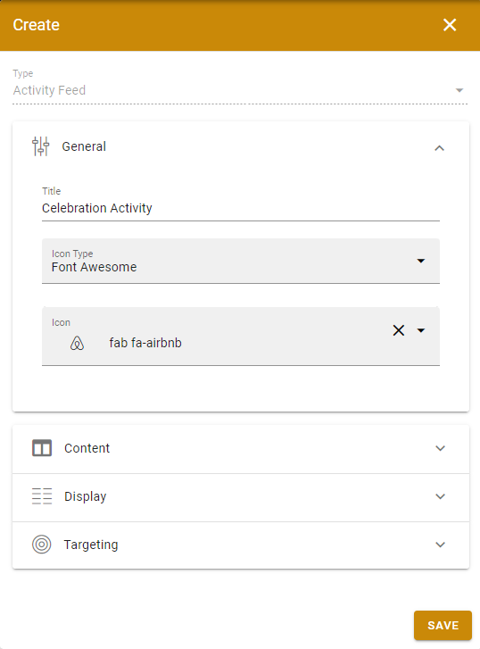

Release 6.12
========================================

Allow to configure the display of properties per tab, new admin setting UI make it consistent with Page Rollup
--------------------------------------
https://trello.com/c/uB389HNW/852-allow-to-configure-the-display-of-properties-per-tab-and-not-global-120
https://trello.com/c/RSoDR3um/853-allow-for-showing-and-sorting-differently-between-tabs-24

Support activity feed. User will get notification by their subscriptions
--------------------------------------
https://trello.com/c/mLoflzEL/939-co-dev-push-notifications-on-community-feeds-and-subscriptions-80

.. image:: ActivityTab.png

Allow user to clear all notifications from settings screen
--------------------------------------
https://trello.com/c/0PJzRdSm/703-make-the-clear-all-notification-more-visible

Allow user to clear all notifications from settings screen
--------------------------------------
https://trello.com/c/0PJzRdSm/703-make-the-clear-all-notification-more-visible

Handle like and comments permission by App Instance Reader/Contributor role.
--------------------------------------
https://trello.com/c/YKriA8JQ/1071-hide-like-and-comment-ui-if-users-not-have-permission

Announcements show icon by Announcement Type.
--------------------------------------
https://trello.com/c/lNeJ5x2V/61-fully-support-status-and-type-for-announcements-32

Share button in page detail.
--------------------------------------
https://trello.com/c/HfQ51DZO/1059-share-page

Support rotation in app.
--------------------------------------
https://trello.com/c/VatYedxH/1024-support-rotate-app-arriva-opm-in-omnia-feed

Versions
-----------------------------------------

.. toctree::
   :titlesonly:

   versions
