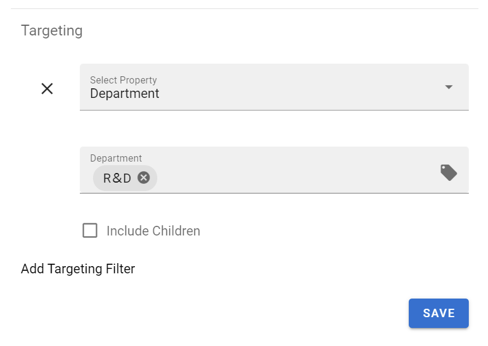
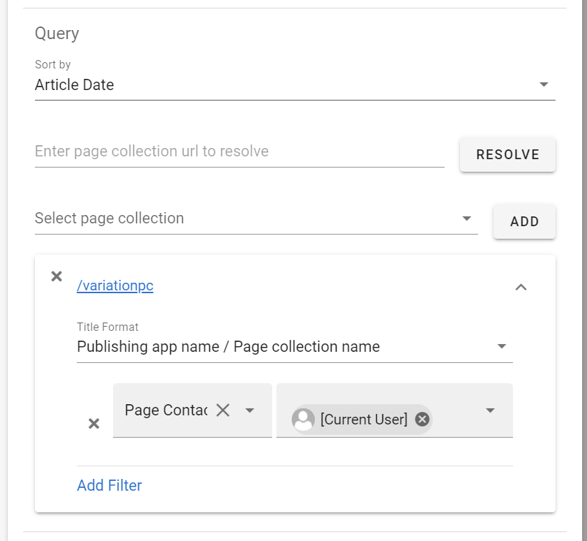

Release 6.6
========================================

Configurable Notifications
--------------------------------------

The rules for when to receive a push notification is now configurable. 
In the settings for Omnia Feed in Omnia Admin you can set all rules related to who gets a notification on a page.

.. image:: NotificationSettings.png

Targeting per tab in the mobile app
--------------------------------------

Each tab on each business profile can now be targeted using the normal targeting framework. 
This allows you to create user specific feeds or embeds. 

Will different available tabs to different users on the same business profile. 

.. image:: TargetingTabResult.png

Date Queries and Current User Queries
--------------------------------------
Its now possible to configure Omnia Feed to deliver notifications to a user when they match a Person property.

This is useful for supporting the editors of your omnia solution. Combined with date queries, these features can be used to give editors a push notification when they have a page to review.

.. image:: DateFilters.png

Mobile App Localization
--------------------------------------
It’s now possible to translate any label in the mobile app from Omnia Admin. All languages officially supported in Omnia will also be supported in the mobile app.

Remember to set your language in the settings of the mobile app.

.. image:: LocalizationSettings.png

Color Settings
--------------------------------------
Several color options are now configurable from Omnia Admin per Business Profile. 

.. image:: ColorSettings.png

Example:

.. image:: Additonal_Colors.png

Improved Performance
--------------------------------------
Omnia Feed should now load much quicker when opening the app and looking for new content. 
Detection for new content in both pages and announcements have also improved.

Versions
-----------------------------------------

.. toctree::
   :titlesonly:

   versions
