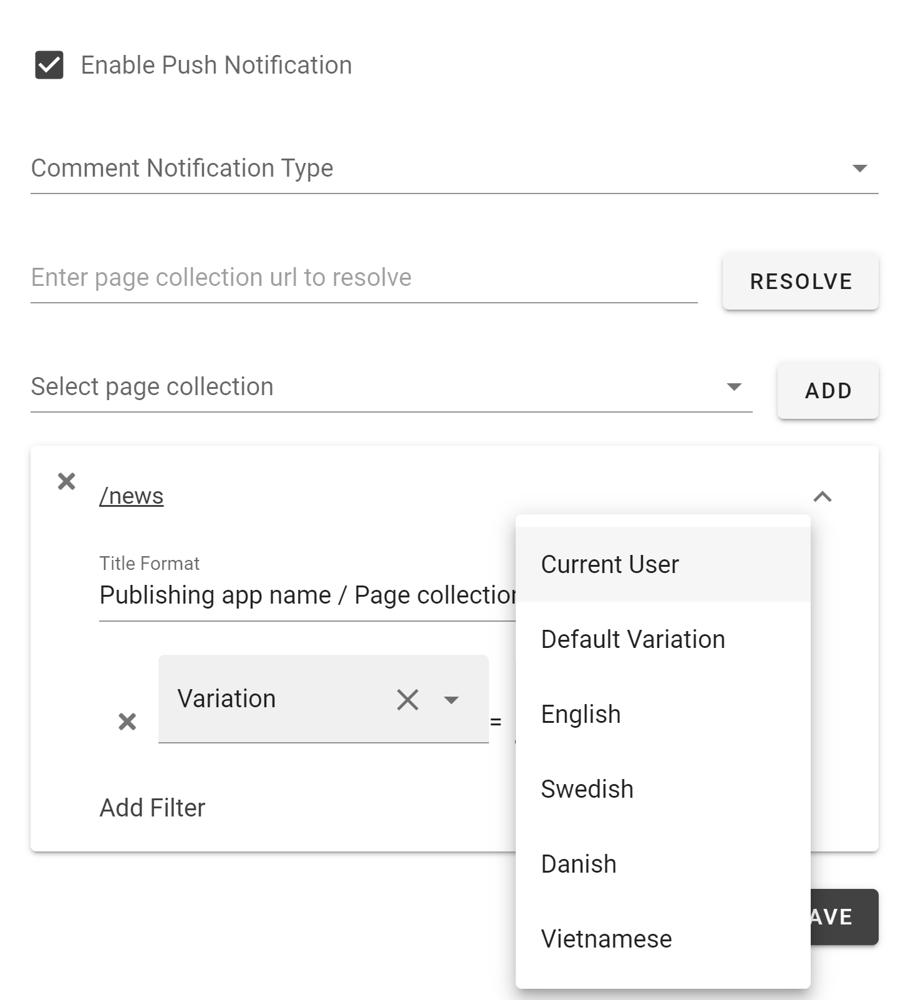
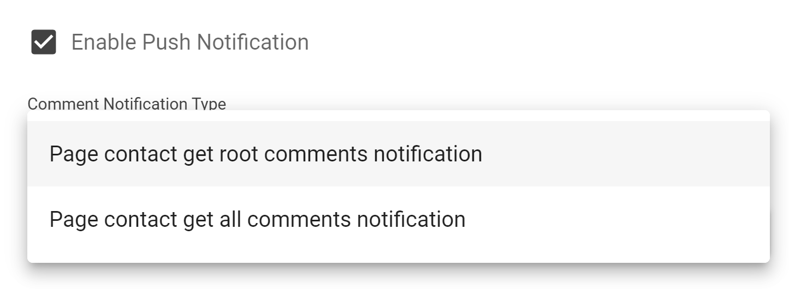
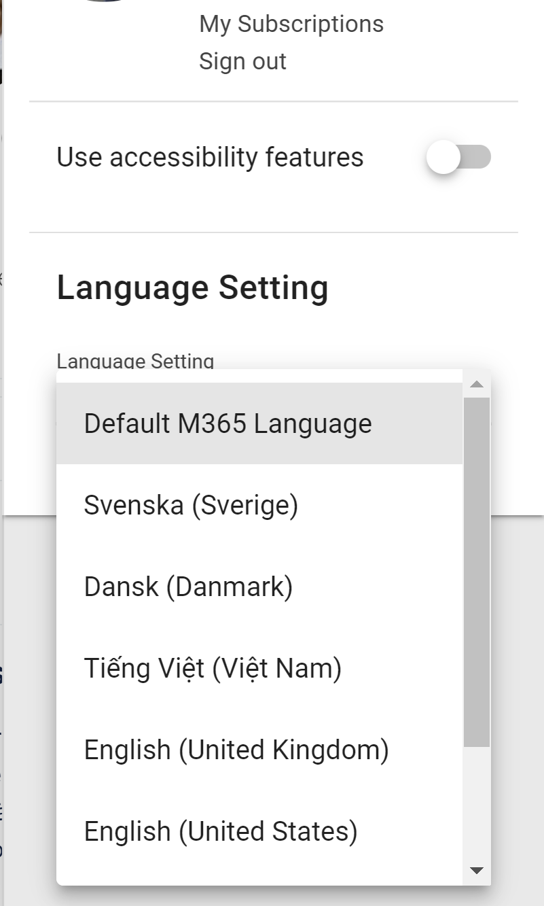

Release 6
========================================

Support variation query
--------------------------------------

It is now possible to configure each tab in Omnia Feed to show a specific variation or to select variation based on user's profile.

Change to notification for new comments
--------------------------------------

Each tab now has a setting to set whether the page contact person will receive notification for all comments or only root-level comments on their pages. All other users will only receive notifications for replies to their comments.

Targeting based on Omnia user's language
--------------------------------------

Omnia Feed will now prioritize the language setting in Omnia user profile for content targeting.

Hidden page
--------------------------------------

Pages being set to hidden now will also disappear from Omnia Feed.

Versions
-----------------------------------------

.. toctree::
   :titlesonly:

   versions