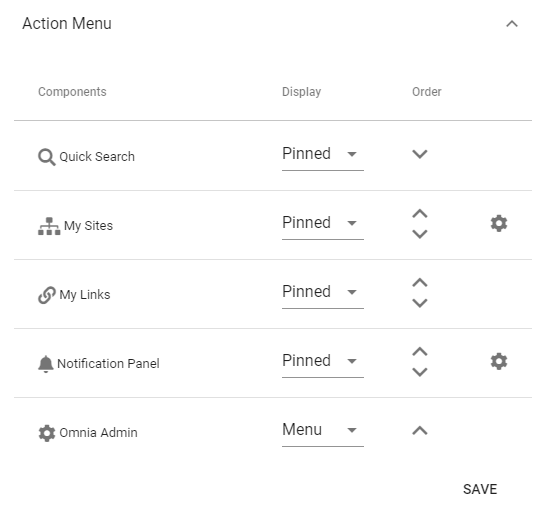
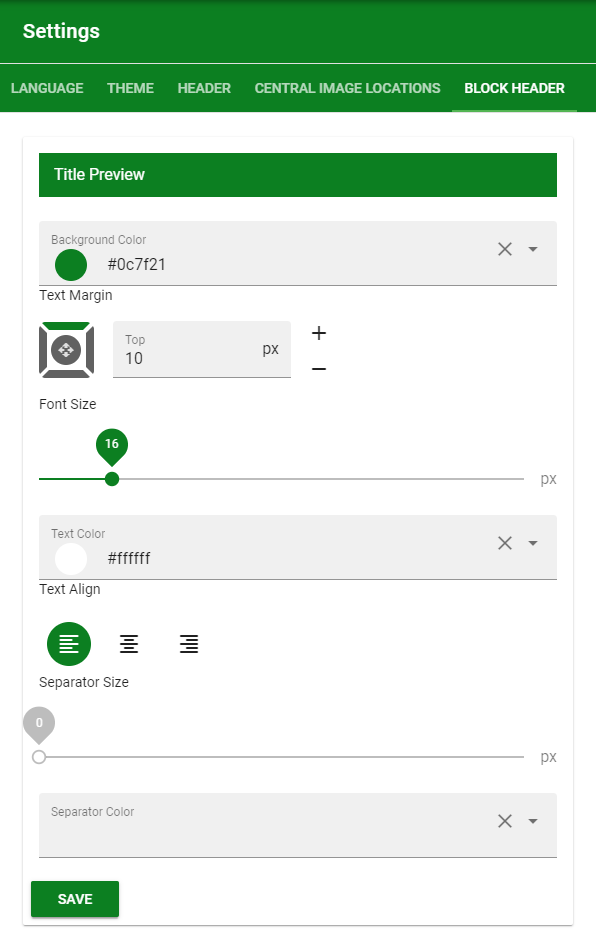

5. Branding
===========================================

1. Go to Omnia Admin.
2. Click on Tenant > Settings in the left-hand navigation.
3. Go to the Header tab and select a background and icon color for the top tenant chrome. The recommendation is that this setting matches the Microsoft 365 suite bar.
4. Select a logo and add the url that the logo should point to.

.. image:: tenant-settings-header.png

5. Click on settings for your default Businss Profile and select the "Header" tab.
6. Select a background and icon color that should be used for chrome of the Business Profile.
7. Configure the Action Menu.

8. Configure a Block Title style that will be used for all sections/blocks on a page.

More information on the Action Menu and the Block Title can be found here: :doc:`Business Profile settings </admin-settings/business-group-settings/settings/index>`