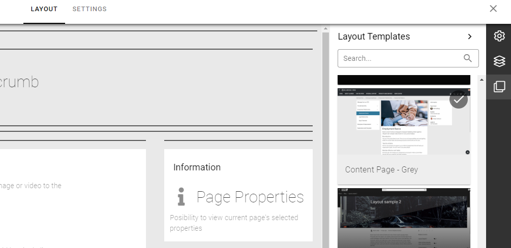
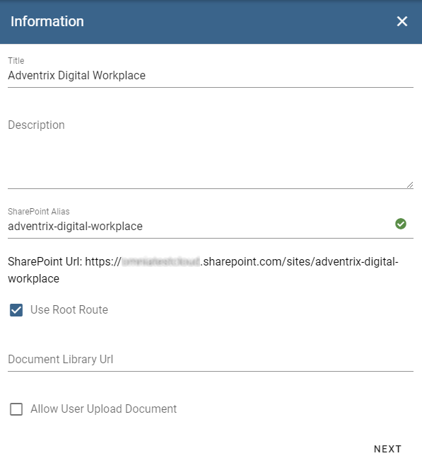
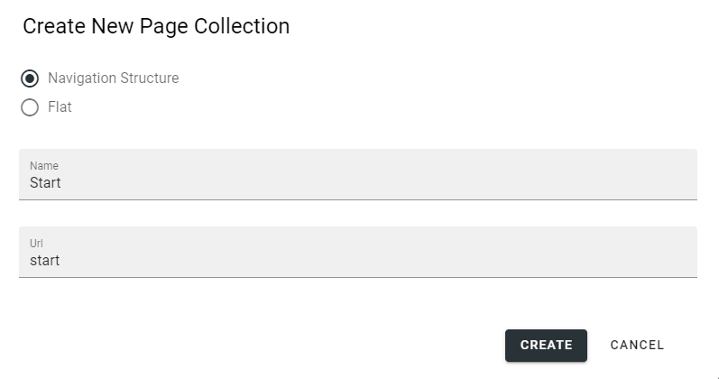
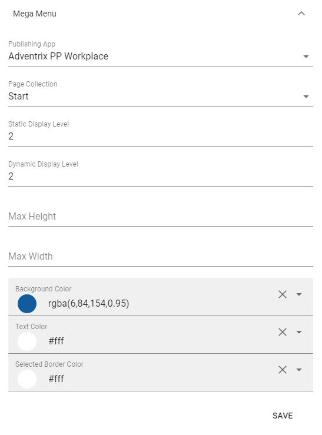

4. Publishing
===========================================

1. Go into Omnia Admin.
2. Click on "Web Content Management" in the left-hand navigation.
3. Click on "Page Types".
4. Create a new page type "Web Page".

.. image:: createnewpagetype.png

5. Open the tool for "Layout Templates" in the far-hand toolbar of the layout.
6. Open the "Pages" accordion and select "Content Page - Grey". 

7. Publish the page type.
8. Create a new page type "News Article".
9. Repeat step 5 - 7, but select the template "News Page - Grey".

10. Click on "Business Profiles" in the left-hand navigation and select the newly created Business Profile from the previous step.
11. Click on "Provisioning Templates" on the business profile in the left-hand navigation.
12. Create a new template based on Publishing.

.. image:: publishingapptemplate.png

13. Add the features "Show Business Profile Header" & "Publishing App Infrastructure" to the template.
14. Click on "Publishing" in the left-hand navigation.
15. Create a new Publishing App based on the newly created template.

16. Browse to the newly created publishing app.
17. Open the Editor and create a new Page Collection.

18. Select the template "Intranet - Grey" under the category "Start Pages".
19. Go to settings and select "Web Page (Tenant)" as an available page type.
20. Publish the page collection.
21. Create a new flat page collection for news articles.

.. image:: newflatpagecollection.png

22. Select the template "News Center - Grey" under the category "News Centers".
23. Go to settings and select "News Article (Tenant)" as an available page type.
24. Publish the page collection.

25. Go to settings of the publishing app and set "Start" as the default page collection.
26. Add "Page Contact" as the Contact Property and "Review Date" as the Review Date Property.
27. Save the settings. 

28. Go to Settings > Header for the current Business Profile.
29. Save the Start page collection as the mega menu.

