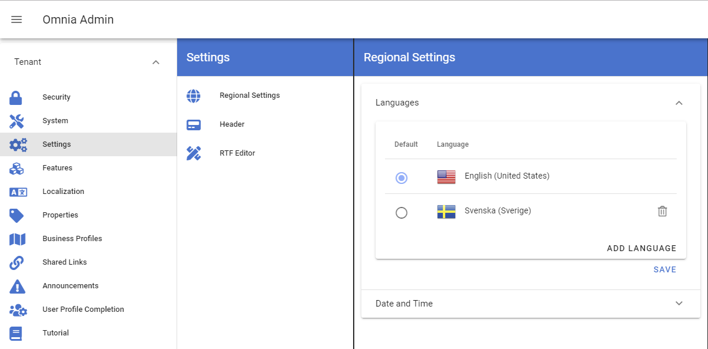
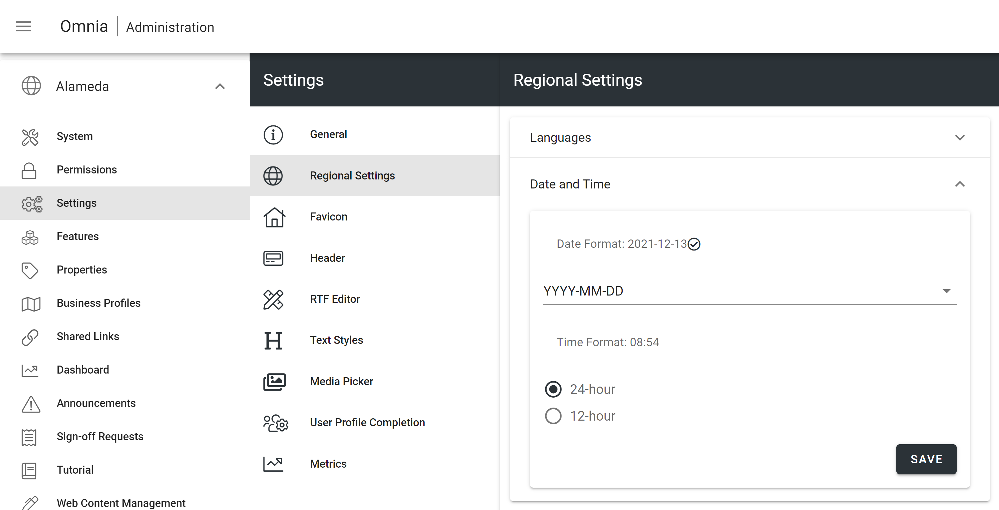

1. Tenant Settings
===========================================

1. Browse to the URL provided by your implementation partner (https://[tenant].omniacloud.net).
2. You will come to a 404 page, but don't worry, just press Shift + O + A to go to Omnia Admin.
3. Click on Settings in the left-hand navigation and setup regional settings such as Language and Date/Time format for the tenant.

