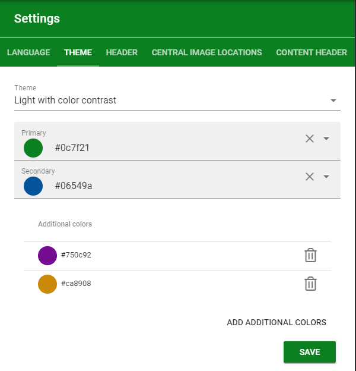
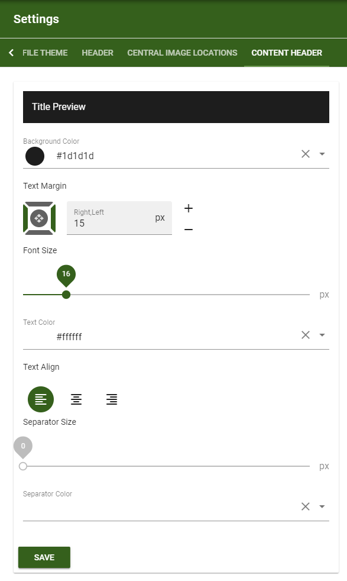

3. Business Profile
===========================================

1. Go to Omnia Admin.
2. Click on "Business Profiles" in the left-hand navigation.
3. Create a new Business Profile. (If you are only going to use one Business Profile in the tenant, you can use the name of your organization.)
4. Select the newly created Business Profile.
5. Click on the "Settings" for the Business Profiles, in the left-hand navigation.
6. Click on the "Profile Theme" tab.
7. Select a theme, a primary color and a secondary color.

8. Click on the "Header" tab.
9. Select a background and icon color that should be used for chrome of the Business Profile.
10. Configure the Action Menu.

.. image:: bp-settings-actionmenu.png

11. Configure a Content Header that will be used for blocks on the page.

More information on the Action Menu and the Content Header can be found here: :doc:`Business Profile settings </admin-settings/business-group-settings/settings/index>`