Setup Document management
===========================================

.. note:: In order for Document management features to appear in the UI, the OmniaManagementSystem extension needs to be installed and the Controlled documents feature needs to be activated. Please consult with your local partner to set up these prerequisites.

Below you will find the steps needed in order to create a basic setup of Document management.

Document types
-------------------------------------------

1. Go to the SharePoint admin center.
2. Click on Content services > Term store in the left-hand navigation.
3. Make sure to add the Working Languages that you would like to support in the Document management System. Note! This is a global setting. It will affect all services dependent on the term store.

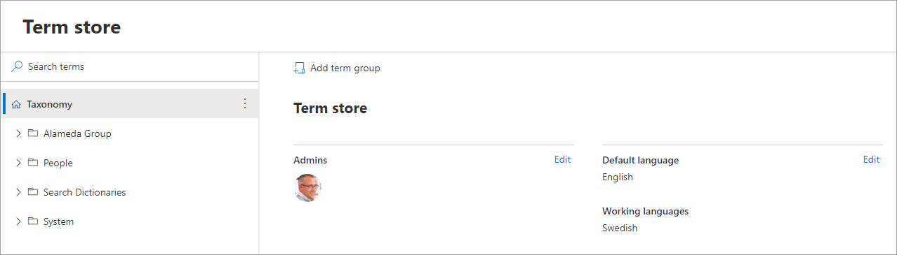

4. Create a new term set for Document Types.

.. image:: documenttypes.png

5. Go to Omnia admin > Properties > Enterprise properties.
6. Find the property Document type and click on the edit icon.
7. Connect the property to the terms set Document Types and save.

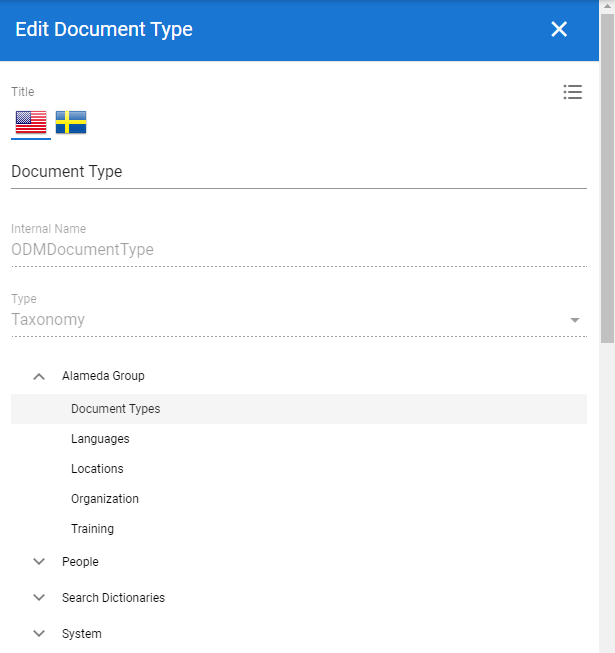

.. note:: This activity can't be undone in the UI. If the property needs to be reconnected, a support ticket needs to be submitted.

Document Title
-------------------------------------------

8. Go to SharePoint admin center.
9. Click on More features > Search.
10. Click on Manage search schema.
11. Filter on “refinablestring50”.

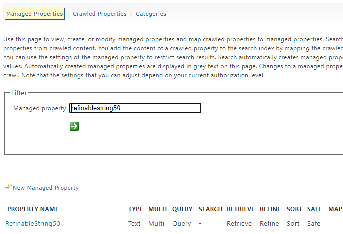

12. Edit the managed property and map the following crawled properties.

.. image:: refinablestring50mapping.png

13. Go to Omnia admin > Properties > Enterprise properties.
14. Find the property title and click on the edit icon.
15. Check the SharePoint searchable checkbox and use RefinableString50 as the default managed property and check all search boxes.

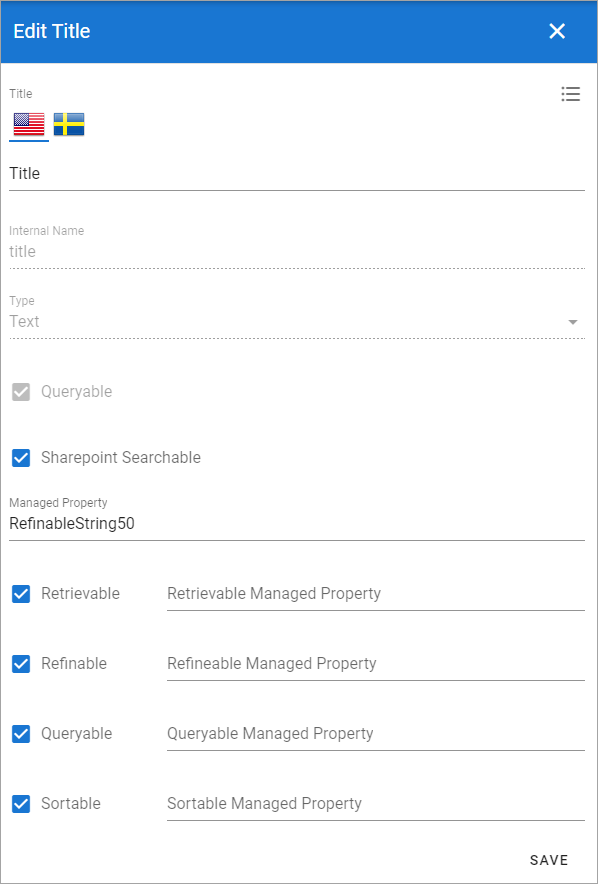

Document Archive
-------------------------------------------

.. note:: If you have Process management setup, you can ignore step 16 - 17.

16. Go to the business profile in which you want to host the central controlled documents archive.
17. Go to Teamwork > Templates and create a new template that can be used for system sites.

.. image:: teamwork-template-add.png

18. Click on Teamwork > Apps and create a new site for the controlled documents archive based on the system site template.

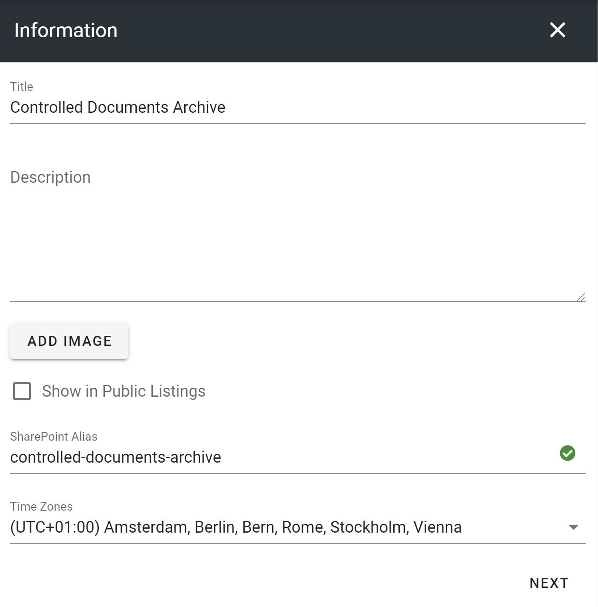

19. Activate the features Archived documents and SPFx Infrastructure on the newly created site.
20. Click on Document management in Omnia admin and click on Settings.
21. Put in the full URL to the newly created site in the Archive site URL and save.

Document authors
-------------------------------------------

22. Go to Omnia admin > Document management > Settings.
23. Take a decision on how you want to define controlled documents authors within your solution:

* Document authors group: This will create an explicit SharePoint group on the site that is used as the document authors group.
* Site owners: You need to have the role of the site owner (or M365 Group owner) to be able to edit controlled documents.
* Site owners and members: You need to be at least a site member (or M365 Group member) to be able to edit controlled documents.

24. Check the Approvers group checkbox if you want to allow sites to have a specific list that can be used to define a group of site specific approvers.

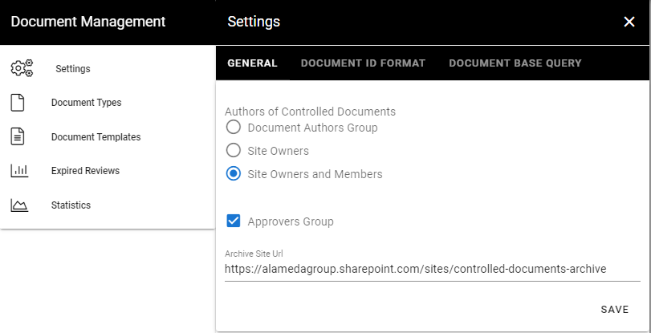

Basic document template
-------------------------------------------

25. Go to Omnia admin > Document management > Document templates.
26. Create a new document template for a blank Word document.

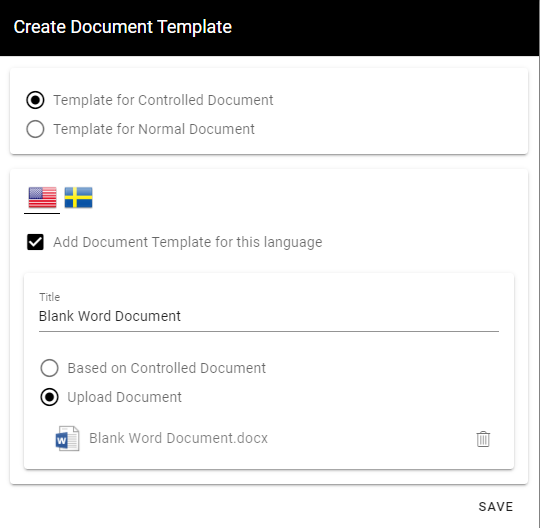

Basic Property Set
--------------------------------------------

27. Go to Omnia admin > Properties > Enterprise properties.
28. Create a new person property for Document owner.

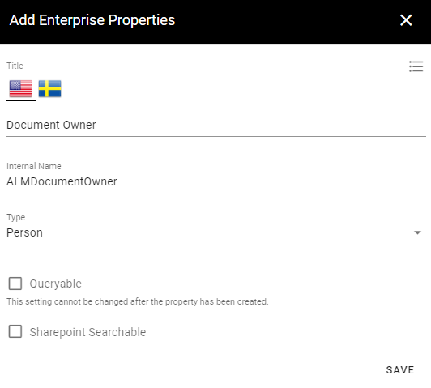

29. Go to Omnia admin > Properties > Property sets.
30. Create a new property set for a basic controlled document.
31. Add the Document owner property and make it required.

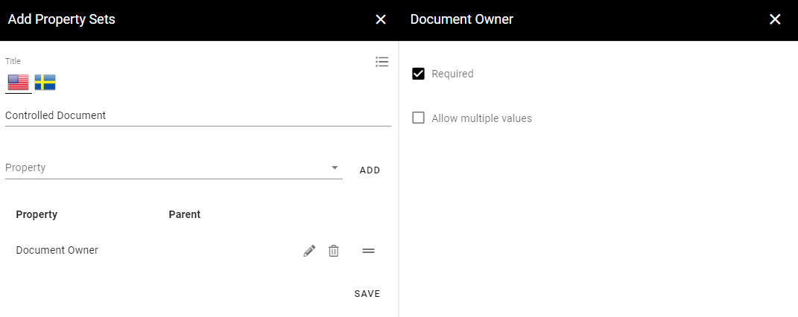

Basic document type
--------------------------------------------

32. Go to Omnia admin > Document management > Document types.
33. Create a first document type that can be used for templates in the system.

.. image:: create-documenttype-general.png

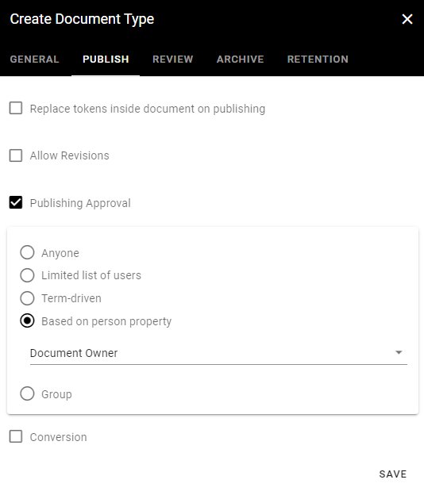

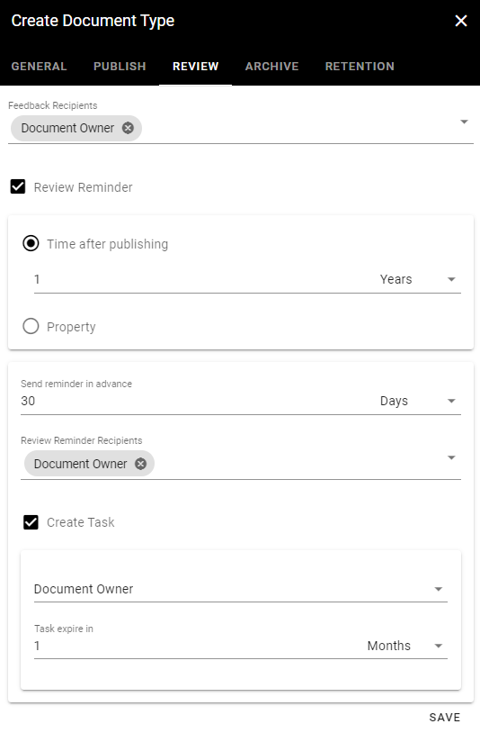

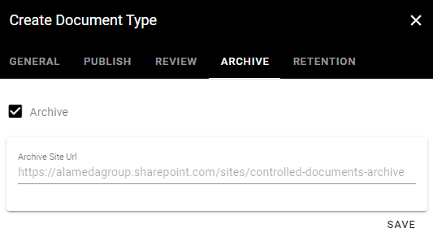

First teamsite
--------------------------------------------

.. note:: Make sure you have installed Omnia SPFx integration using the instruction in Omnia admin > System > SPFx Instruction.

In order to create a first controlled document that can be indexed by SharePoint search, we need to create a first site. If you already have existing team sites in your solution that are attached to Omnia, you can use one of those and activate the feature Controlled documents library on that site. In this example we will create a new provisioning template for Departments that will activate this feature by default.

34. Go to Omnia admin and select your default business profile.
35. Click on Teamwork > Templates.
36. Create a new provisioning template for departments.

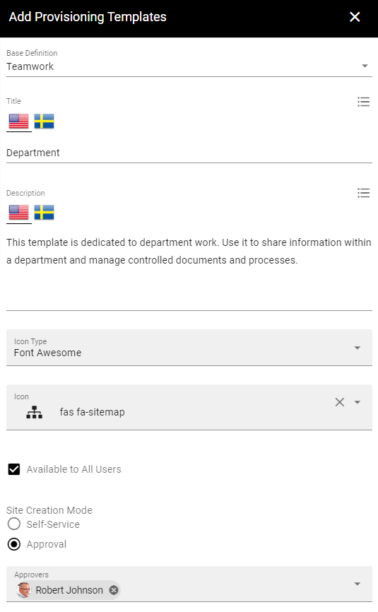

.. image:: add-provisioningtemplate-department-step2.png

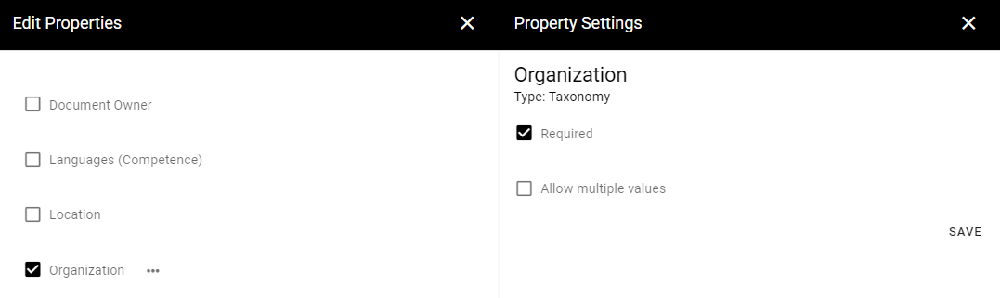

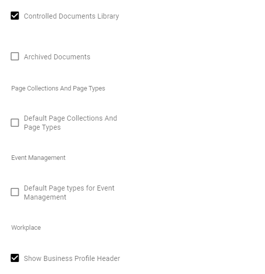

37. Create a new site based on the provisioning template.

.. image:: create-department-step1.png

.. image:: create-department-step2.png

38. Go to the newly created site and click on Controlled documents in the left-hand navigation
39. Click on Permissions in the right-hand corner of the controlled documents library.

.. image:: controlled-documents-permissions.png

40. Add a default readers group (in this example Everyone except external users).

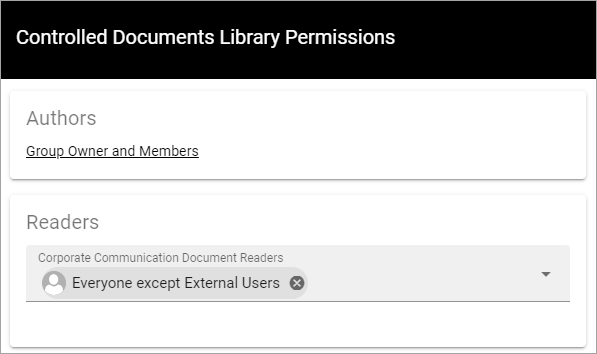

Publish a controlled document
--------------------------------------------

41. Create and publish a new controlled document.

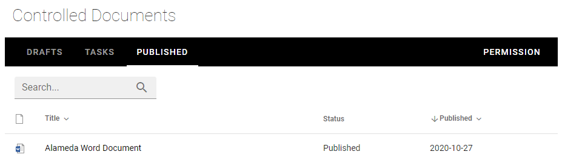

42. Create a draft and publish a new edition. (Note! We do this to be able to crawl a document in the archive as well).

Default search properties
--------------------------------------------

Now you will have to wait a few minutes before the controlled document has been indexed by SharePoint search.

42. Go to SharePoint admin center > More features > Search.
43. Click on Managed search schema.
44. Map the following Managed and Crawled properties. (Note! This is just a recommendation and any refinable managed properties can be used.)

- RefinableString51 > ows_ODMDocId
- RefinableString52 > ows_ODMDocumentType
- RefinableString54 > ows_ODMApprovedBy
- RefinableString55 > ows_ODMContentLanguage
- RefinableString56 > ows_SiteName
- RefinableString57 > ows_SPSiteUrl
- RefinableString59 > ows_q_USER_ODMApprovedBy
- RefinableString60 > ows_taxid_ODMDocumentType

.. image:: search-refinablestrings.png

- RefinableInt30 > ows_ODMDocIdNumber
- RefinableInt31 > ows_ODMEdition

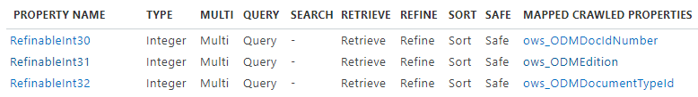

- RefinableDate10 > ows_q_DATE_ODMPublished
- RefinableDate11 > ows_q_DATE_ODMApproved
- RefinableDate12 > ows_q_DATE_ODMReviewDate
- RefinableDate13 > ows_q_DATE_ODMPublishedFrom
- RefinableDate14 > ows_q_DATE_ODMPublishedTo

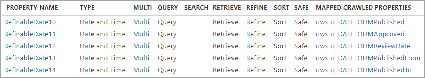

45. Go to Omnia admin > Properties > Enterprise properties.
46. Edit and update the search configuration for the following enterprise properties.

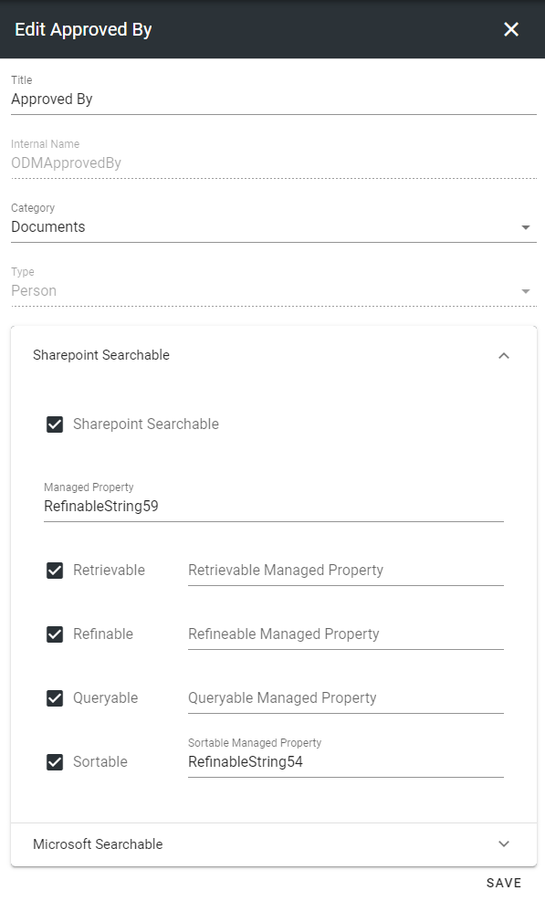
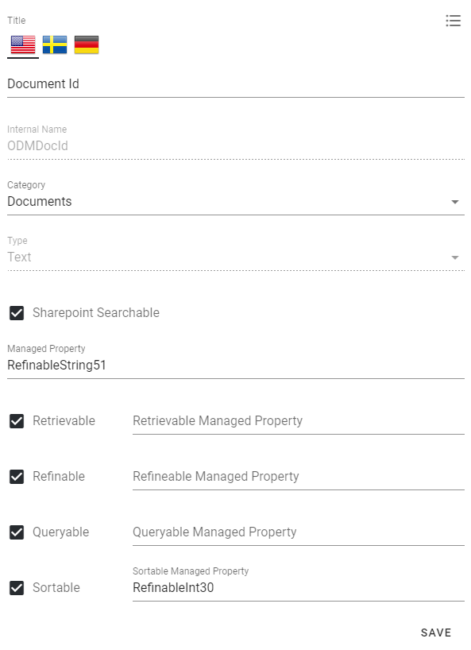
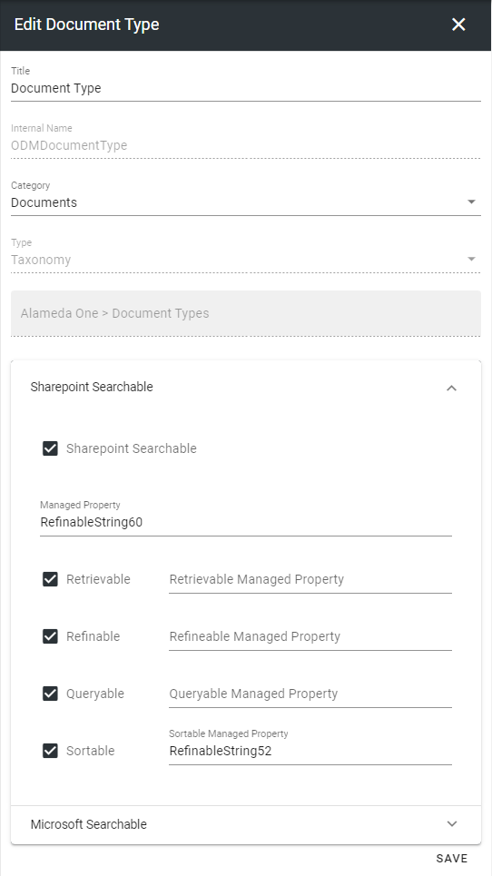
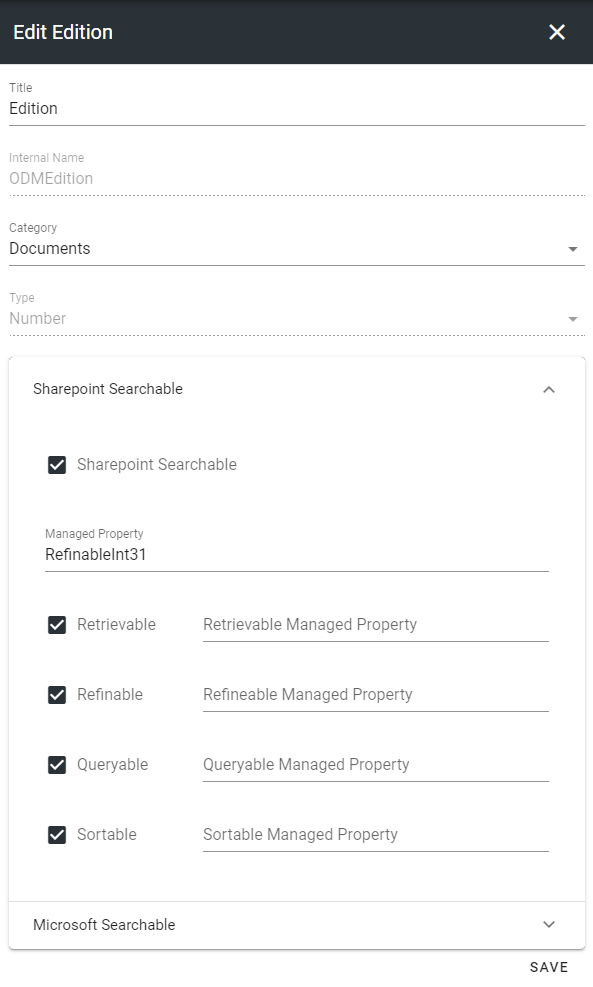
.. image:: property-published.png
.. image:: property-reviewdate.png

47. Create another draft of a controlled document and publish it. (Note! This is necessary in order for SharePoint search to map the crawled properties to the managed properties.)

You are now ready to start creating document types, document templates and add controlled documents in teamwork and publishing apps.

 
